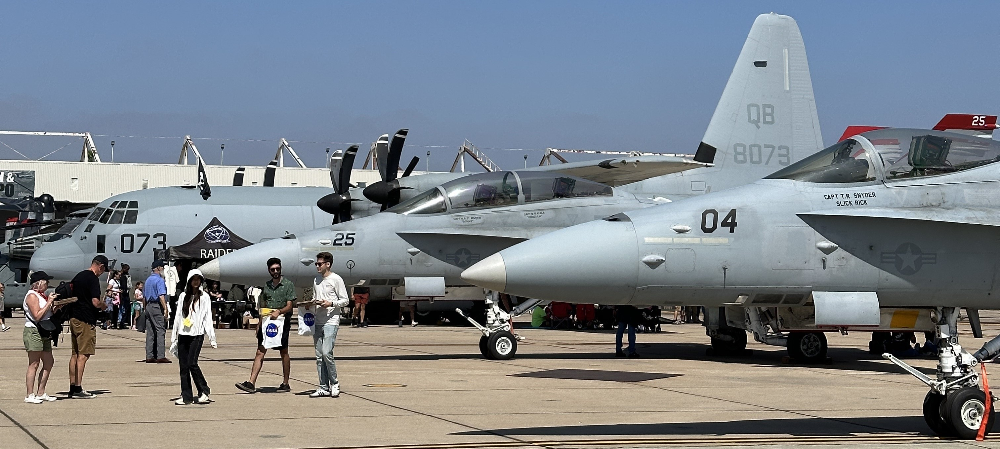

## Airshows

 
     

In 2017, I attended my first airshow at the Planes of Fame Air Museum. I had a budding interest in World War II aviation but had yet to see any aircraft in person. I thoroughly enjoyed being in the presence of historic warbirds, aerobatic performers, and modern military airpower. Since then, I have visited over twenty-five airshows across California and beyond.

* [2023 EAA Airventure Oshkosh](https://williamteav.github.io/personal_website/blog/post010/osh23.html)
* [2023 Southern California Air Show](https://williamteav.github.io/personal_website/blog/post009/socal23.html)
* [2023 Point Mugu Air Show](https://williamteav.github.io/personal_website/blog/post008/mugu23.html)
* [2022 Airshow Season Recap](https://williamteav.github.io/personal_website/blog/post007/airshows22.html)
* [2021 Airshow Season Recap](https://williamteav.github.io/personal_website/blog/post006/airshowsfall21.html)
