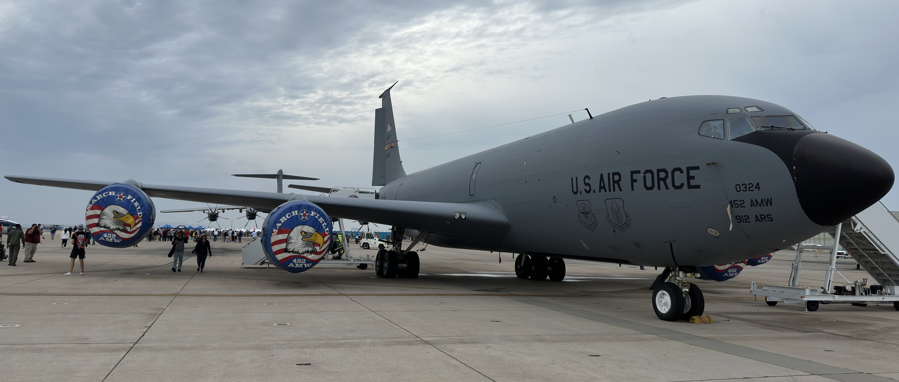

# 2023 Miramar Air Show

Located just north of San Diego, Marine Corps Air Station Miramar schedules their annual airshow for the final weekend of September. Their airshow is known for the Marine Air-Ground Task Force (MAGTF) combined arms demonstration featuring aircraft, helicopters, ground vehicles, and pyrotechnic effects. 

## Static Display Highlights

### Airbus A400M Atlas

A Royal Air Force A400M transport arrived on Friday following the conclusion of the Blue Angels performance and was open to the public during the weekend. This aircraft is based at RAF Brize Norton and was delivering supplies to British units training in the United States.

### Bell AH-1Z Viper

Developed from the Vietnam-era AH-1 Cobra, the Viper serves as the primary Marine Corps attack helicopter.

### Bell UH-1Y Venom

Developed from the Vietnam-era UH-1 Huey, the Venom provides both transport and light attack capabilities.

### Bell Boeing V-22 Osprey

The Osprey's tiltrotor configuration allows the aircraft to transition between conventional flight and hovering. This white and gray V-22 is a CMV-22B carrier onboard delivery variant. Several Ospreys were opened for attendees to walk through.

### Lockheed Martin KC-130J Super Hercules

The KC-130J is a transport aircraft with the ability to conduct midair refueling.

### Sikorsky CH-53E Super Stallion

The Super Stallion is the Marines' primary heavy lift helicopter. CH-53s took part in the MAGTF demonstration, showcasing their ability to transport towed artillery and light vehicles. 

### Northrop F-5N Tiger II

This F-5N is assigned to VMFT-401 "Snipers" from Marine Corps Air Station Yuma. VMFT-401 is an adversary squadron and its aircraft are painted to mimic Soviet fighters.

### McDonnell Douglas F/A-18D Hornet

The Marines continue to operate the F/A-18D but are gradually transitioning to the F-35.

NASA also owns a small fleet of F/A-18s to observe experiments as chase aircraft.

### Lockheed Martin F-35B Lightning II

The F-35B is capable of short takeoffs and vertical landings, making it ideal for operations aboard amphibious landing ships and helicopter carriers. 

A F-35B from VMFAT-502 "Flying Nightmares" performed an aerobatic demonstration which included a short takeoff, hover, and vertical landing.

### M142 HIMARS

Developed by Lockheed Martin, HIMARS is short for High Mobility Artillery Rocket System. 

### Boeing KC-135R Stratotanker

This Stratotanker is based at March Air Reserve Base in Riverside, California.

### LAV-25

The LAV-25 is primarily armed with a 25mm cannon and can be equipped with machine guns and anti-tank missiles.

### AN/TWQ-1 Avenger

The Avenger is a short range air defense platform based on the Humvee. It is armed with a combination of missiles and machine guns.

### MIM-104 Patriot

Capable of targeting missiles, drones, and aircraft, the Patriot surface-to-air missile system has been exported worldwide.

### Kratos UTAP-22 Mako

The Mako is a drone designed to collaborate with manned aircraft and can be equipped with a variety of munitions and electronic equipment.

### Kratos XQ-58 Valkyrie

The Valkyrie is a stealth drone which first flew in 2019. It is designed for a multitude of missions, including ground attack and electronic warfare.

### Naval Aircraft Factory N3N

The N3N is a trainer biplane flown by the US Navy before and during World War II.

### Boeing B-29 Superfortress

"Doc" is one of two airworthy B-29 Superfortresses and is regularly on static display at Miramar.

### Consolidated PBY Catalina

The PBY Catalina is a maritime patrol aircraft which saw widespread use during World War II.

### Northrop T-38 Talon

The T-38 Talon is a jet trainer aircraft in service since the 1960s.

### DeLorean Aerospace DR-7

The DR-7 is an electric flying car capable of vertical takeoffs and landings.