# Castle Air Museum

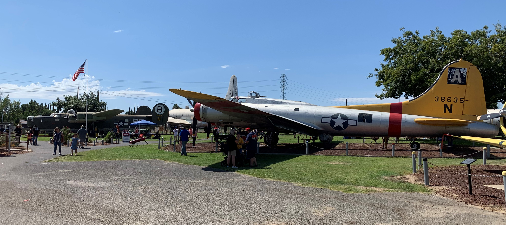

Located in Atwater, a small town in California’s Central Valley, Castle Air Museum is home to over seventy historical military aircraft, the majority of which are displayed outdoors. The museum resides in proximity to Castle Airport. During the Cold War, Castle Airport operated as Castle Air Force Base and was home to the 93rd Bombardment Wing of Strategic Air Command. 

### Aircraft on Display

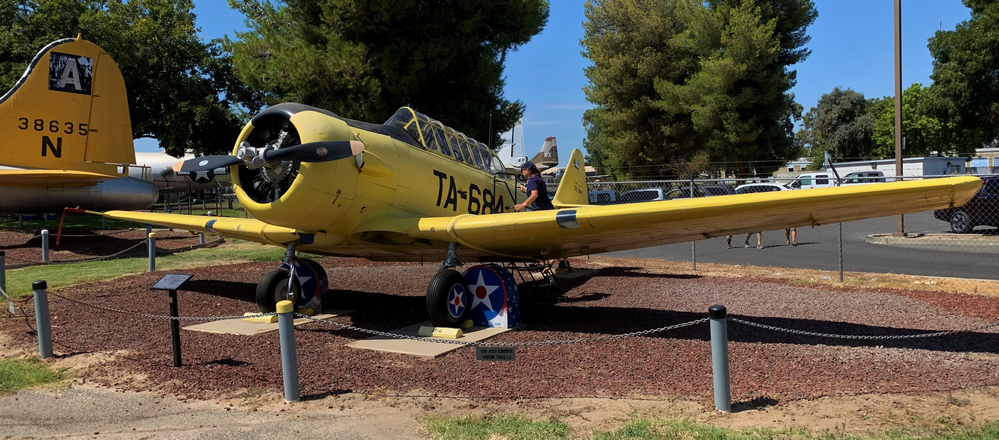

Months before the attack on Pearl Harbor, the Army Air Corps established Merced Army Air Field (later Castle Air Force Base) to train pilots. A popular training aircraft of the time was the North American AT-6 Texan. This particular aircraft was operated by the Royal Canadian Air Force prior to its acquisition by the museum.  

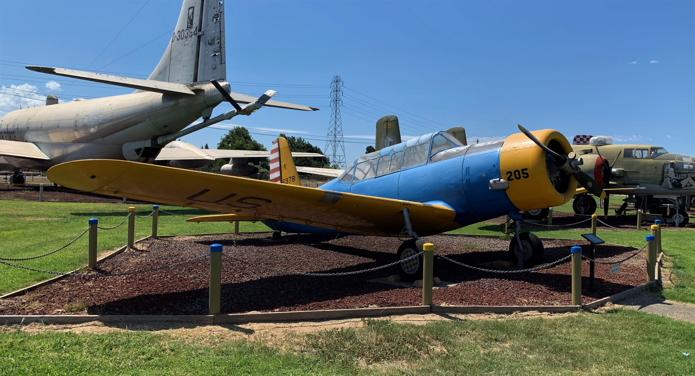

The Vultee BT-13 Valiant was an intermediate trainer for pilots during World War II.  

Outdated at the beginning of World War II, the Douglas B-18 Bolo medium bomber was relegated to transport and anti-submarine duties. The aircraft on display is a B-18B with a lengthy postwar career as a crop sprayer, cargo transport, and fire tanker. 

Designed by Douglas as a successor to its B-18, the B-23 Dragon was never used in combat, passed over in favor of more advanced medium bombers. This B-23 was used during wartime to train maintenance crews. Following the war, it was an executive transport for several companies. 

A military variant of the Beechcraft Model 18, the C-45 Expeditor served as a light transport. The C-45G on display was stationed in Italy before transitioning to the Environmental Protection Agency and the Department of Agriculture.

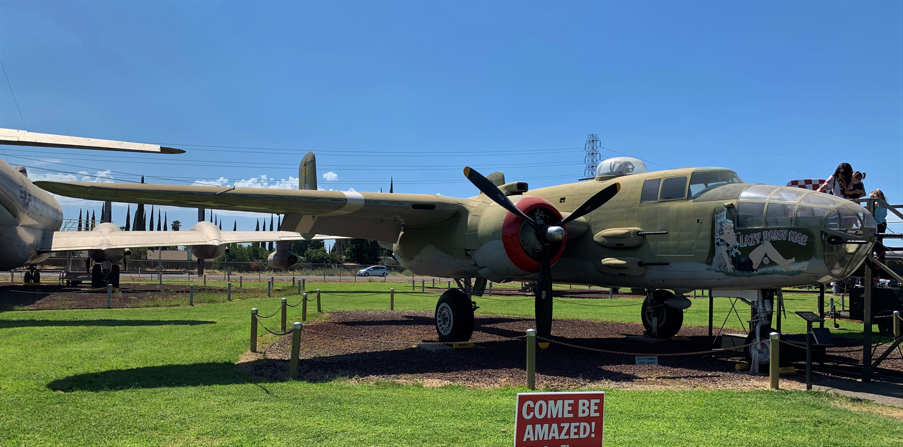

Throughout World War II, the North American B-25 Mitchell could be adapted for a variety of missions ranging from conventional bombing to anti-shipping patrols. Its claim to fame occurred in April 1942 when several B-25s took off from the aircraft carrier USS Hornet to bomb Tokyo. The museum’s aircraft is a B-25J, the most numerous variant of the Mitchell. After the war, this B-25 was converted to an air tanker and later served as a testbed for Texas Instruments. 

A speedy ground-attack bomber, the Douglas A-26 Invader saw action in World War II, Korea, and Vietnam. The museum’s A-26B was delivered to the Salvadoran Air Force during the late 1970s. 

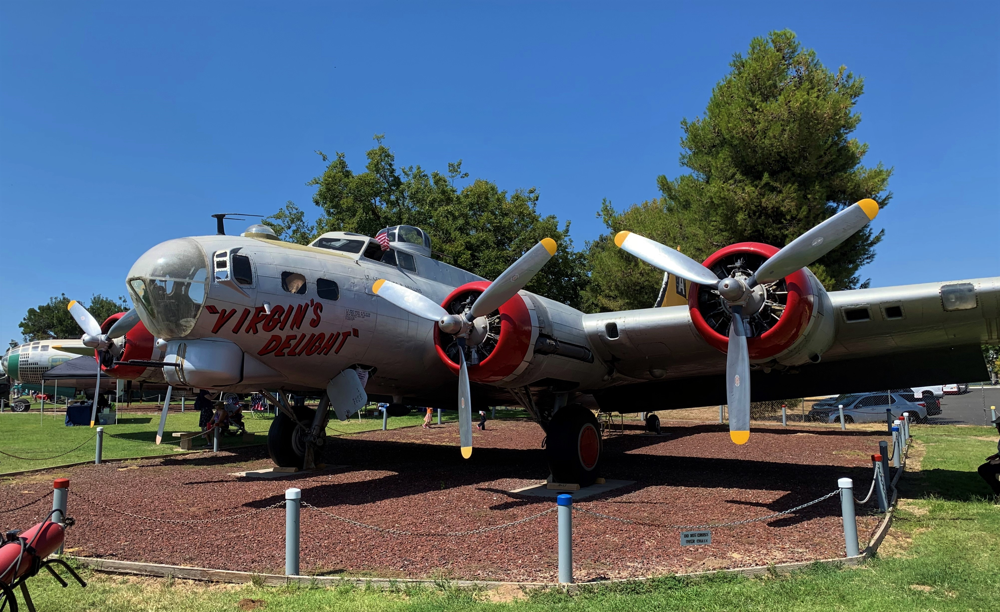

Nicknamed the “Flying Fortress” due to its defensive armament and ability to take damage, the Boeing B-17 rose to fame through its daylight bombing missions against Nazi Germany. Several B-17s, such as this B-17G, saw postwar service as fire tankers.  

The most-produced heavy bomber in history, the Consolidated B-24 Liberator flew alongside B-17s over Europe. The Liberator’s superior range, however, allowed it to supplant the Flying Fortress in the Pacific Theater. Records indicate that this B-24M flew as a transport in Bolivia from 1951 to 1973.   

Featuring a pressurized cabin and computer-controlled gun turrets, the technologically advanced Boeing B-29 Superfortress provided the means for a sustained bombing campaign against the Japanese home islands. This B-29 is a composite of three separate aircraft and is also reputed to be haunted.  

Of the various transports available, only the Curtiss C-46 Commando could fly the air supply route over the Himalayas. Overshadowed by the C-47, the C-46 was criticized for its difficult maintenance and survivability issues. The C-46D on display had previously served the Japan Air Self-Defense Force. 

An icon of World War II, the Douglas C-47 Skytrain was a conversion of the popular DC-3 airliner. Many operators across the world continue to use the C-47 for both civil and military purposes. This C-47 bears alternating black and white invasion stripes to reduce friendly fire during the Normandy landings.  

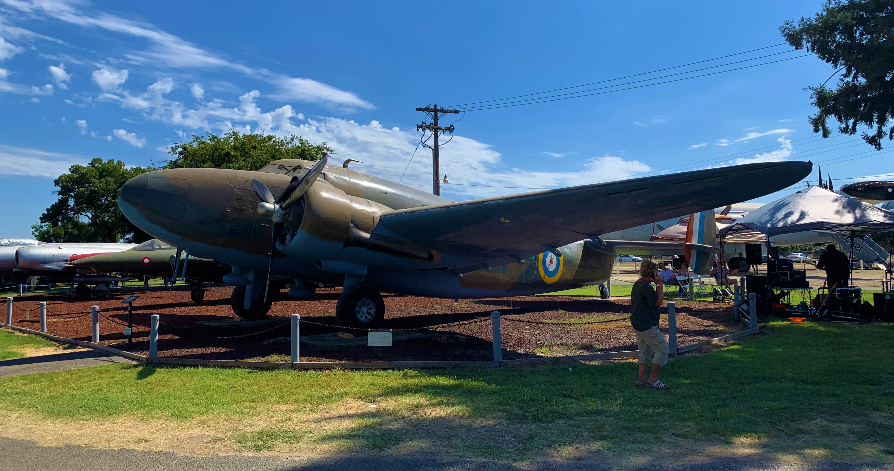

Derived from the Lockheed Model 18 Lodestar, the C-56 was used as a personnel transport. This example was acquired during World War II by the South African Air Force and converted into a bomber. 

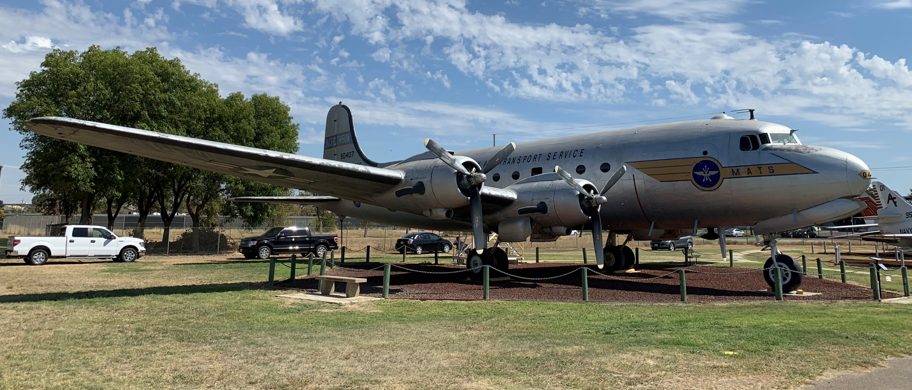

A military conversion of the Douglas DC-4 airliner, the C-54 Skymaster was the first aircraft to bear the designation “Air Force One.” 

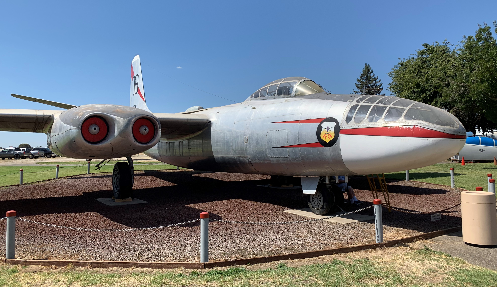

The United States Air Force’s first jet bomber, the North American B-45 Tornado flew reconnaissance missions during the Korean War and equipped several air wings of Strategic Air Command through the 1950s. The museum’s aircraft is one of three surviving B-45s and the only B-45A variant remaining.  

After World War II, the B-29 design incorporated engine and structural improvements, resulting in the B-50 Superfortress. The 93rd Bombardment Wing was equipped with B-50s in the early Cold War years. This aircraft is a WB-50 weather reconnaissance variant.   

A cargo variant of the B-29 Superfortress, the C-97 Stratofreighter, was further modified for aerial refueling, resulting in the KC-97 Stratofreighter. Several KC-97s were outfitted with jet engines to better match the speed of other jet aircraft during refueling operations. 

Related to the Boeing 707, the KC-135 Stratotanker succeeded the KC-97 in the aerial refueling role. The Stratotanker remains in service with the United States Air Force.

With the longest wingspan of any combat aircraft ever built, the Convair B-36 Peacemaker is also the largest piston aircraft to enter mass production. Designed during World War II, the B-36 would provide the United States with the capability of striking Nazi Germany from bases in North America. While the aircraft did not enter service until after World War II, the Peacemaker remained an integral piece of Strategic Air Command’s deterrence force during the early Cold War. The aircraft on display is a reconnaissance RB-36H.

The Boeing B-47 Stratojet, with its six turbojets and swept wing, represented the latest advances in postwar technological advances. Prior to the advent of intercontinental ballistic missiles, aircraft such as the B-47 provided nuclear deterrence against the Soviet Union. The museum’s B-47E was the last of its kind to fly.  

Having equipped the bomber wings of the United States Air Force since 1955, the Boeing B-52 Stratofortress is expected to remain in service for many years to come. This B-52D participated during the Vietnam War and sports wartime camouflage. 

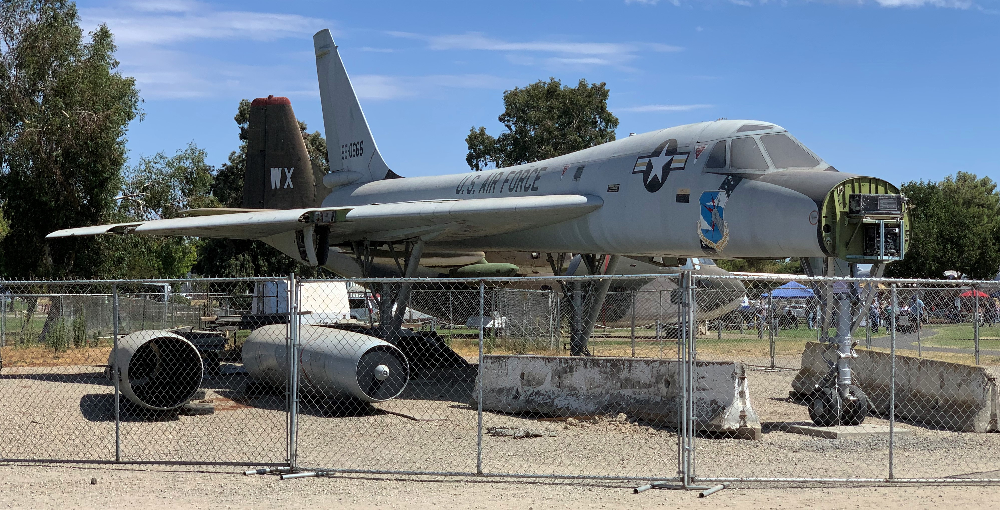

Designed to fly faster and higher than existing Soviet interceptors, the Convair B-58 holds the distinction of being the world’s first operational supersonic bomber. The B-58’s career was cut short by the introduction of Soviet surface-to-air missiles.

The United States’ first jet fighter, the Lockheed F-80 Shooting Star arrived in Europe in the waning moments of World War II but did not see combat. A few years later, however, the F-80 would clash against Soviet-built MiG-15s over Korea. 

Intended to defend against incoming Soviet bombers, the Lockheed F-94 was one of the first jet fighters to be equipped with radar. During the Korean War, F-94s operating at night downed several hostile aircraft.  

When it entered service in 1947, the Republic F-84 Thunderjet was the first United States Air Force fighter jet capable of carrying nuclear weapons. During the Korean War, the Thunderjet was outclassed by the MiG-15 but excelled in the ground-attack role. 

An evolution of the Thunderjet, the Republic F-84F Thunderstreak lacked the performance of contemporary swept-wing fighters but found its niche as a ground-attack platform. During the Cold War, NATO Thunderstreaks were armed and ready to execute tactical nuclear strikes against the Warsaw Pact.

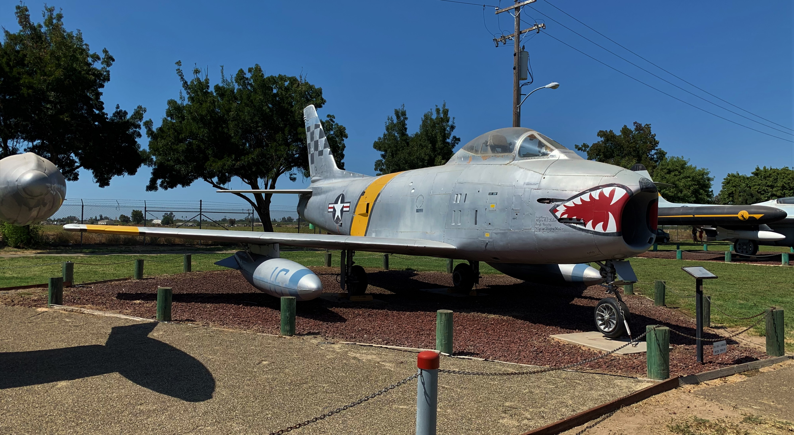

Later variants of the North American F-86 Sabre incorporated radar and a heavier assortment of weaponry. Known as the “Sabre Dog,” these F-86s were tasked with intercepting enemy aircraft and carried either cannons or rockets.

Patrolling the arctic skies, the Northrop F-89 Scorpion was sluggish but heavily armed. Later variants of the Scorpion were armed with wingtip rockets and Genie air-to-air nuclear missiles. 

Designed as an escort fighter, the McDonnell F-101 Voodoo was instead used as a nuclear strike fighter, interceptor, and photoreconnaissance aircraft. A difficult aircraft to fly, the Voodoo nevertheless broke multiple speed records, earning the nickname “One-Oh-Wonder.”

The lightweight, supersonic Lockheed F-104 Starfighter was not agile enough for dogfighting but found roles in ground attack, interception, and photoreconnaissance. Many NATO members operated the Starfighter, with several flying until the twenty-first century. 

An all-weather interceptor, the Convair F-106 Delta Dart defended the skies of North America against potential Soviet bombing raids. Its avionics were linked with ground systems, allowing the Delta Dart to seamlessly detect and acquire targets. 

Taking to the skies for the first time in 1958, the McDonnell F-4 Phantom was a large but powerful fighter aircraft. An icon of the Cold War, the Phantom was deployed by many foreign air forces, several of which continue to operate the aircraft. The jet on display is a F-4E painted in Thunderbirds livery. 

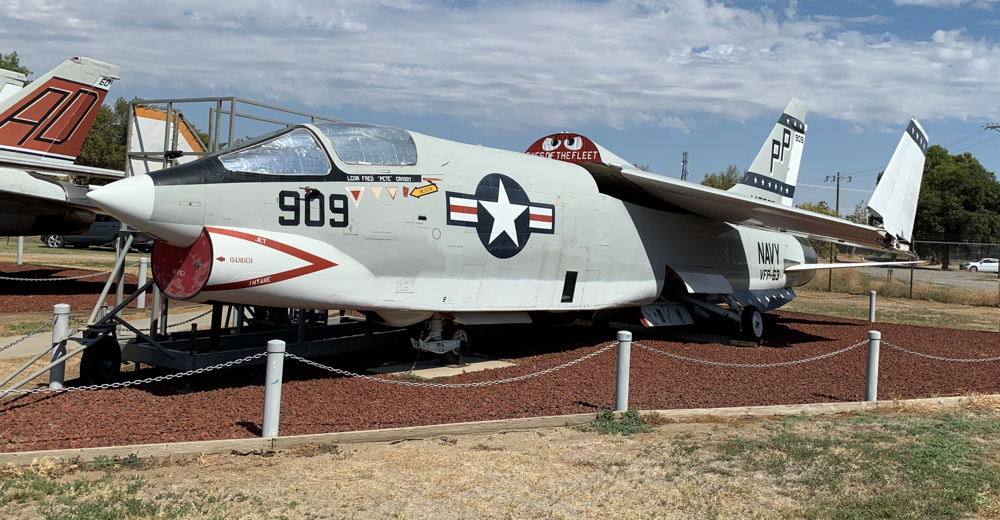

The first carrier-based fighter to break the sound barrier, the Vought F-8 Crusader featured a unique variable-incidence wing which allowed for lower landing speeds. Despite being outdated by the Vietnam War, F-8s scored several victories against MiG opposition. This particular aircraft is a reconnaissance RF-8G.

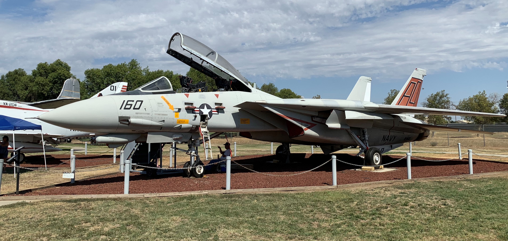

With its long range and advanced radar, the iconic Grumman F-14 Tomcat was tasked with defending friendly fleets against airborne targets. Several F-14s were sold to Iran and remain in service with the Islamic Republic of Iran Air Force. 

With over 100 victories against zero losses in aerial combat, the McDonnell Douglas F-15 Eagle remains one of the world’s most formidable air supremacy aircraft. 

The lightweight and agile General Dynamics F-16 Fighting Falcon is the world’s first fly-by-wire fighter aircraft. Its affordability, versality, and performance allows the Fighting Falcon to be widely exported across the globe. The aircraft on display is a F-16A.

A light attack aircraft, the Douglas A-4 Skyhawk was small enough to fit aboard carriers without the need for folding wings. The aircraft on display is an A-4L.

The first aircraft to drop bombs on North Vietnam, the Douglas A-3 Skywarrior was designed to give aircraft carriers a means to deliver nuclear ordinance. Several aircraft were converted for electronic warfare and tanker duties. The Skywarrior, also known as the “Whale,” remains the largest aircraft to ever operate from a carrier. 

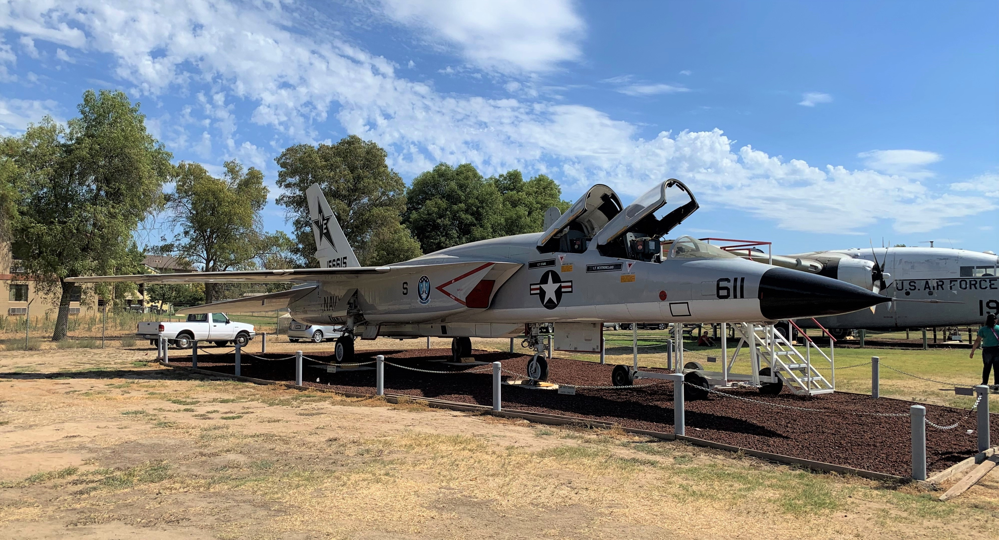

The carrier-based North American A-5 Vigilante was designed to execute nuclear strikes at twice the speed of sound. While advanced for its time, the introduction of submarine-based nuclear missiles brought an early end to the A-5’s career as a bomber. Afterwards, most Vigilantes (such as this one) were converted into RA-5C reconnaissance aircraft. 

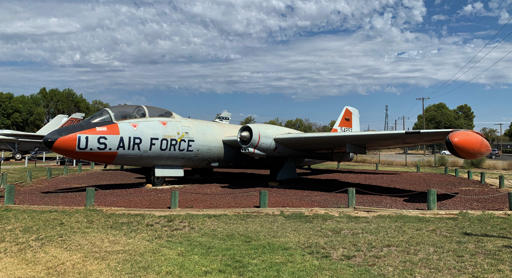

A license-produced English Electric Canberra light bomber, the Martin B-57 Canberra flew bombing and reconnaissance missions over Southeast Asia. Several highly modified B-57s are in service with NASA. 

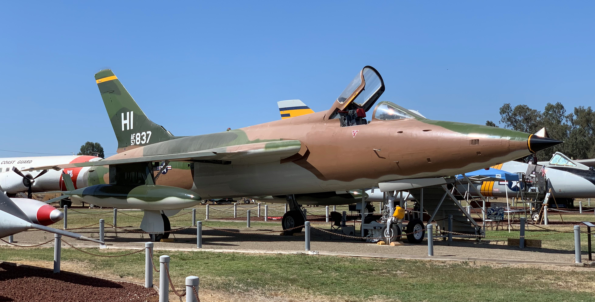

The largest single-seat aircraft in history, the supersonic Republic F-105 Thunderchief fighter-bomber carried out the most ground-attack missions during the Vietnam War. The aircraft on display is a F-105B.

The General Dynamics FB-111 Aardvark was the world’s first operational swing-wing aircraft and a bomber capable of flying high-speed nuclear missions into the Soviet Union. 

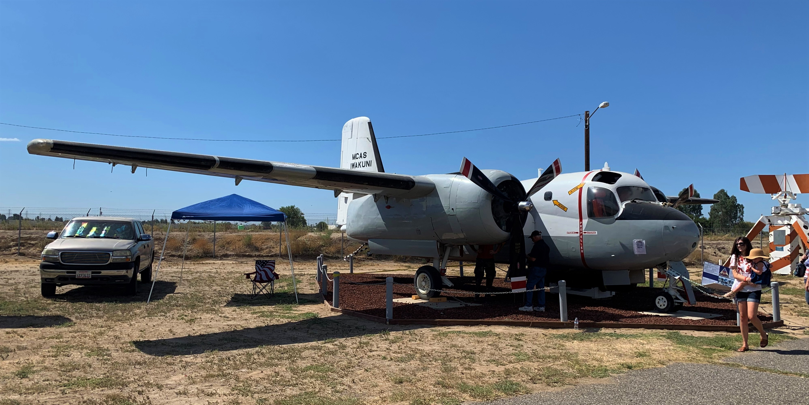

Designed to detect and destroy submarines, the Grumman S-2 Tracker combined the “hunter” and “killer” roles into a single platform. 

A derivative of the Grumman A-6 Intruder, the recently-retired Northrop-Grumman EA-6B Prowler was optimized for electronic warfare and played a key role in the First Gulf War. 

Unlike most helicopters, the Kaman HH-43 Huskie utilizes an intermeshing rotor configuration, negating the need for a tail rotor. The Huskie was well suited for firefighting and rescue operations. During the Vietnam War, the HH-43 flew missions to retrieve downed pilots. 

The tandem-rotor Boeing CH-47 Chinook has been flying since the early 1960s and is capable of quickly transporting heavy loads. 

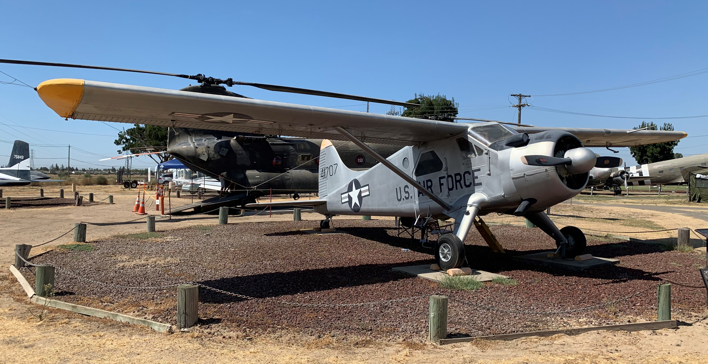

The de Havilland Canada DHC-2 Beaver, designated U-6A by the US Army, was used during Korea and Vietnam to transport passengers, evacuate patients, and conduct reconaissance.

A postwar trainer, the Beech T-34 Mentor is a derivative of the civilian Beechcraft Bonanza. 

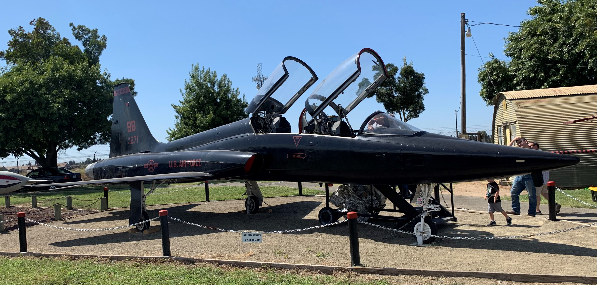

The world’s first supersonic trainer, the Northrop T-38 Talon has been training pilots for over half a century. 

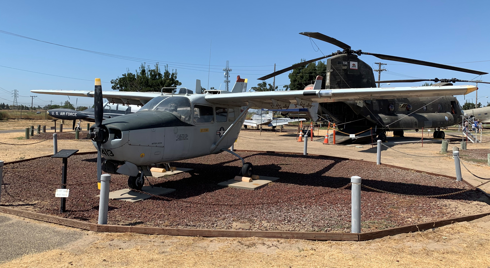

During the Vietnam War, the Cessna O-2 Super Skymaster served as forward air controllers, directing ground attack aircraft to their targets.  

Developed from the Cessna 310, the Cessna U-3A Blue Canoe is a light transport aircraft. 

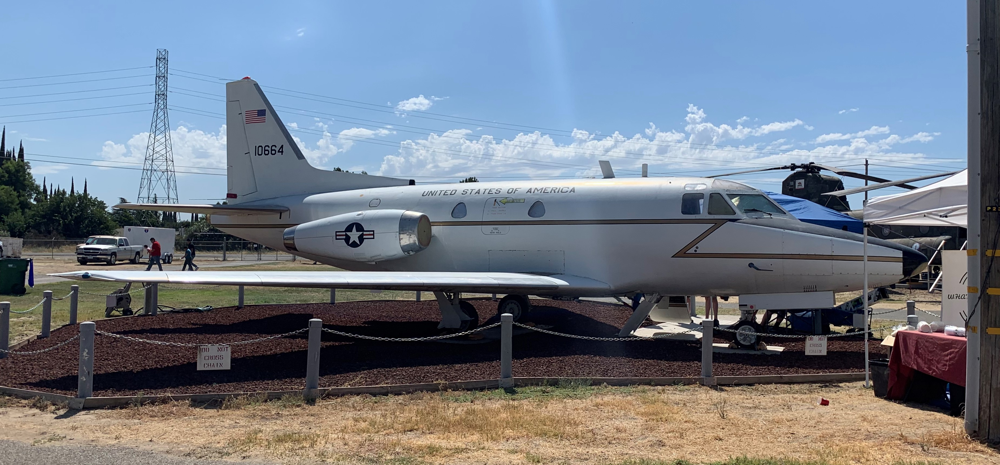

Somewhat resembling the F-86 Sabre fighter, the North American T-39 Sabreliner is the only business jet allowed to perform aerobatic maneuvers. 

A heavily modified Lockheed Super Constellation airliner, the Lockheed EC-121 Warning Star carried radar and other electronic equipment in search of external threats. The aircraft saw extensive action during the Vietnam War, collecting intelligence information and directing US fighters towards their targets. 

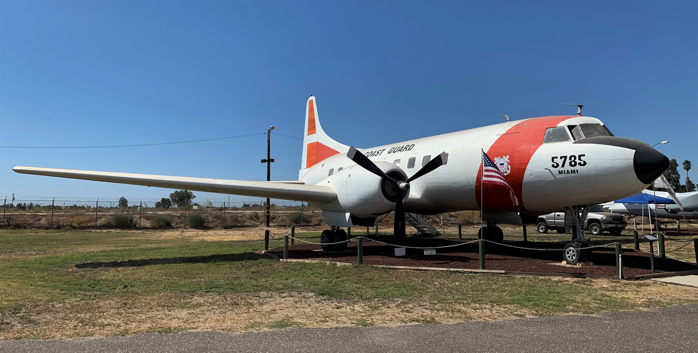

The Convair C-131 Samaritan was mainly used for executive transport and medical evacuations. The aircraft on display is a Coast Guard HC-131.

During the Korean War, the Fairchild C-119 Flying Boxcar delivered troops, supplies, and prefabricated bridges. Following the war, the aircraft was used to retrieve satellites and drones. 

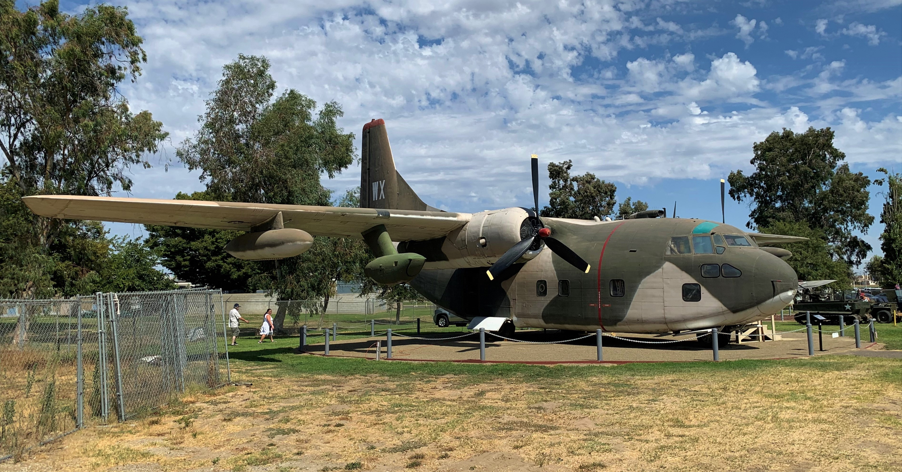

During the Vietnam War, the Fairchild C-123 Provider was used to spray Agent Orange. 

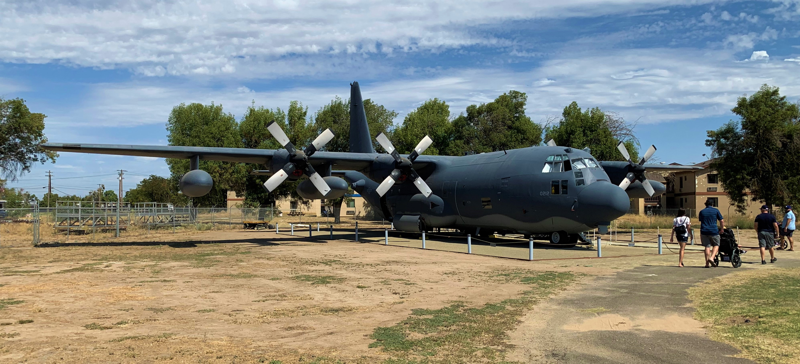

A ubiquitous transport aircraft, the Lockheed C-130 Hercules can be seen across the world flying a variety of missions. 

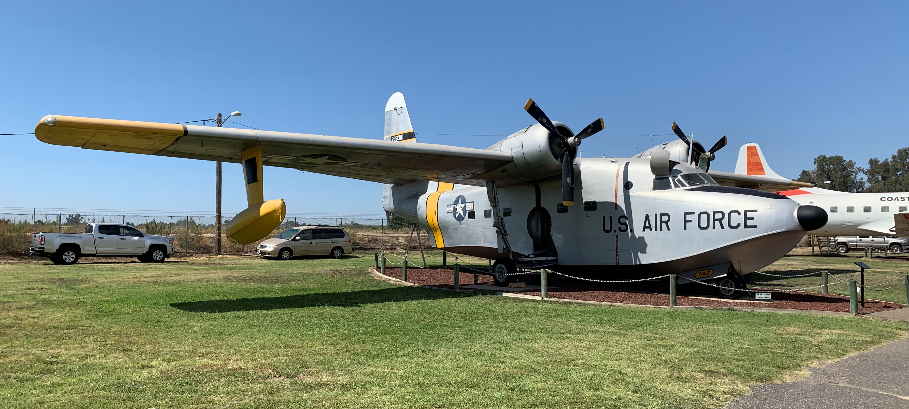

The Grumman HU-16 Albatross flying boat mainly flew search and rescue missions. Some were modified for antisubmarine warfare.

Known as the Tweet for the noise emitted by its engines, the Cessna T-37 is a trainer that was subsequently developed into the A-37 Dragonfly ground attack aircraft. 

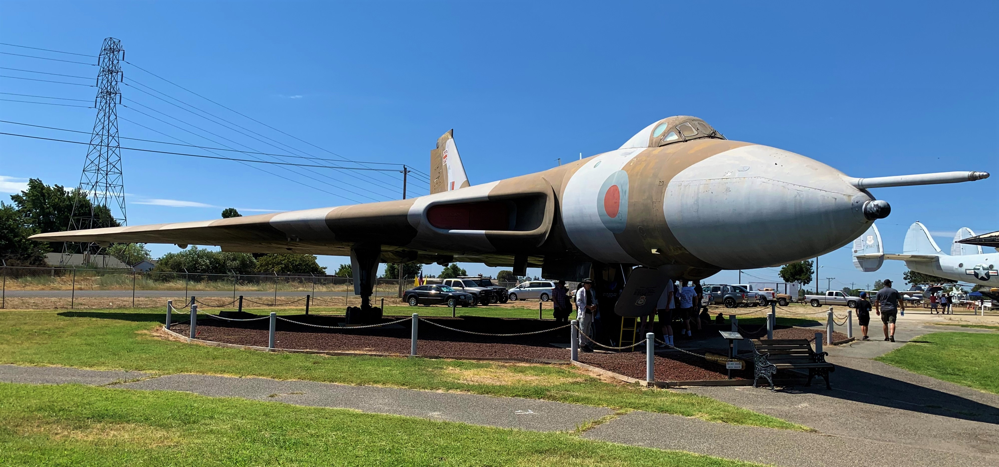

An airshow favorite due to the distinctive howl of its four Olympus engines, the Avro Vulcan was one of three British “V bombers” in service during the Cold War. Despite its massive size, the Vulcan’s delta wing provided remarkable high-altitude maneuverability. 

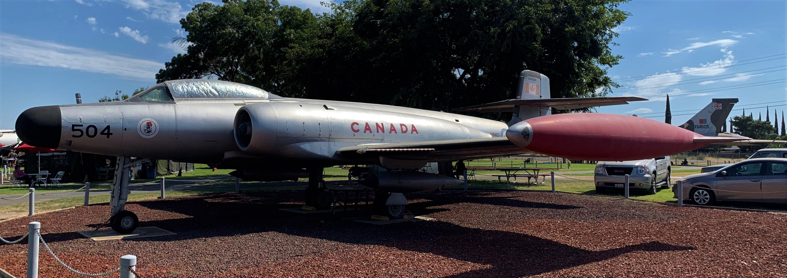

Canada’s first supersonic fighter, the Avro-Canada CF-100 Canuck flew air defense missions during the early Cold War years.  

The successor to the MiG-15, the Mikoyan-Gurevich MiG-17 offered significant improvements in high-speed stability. Assigned the reporting name “Fresco” by NATO intelligence, the MiG-17 was widely exported and saw action across the globe. 

Small, agile, and fast, the delta-winged Mikoyan-Gurevich MiG-21 remains the world’s most produced fighter aircraft. Like the MiG-17, the MiG-21 “Fishbed” was widely exported and flown in numerous Cold War conflicts. 

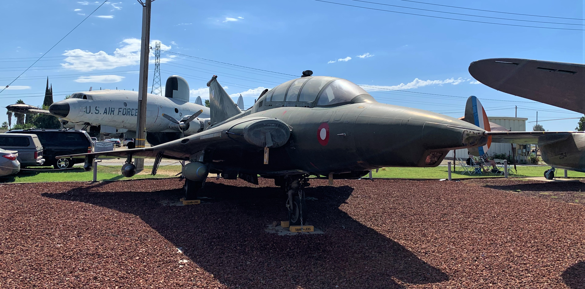

With its unique double-delta wing, the SAAB J35 Draken was one of Sweden’s premier Cold War fighters and fulfilled the air defense role for many European air forces. Through its advanced fire control and weaponry systems, the Draken remained formidable throughout the latter half of the twentieth century. 

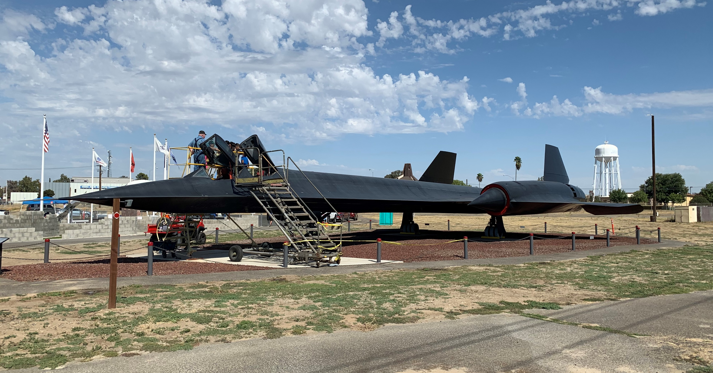

Capable of Mach 3 flight, the Lockheed SR-71 Blackbird flew high-altitude reconnaissance missions over the Soviet Union during the Cold War. 

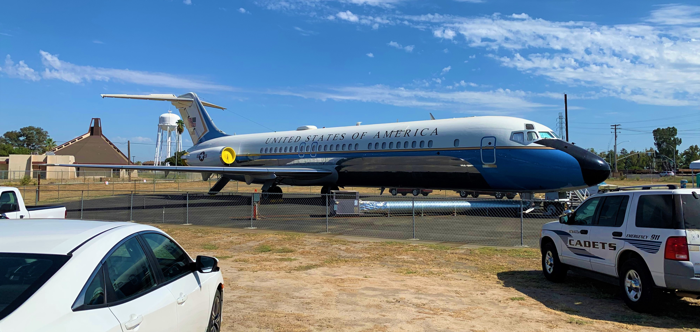

The McDonnell Douglas VC-9C on display served as a transport for several Presidents, First Ladies, and Cabinet members. 
