# Background

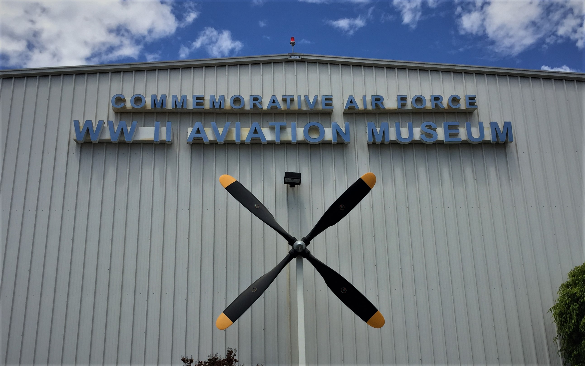

The Commemorative Air Force (CAF) is an organization devoted to restoring, operating, and maintaining historic aircraft. Their inventory of over 100 airworthy warbirds is distributed across a nationwide network of wings. 

I decided to check out the Southern California Wing ([CAF SoCal](https://www.cafsocal.com/)) after watching their aircraft perform during the 2017 Planes of Fame Airshow. They are based in Camarillo, a small town 50 miles east of Los Angeles. The CAF SoCal museum is located on the grounds of Camarillo Airport.

--- 

## CAF SoCal Aircraft

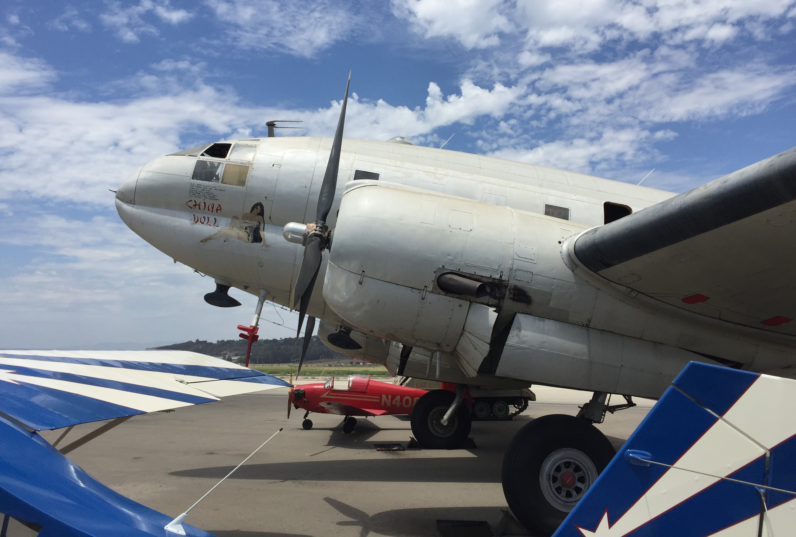

The **C-46 Commando** had its origins in Curtiss-Wright’s attempt at dominating the prewar air travel industry. During World War II, these aircraft flew supply missions over the Himalayas to support the Allied war effort. However the Commando’s reputation was tempered by midair accidents and technical difficulties. 

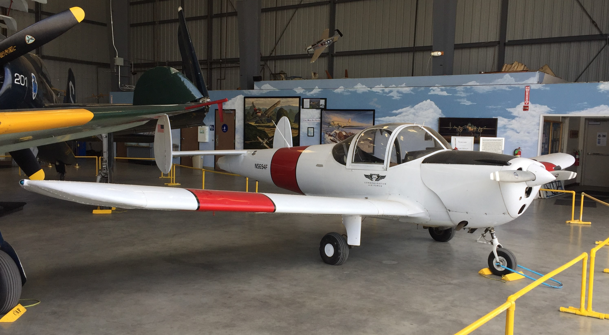

Seeking the best in safety and simplicity, the Engineering and Researching Corporation (ERCO) marketed the **Ercoupe** as the ideal plane for novice pilots.

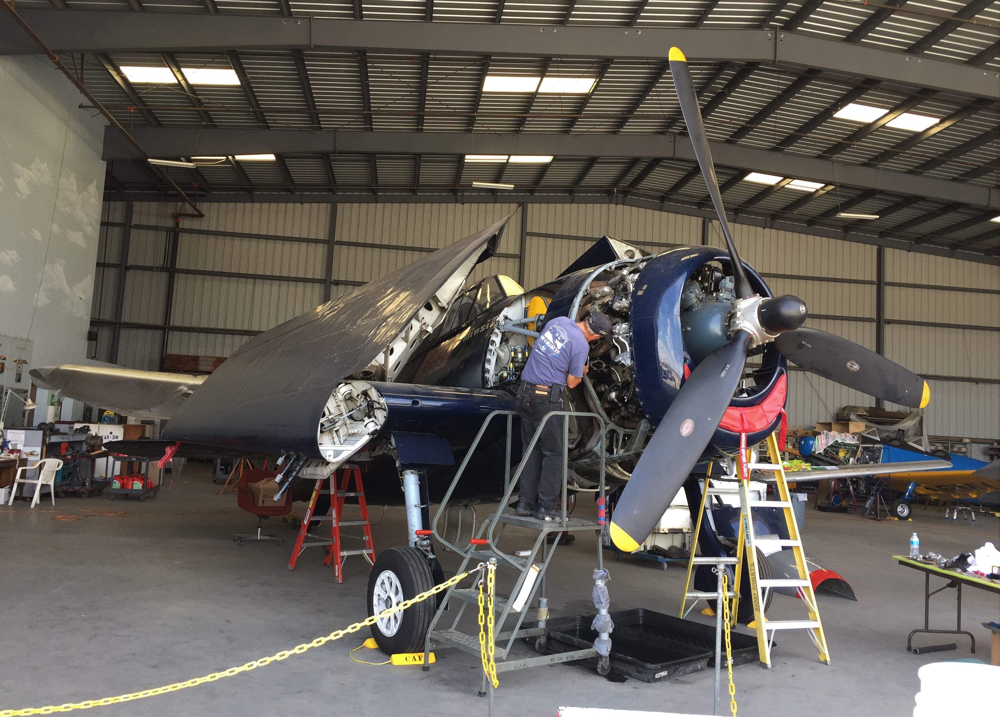

Making its combat debut in 1943, the **Grumman F6F Hellcat** supplanted the F4F Wildcat as the US Navy’s primary carrier-based fighter. During a series of engagements in the Battle of the Philippine Sea, Hellcats defending the Fifth Fleet inflicted lopsided losses against attacking aircraft. Ultimately the F6F amassed a 19:1 kill ratio and was credited with three-fourths of all aircraft shot down by US Navy pilots.  

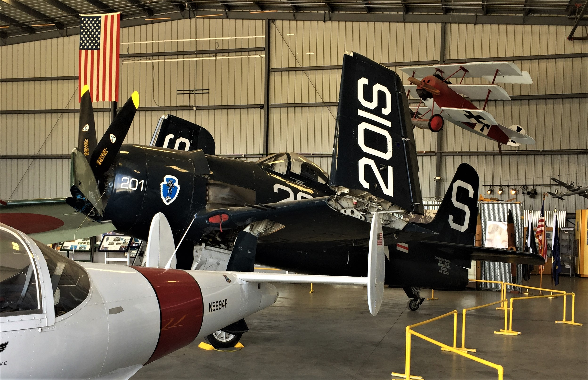

The successor to the Hellcat, the **Grumman F8F Bearcat** boasted excellent climbing and turning characteristics. The first F8F squadron became operational in the summer of 1945 but never saw combat. Postwar, the French later flew Bearcats in their ill-fated attempt to maintain control over Indochina. The aircraft remains popular today in the air racing community. 

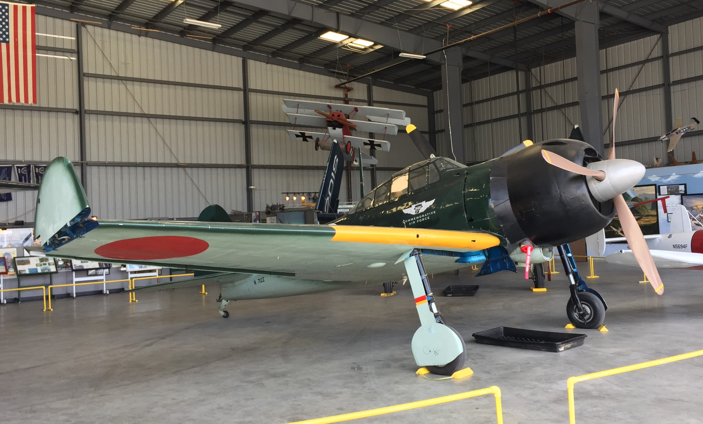

An integral component of Japan’s early war successes, the **Mitsubishi A6M Zero** could outclimb, outpace, and outturn its opponents. It’s remarkable maneuverability, however, came at a price. The aircraft was lightly armored and lacked self-sealing fuel tanks. As the war progressed, the Zero’s aura of invincibly was shattered by a combination of pilot attrition and the introduction of more powerful Allied fighters. Nevertheless the A6M remained a formidable opponent in the hands of a competent pilot. 

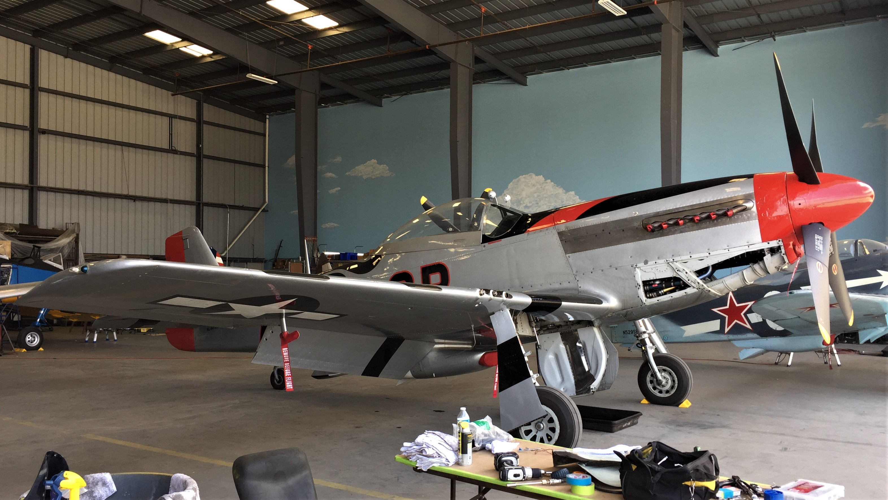

The introduction of the **North American P-51D Mustang** tilted the air war over Europe in favor of the Allies. For bomber crews, it was the long-sought escort fighter capable of providing coverage to and from Berlin. In 1944, P-51s contributed to the success of Operation Pointblank, which effectively crippled the Luftwaffe’s ability to resist the Normandy landings. After the war, many Mustangs were flown in air races.  

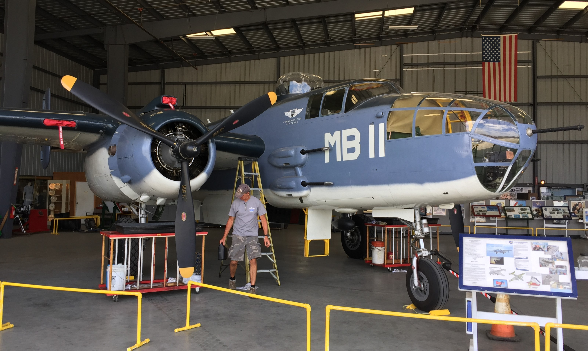

The U.S. Navy procured several **North American B-25 Mitchell** medium bombers and designated them as the PBJ. PBJs were sent to the Pacific where they flew antishipping missions and supported amphibious operations. 

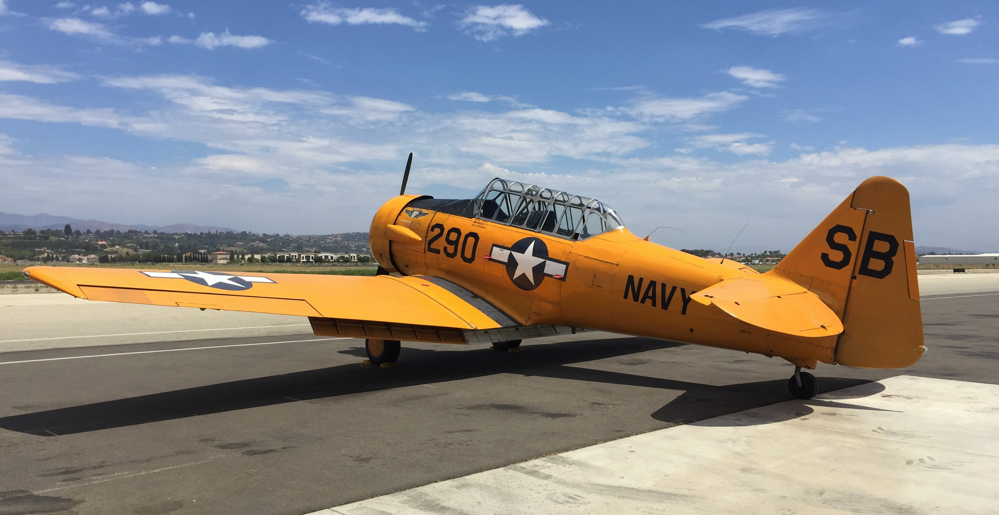

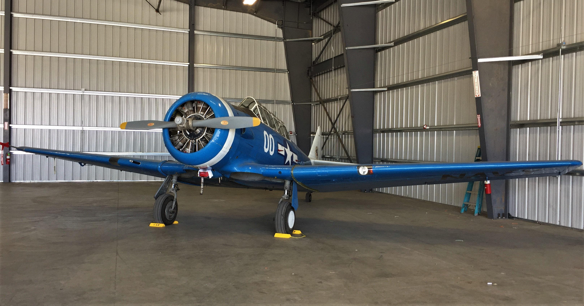

CAF SoCal operates two **North American Texan** trainers. Whereas the Army referred to these aircraft as the T-6, the Navy designated them as the SNJ.

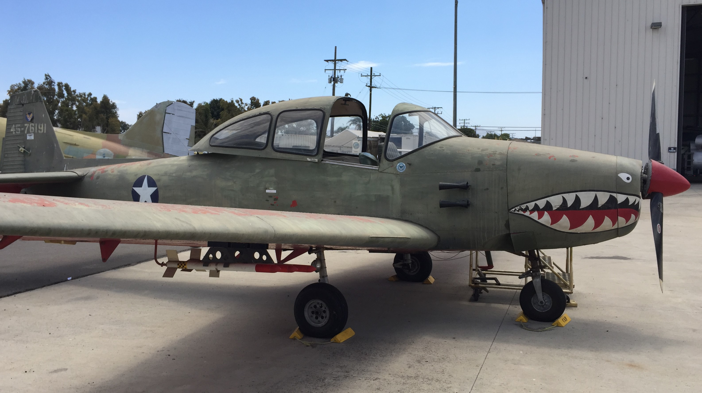

An icon of the immediate postwar era, the **North American Navion** incorporated design elements from the P-51 Mustang and found its way across a wide variety of civilian and military clients. 

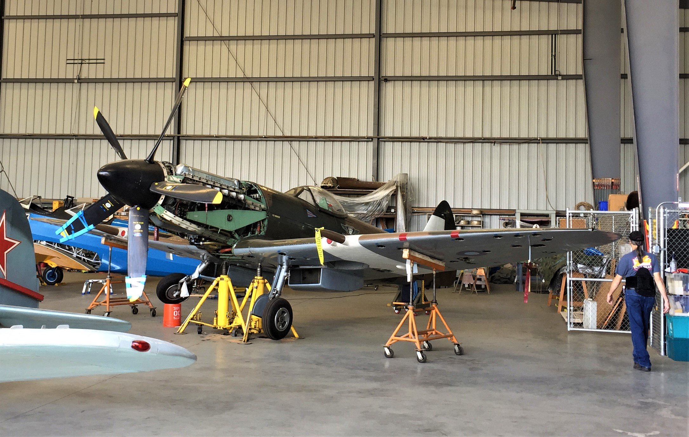

The **Supermarine Spitfire**, a design which first flew in 1936, was continuously upgraded throughout the Second World War to remain competitive against the latest Axis aircraft. CAF SoCal’s Spitfire is a Mk XIV variant. This type of Spitfire entered service in late in 1943 and was powered by the Rolls-Royce Griffon 65 engine. The Mk XIV’s excellent rate of climb and high-altitude performance allowed it to intercept V-1 flying bombs en route to London. The Spitfire Mk XIV was also the first aircraft to shoot down the new Messerschmitt Me-262 jet fighter.   

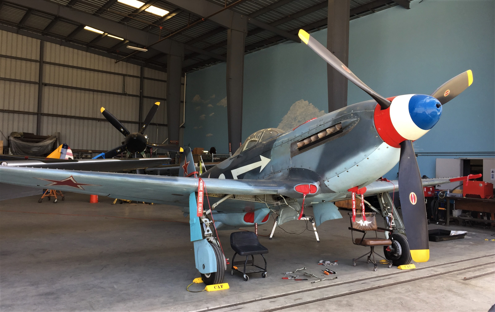

The small and lightweight **Yakovlev Yak-3** excelled at low-altitude dogfighting over the vast expanses of the Eastern Front. The Yak-3 made its combat debut in the summer of 1944, during which the Soviets launched Operation Bagration to push the Germans to the outskirts of Warsaw. At the turn of the millennium, a small quantity of Yak-3s were produced in Russia – one of which currently flies with CAF SoCal. 

--- 

### Other Developments

CAF SoCal is currently restoring a Republic P-47N Thunderbolt that was damaged in 2006. 

--- 

### More Information

The annual Wings Over Camarillo airshow is held every August at Camarillo Airport. Additionally, CAF SoCal aircraft are regularly seen at airshows all along the West Coast. An airshow schedule can be found on their website.  

The museum also hosts presentations related to their aircraft. 
