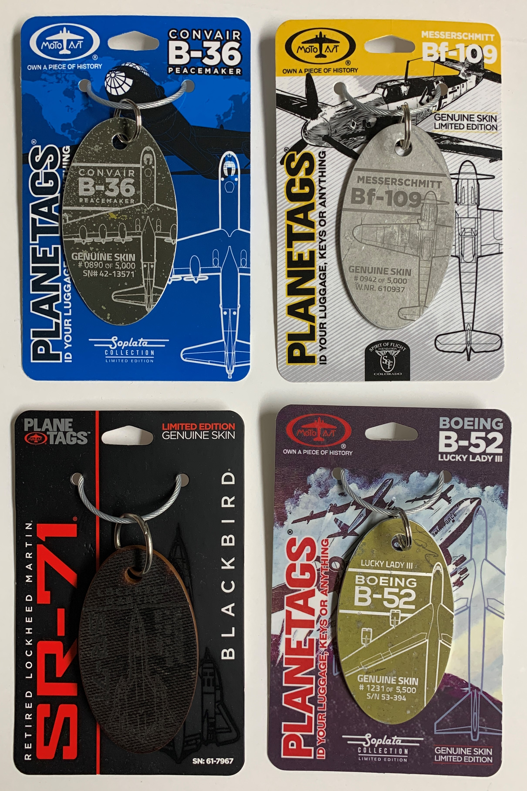
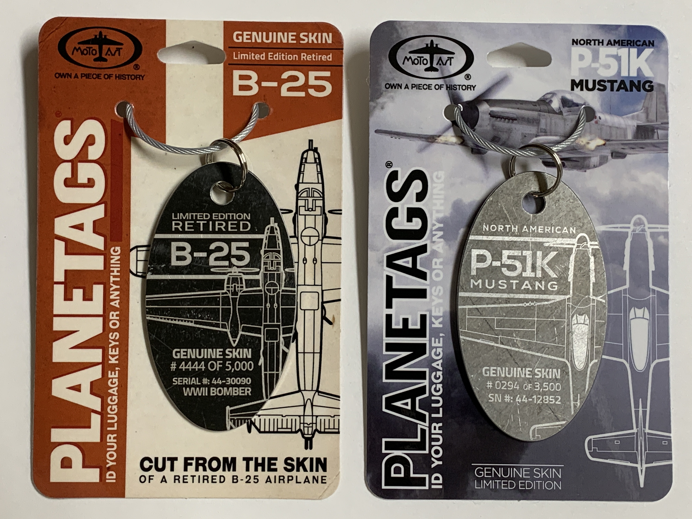
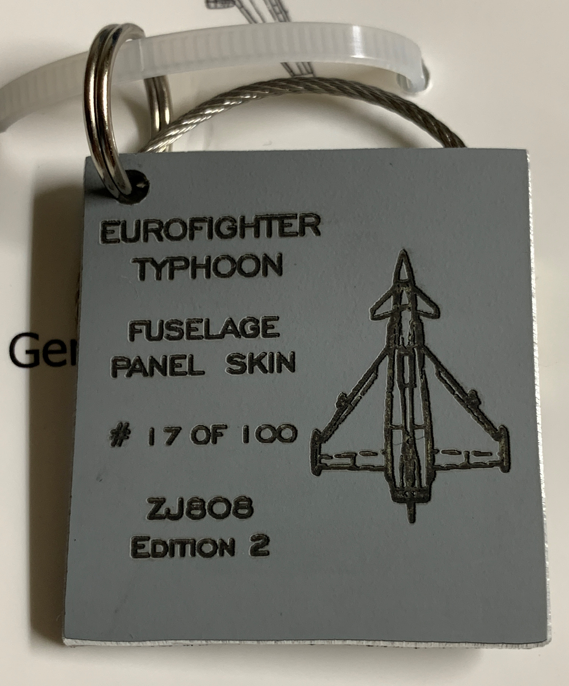

# Tagging Along

What happens when aircraft reach retirement? Some find their way to museums. Others might linger on for years in a desert boneyard. But most end up being scrapped. For a select few, however, there is new life in the form of fuselage tags. 

A newcomer to the world of collectibles, fuselage skin tags are an afforable way for aviation enthusiasts to own a small piece of a particular aircaft. Usually a seller would acquire sections of fuselage, cut out tags, and engrave them. These engravings typically showcase the aircraft model, its serial number, and the tag number. Depending on the location of the cut, a tag might be bare metal or painted in one or more colors. Certain color combinations are highly sought after by collectors and may fetch a high price in the aftermarket. The same goes for tags which have a limited run.

Fuselage tags exist from a wide variety of aircraft, ranging from WWII fighters to present day airliners. There are numerous tag manufacturers across the globe, which has contributed to the gradual growth of the hobby. 

I personally have purchased a few tags for myself. I tend to gravitate towards historic aircraft and there is a plentiful selection of those tags to come around. I made my first purchase in August 2020 with PlaneTags. Based in Southern California, they are perhaps the largest producer of fuselage tags in the Western Hemisphere and carry a wide inventory. In the months since, I have also purchased from vendors in the United Kingdom and Poland. 

I currently display my tags in a binder. I place my tags into four-pocket, 3.5" x 5" photo protectors. The tags slide in easily and are kept safe and organized. 

## List of Tag Vendors 

https://www.aviationtag.com  
https://www.jet-eyes.com  
https://flightinspiration.com  
https://planetags.com 
https://www.skyart.com   
https://www.relicdesignco.com/ 
