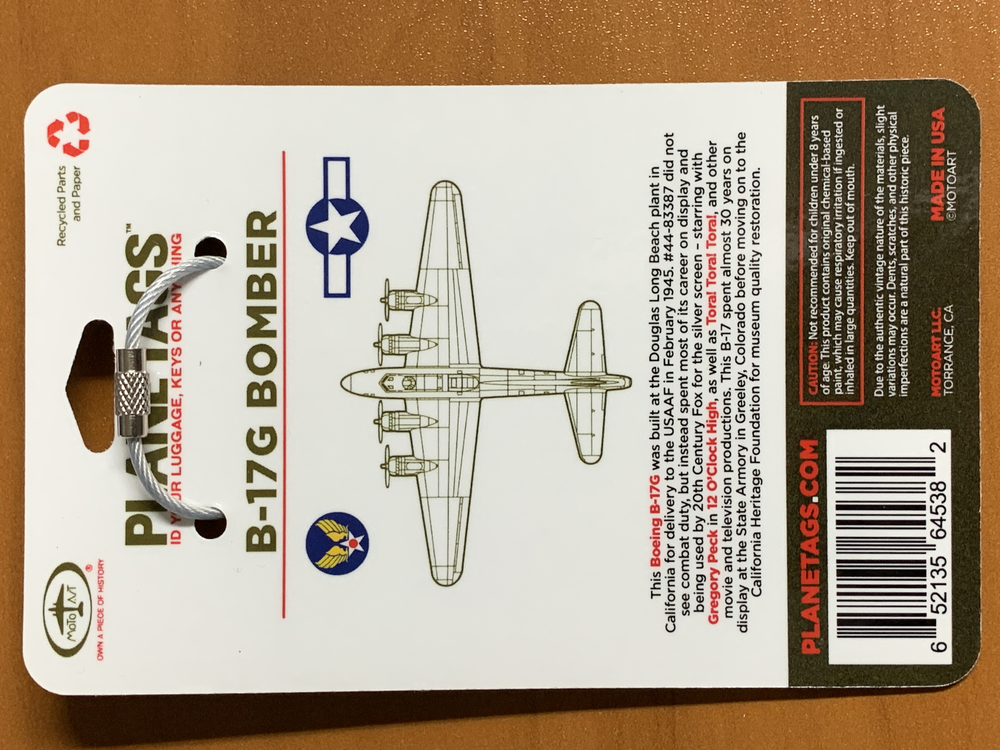

# A Fortress Find

In March 2020, I was notified that a MotoArt B-17 Flying Fortress PlaneTag, which had been offsale for a very long time, was suddenly available for purchase. I had been longing for a B-17 to augment the rest of the World War II aircraft tags in my collection. For context, MotoArt has released two B-17 PlaneTags, one from 44-83575 (better known as Nine-O-Nine) and another from 44-83387. The March rerelease was for the latter aircraft, which never flew in combat but has made appearances in various films. I knew this was a now-or-never chance to obtain a highly sought-after piece of aviation history so I went ahead and placed an order. 

Browsing various social media platforms, I spotted various images of the tags from those who purchased them earlier. I wasn't sure what the appearance of my tag would be, which adds to the anticipation and excitement. Just two weeks later, my tag arrived in a small padded envelope. I first noticed that the tag was very thin, easily the thinnest of any tag I own. The laser etching on the face was somewhat difficult to read unless oriented at a certain angle. However, I was very impressed by the tag's coloring, in particular the presence of two shades of olive green. Additionally, the silver base had a very interesting speckled texture, which contrasts nicely against the smooth, green paint.

In short, I am quite satisfied with the latest addition to my tag collection. The B-17 Flying Fortress played an instrumental role during World War II and to own even a small fragment of one is priceless. 
