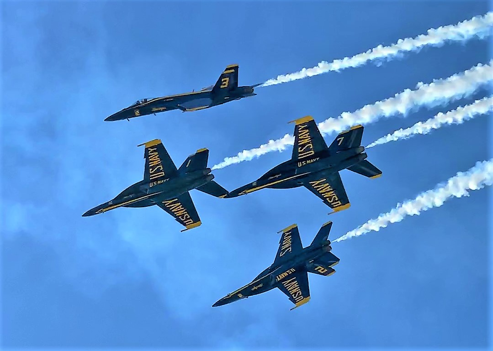

# A Tale of Two Airshows - A Recap of the 2021 Airshow Season

After two years of cancellations and postponements, I was finally able to take in the sights and sounds of not one, but two amazing airshows. I first attended the California Capital Airshow and a week later, traveled down south for the Pacific Airshow.  

--- 

## California Capital Airshow (September 24-26)

Taking place at Mather Airport, just a short drive northeast from Sacramento, the California Capital Airshow treated its audience to spectacular demonstrations from a wide variety of aircraft. 

I arrived a few hours before the flying was scheduled to begin so I first checked out the static diplays. While there seemed to be fewer exhibitors than normal, there were still plenty of aircraft to explore. A Boeing KC-135 Stratotanker, Boeing C-17 Globemaster III, and Lockheed C-5M Super Galaxy from nearby Travis Air Force Base were present and open for visitors to enter and interact with the crew. My personal highlight was being able to descend into the boom operator station on the Stratotanker and hear stories about midair refueling.  

The performer list was jam-packed with military airpower. The F-35A, F-35C, and F/A-18E demo teams each performed a series of maneuvers demonstrating their aircraft's speed, agility, and power. The USAF Thunderbirds and RCAF Snowbirds teams dazzled with precise formation flying. Warbird fans were treated with multiple passes from a F4U Corsair and F8F Bearcat, both owned and operated by the Planes of Fame Museum in Chino, California. My personal favorite was watching the legendary U-2 spyplane roar down the runway and perform a high-angle climb. I was not expecting the legendary Cold War icon to be so loud during takeoff but during passes it was much quieter. 

Not to be overshadowed was the Red Bull Air Force, which left the crowd in awe with a specialized Bo 105 helicopter capable of flips, rolls, and inverted flights. 

## Pacific Airshow (October 1-3)

Centered over the Huntington Beach waterfront, the Pacific Airshow combined a sunny day at the beach with thrilling air displays. 

The event was highlighted by a rare trifecta of the USN Blue Angels, USAF Thunderbirds, and RCAF Snowbirds. Having caught both the Thunderbirds and Snowbirds the week prior, I was very much looking forward to seeing them again. This was also my first time watching the Blue Angels since their transition from the F/A-18C Hornet to the larger and more powerful F/A-18E Super Hornet. The pilots were still able to pull off their signature formations with minimal wingtip-to-wingtip separation but the newer Super Hornets were much louder which enchanced several features of the show, most notably the sneak pass. 

Several intriguing aircraft took part in the airshow. One was the Yak-110, a highly aerobatic machine created using the fuselages of two Yak-55s with an additional turbojet engine mounted in the center. Another was a McDonnell Douglas MD-10 convered into the Orbis Flying Eye Hospital. The aircraft is used to train doctors and treat patients across the globe. 

### Final Thoughts
After a difficult 2020, it was great to see airshows make a return and performers take the skies once again. At Sacramento, I enjoyed being able to tour the static exhibits and observe aircraft taking off on the runway. At Huntington Beach, I felt much closer to the action and enjoyed the offshore breeze. Both the California Capital Airshow and Pacific Airshow had their own strengths. Both were also excellent events and I look forward to returning in the future.