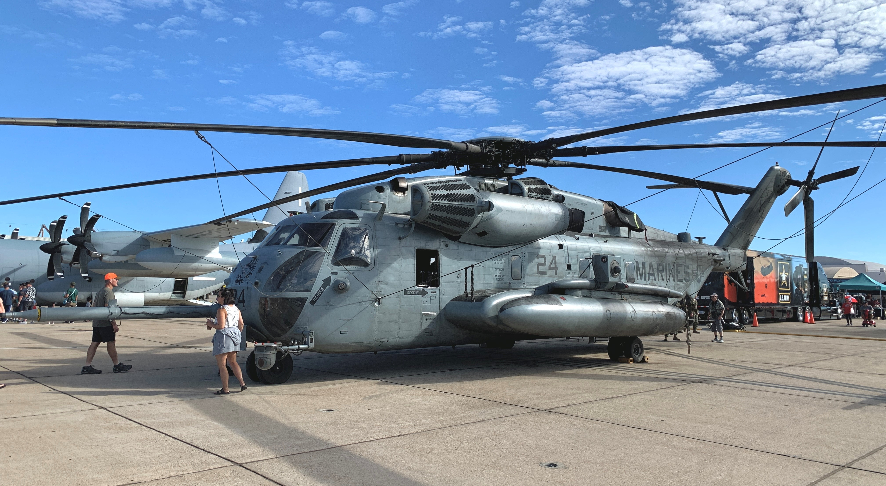

# Full Throttle: The 2022 West Coast Airshow Season

2022 marked a return towards normalcy as the airshow industry continued its recovery following two years of pandemic-related disruption. I was able to attend a total of six airshows in California and Nevada, which are summarized in further detail below: 

--- 

## Wings Over Solano (May 14-15)

Most of the airshows in California occur during the fall but a few do take place earlier in the spring. The first airshow I attended in 2022 was Wings Over Solano at Travis Air Force Base. Travis, located between San Francisco and Sacramento, is nicknamed the “Gateway to the Pacific” and functions as a hub for transport and refueling aircraft such as the C-5 Galaxy, C-17 Globemaster III, and KC-10 Extender. There were numerous aircraft on static display, such as the KC-46 Pegasus, the Air Force’s newest refueling and transport aircraft. Both the F-35 Lightning II and F-16 Viper demo teams were present at the airshow and took part in a spectacular Heritage Flight with a P-38 Lightning and P-51 Mustang. Three Travis-based aircraft, a C-5, C-17, and KC-10 took part in a ground parade before taking to the skies for an aerial flyover. The show was headlined by the Patriots Jet Team, who fly six Czech-made L-39 Albatros trainers. The Patriots are an all-civilian team although many of its pilots have prior experience with other aerial demonstration teams. The true highlight of the show was the appearance of a B-2 Spirit and B-1 Lancer. The two strategic bombers flew in from elsewhere and made a few passes over show center. This was my first time seeing either aircraft and it is rare to see both flying at the same event. Even at low speeds, I could hear and feel the deafening crackle of the B-1’s four engines. The B-2, one of only 21 built, was much smaller and quieter but nonetheless extremely impressive. 

## MCAS Miramar Airshow (September 23-25)

Marine Corps Air Station Miramar, located just north of San Diego, is known as “Fightertown USA” due to the base serving as the original home of the US Navy TOPGUN program. A few scenes from the iconic Top Gun movie were also filmed at the base. This airshow is best known for its Marine Air-Ground Task Force (MAGTF) combined arms demonstration featuring various aircraft, helicopters, and ground vehicles. Miramar is one of a few airshows with an F-35B flight demonstration. The F-35B variant is capable of hovering and vertical takeoff/landing. The F-22 Raptor demo team also participated at the airshow and put together a terrific performance highlighting the aircraft’s power and maneuverability. In addition to a packed flying schedule, attendees had plenty of static aircraft to visit. One of the aircraft on display was “Doc”, one of only two flying Boeing B-29 Superfortress bombers in the world. There were also all three F-35 variants lined together, which attracted a large crowd wanting a closer look at the fifth-generation fighters. The airshow was headlined by the US Navy Blue Angels, who were into their second season with the Boeing F/A-18 Super Hornet. 

## Pacific Airshow (September 30-October 2)

This is personally one of my favorite airshows because of its location along the sandy coast of Huntington Beach. The heat is never a concern and there is always a good view no matter where you sit.  There is minimal downtime between acts and the airshow being simulcast on Hulu speaks to how much effort went into producing a world-class event. The secret for this airshow is to find seating along the flight path, usually left of show center, used by aircraft entering the aerobatic box. Another strength of this event was a flight schedule loaded with a variety of civilian and military performers. One of the more unique performers was the Opener Blackfly, an electric vertical takeoff or landing (eVTOL) aircraft set to enter the consumer market soon. This personal vehicle seats one pilot and has many user-friendly functions such as automatic landing. A massive B-52 Stratofortress strategic bomber from Edwards Air Force Base also made a few passes over the shoreline, its eight engines producing a distinct, high-pitched whine. Additionally, there was a Tailhook Legacy Flight which featured current and historic naval aircraft. The 2022 formation included an F/A-18 Super Hornet, F-35C Lightning II, and T-2 Buckeye.  
 
## California Capital Airshow (September 30-October 2)

Taking place a short drive northeast from Sacramento, the 2022 California Capital Airshow featured an all-military lineup. The California Department of Forestry and Fire Protection (CAL FIRE) had several aircraft on display, including the OV-10 Bronco and S-2 Tracker. Multiple World War II aircraft such as the P-47, P-40, and P-38 were on display and later took to the skies for some passes. This airshow featured a water drop demonstration from a C-130 Hercules equipped with the Modular Airborne Fire Fighting System (MAFFS). Although there is no longer an official F-15 Eagle demo team, an F-15 Eagle did take to the skies for a brief flight display. The EA-18G Growler demo team was also present and in addition to their normal routine, the Growlers participated in a legacy flight with an F4U Corsair.

## Aerospace Valley Airshow (October 14-16)

After a thirteen-year hiatus, Edwards Air Force Base opens its gates to an airshow. Edwards is located in a section of California known as “Aerospace Valley” due to the multiple aerospace companies and testing facilities located in the area, which includes Palmdale, Lancaster, and Inyokern. The skies over this area of the Mojave Desert are etched with accomplishments of past aviators and continue to bear witness to the latest and greatest advancements. One of them occurred seventy-five years ago when Chuck Yeager became the first pilot to break the sound barrier in level flight. Today Edwards Air Force Base remains the only location in the United States where airshow attendees can experience a sonic boom. In fact, I counted six sonic booms over the course of two days. Edwards Air Force base also serves as a major flight testing center and is home to the NASA Armstrong Flight Research Center. Many unique and notable aircraft were on display such as the X-62 VISTA. Three NASA aircraft (F-15, F/A-18, Gulfstream III) flew during the airshow, with the F-15 and F-18 each performing a sonic boom. The F/A-18 broke the sound barrier while inverted, producing a much quieter sonic boom. Perhaps the biggest attraction at the Aerospace Valley Airshow was SOFIA, a Boeing 747 modified to carry an infrared telescope. SOFIA made its only airshow appearance at Edwards and in addition to flying over the crowd, was also open for public viewing. I enjoyed the airshow immensely and am looking forward towards the next one.  

## Aviation Nation (November 4-6)

Aviation Nation occurs every other year at Nellis Air Force Base, located not too far away from the famous Las Vegas strip. Nellis plays a vital role in aerial combat training and regularly hosts a multinational training exercise known as Red Flag. The base is home to aggressor F-16s and F-35s sporting paint schemes similar to those applied on Russian and Chinese fighters. Aviation Nation is highly regarded as one of the best airshows in the United States and the 2022 edition aced both the exhibits and the flying demonstrations. Some of the aircraft on display included the A-10, F-22, F-35, B-1, and AH-64. There were also plenty of booths to purchase merchandise and souvenirs. One of the more unique items to gaze upon was a Russian 9K33 Osa surface-to-air missile vehicle. Attendees could also pick up and hold a variety of both American and Russian firearms. Looking upwards, spectators were treated to displays from the F-22, F-35, F/A-18, and EA-18G demo teams. The crown jewel of Aviation Nation is the combined arms demonstration, which is an immersive airfield defense, ground attack, and rescue simulation. The skies were filled with the roar as F-35s and F-22s clashed with aggressor F-16s, clearing the path for airstrikes by F-15Es and A-10s. The pyrotechnics were superb and the use of flares awed the crowd. The event concluded with the season finale performance of the Thunderbirds, who are based at Nellis. Aviation Nation is a highly rated airshow and an absolute must-see. 

--- 
### Final Thoughts

From the vast expanse of Rogers Dry Lake to the cozy coastline of Huntington Beach, last year’s airshows were spectacular, breathtaking, and memorable. No matter how many times I observed the same demo flight routine or aerial demonstration performance, it always felt like I was seeing it for the first time ever. With a new airshow season around the corner, I look forward to what surprises 2023 has in store. 