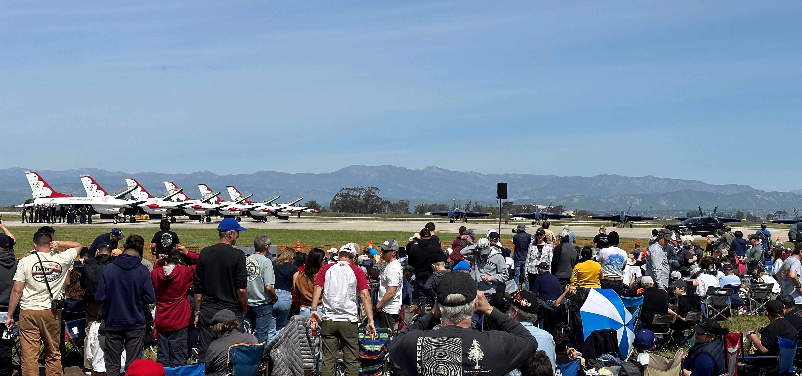
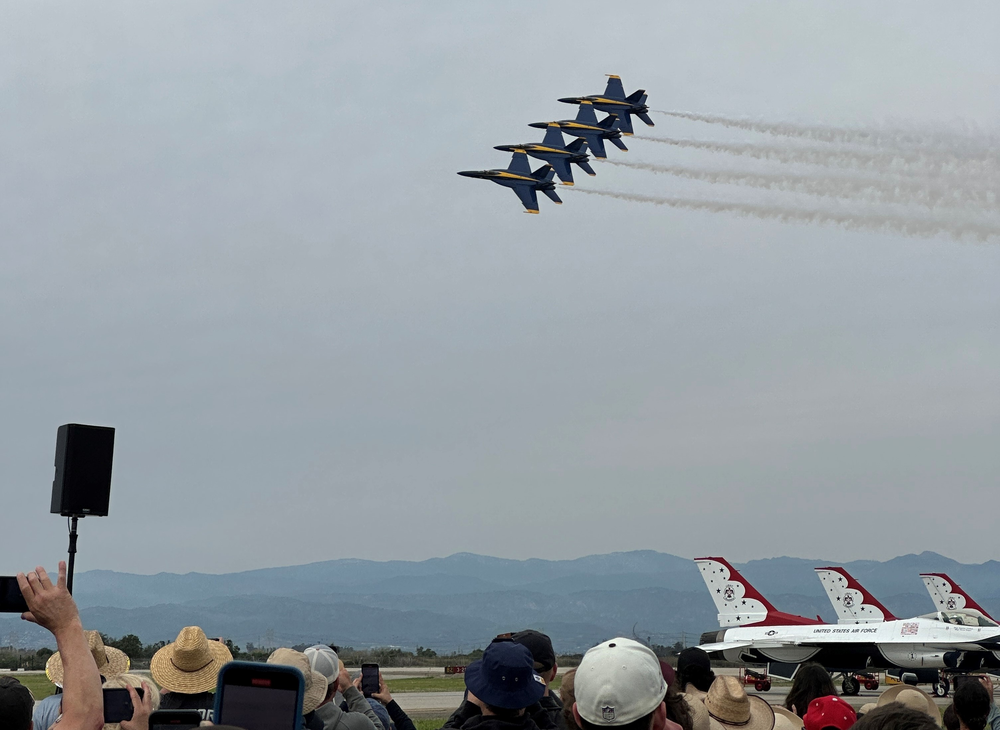

# 2023 Point Mugu Air Show Recap 

Taking place at Naval Base Ventura County (NVBC) along the Southern California coast, the 2023 Point Mugu Air Show was open to the public on March 18 and 19. This was the first air show at NVBC since 2015 and it certainly attracted a massive crowd. I attended the air show on both Saturday and Sunday. With five hours of flying performances and plenty of unique aircraft on display, there was a lot to take in and I found myself not wanting to leave. 

The weather definitely was a factor in this year's airshow. Saturday was very pleasant and drew a much larger audience, resulting in lengthy hour-long waits to enter the premises. By contrast, spectators at the Sunday air show had to contend with the cold, wind, and rain. The security line was almost non-existent when I arrived in the morning but the crowd gradually increased in size as the day went on. 

Below are brief descriptions of just a few of the performers and displays at the air show: 

## National Anthem Flyover

The airshow opened with the singing of the Star Spangled Banner accompanied by a three-ship helicopter flyover. All three helcopters were operated by an all-female crew as the Navy commemorated fifty years of 

## Pacific War Reenactment

The Commemorative Air Force’s Southern California Wing, located in nearby Camarillo, choreographed a mock Pacific Theater air battle with their North American PBJ Mitchell, Grumman F6F Hellcat, and Mitsubishi A6M Zero. 

## Co-Headliner Jet Teams

Attendees were treated to performances by both the US Air Force Thunderbirds and US Navy Blue Angels. Both teams recently concluded their winter training in California. The Blue Angels had just begun their 2023 season a week earlier whereas the Thunderbirds opened their schedule at Point Mugu. 
 
## E-2D Advanced Hawkeye

The Northrop Grumman E-2D Advanced Hawkeye is a carrier-based airborne early warning aircraft. The Hawkeye’s most distinguishing feature is its rotating radome, which allows the crew to collect and analyze data.

## Lockheed P-3 Orion

Based on the Lockheed L-188 Electra airliner, the P-3 Orion is a maritime patrol aircraft with anti-submarine capabilities. It entered service in the early 1960s and is gradually being phased out by the Boeing P-8 Poseidon. This P-3 belongs to Air Test and Evaluation Squadron 30 (VX-30) based at Point Mugu.

## Boeing F/A-18E/F Super Hornet

The Super Hornet, nicknamed “Rhino”, is the frontline fighter of the US Navy. It succeeded the similar looking but smaller F/A-18 A-D models, now referred to as “legacy Hornets”. In addition to the Super Hornets being flown by the Blue Angels, there were several lined up on static display. Several of the Super Hornets present belonged to VX-31 “Dust Devils” and VX-9 “Vampires”. Both squadrons are based at aval Air Weapons Station China Lake. The Super Hornet which attracted the most attention was F/A-18F 166673, which was recently painted in the “Black Bunny” scheme.

## McDonnell Douglas AV-8B Harrier II

Capable of vertical takeoff or landing, the Harrier II has a distinguished service history with the United States Marine Corps and is in the twilight of its career. 

## ATAC IAI Kfir

Airborne Tactical Advantage Company (ATAC) owns a fleet of decommissioned fighters which now serve as adversary trainers. The IAI Kfir, an Israeli fighter based on the French Dassault Mirage V, is one of a multitude of aircraft types currently flown by ATAC. 

## Eurocopter MH-65 Dolphin

Developed from the French Eurocopter AS365 Dauphin, the MH-65 Dolphin is primarily flown by the United States Coast Guard. In addition to being on display, the MH-65 performed a simulated search and rescue. The demonstration allowed the Dolphin to showcase its excellent speed and maneuverability. 