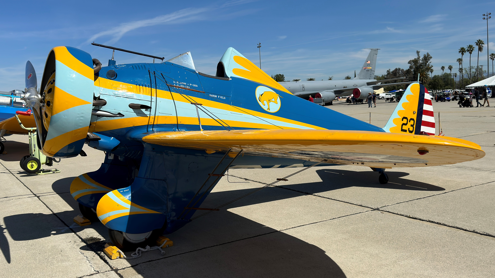
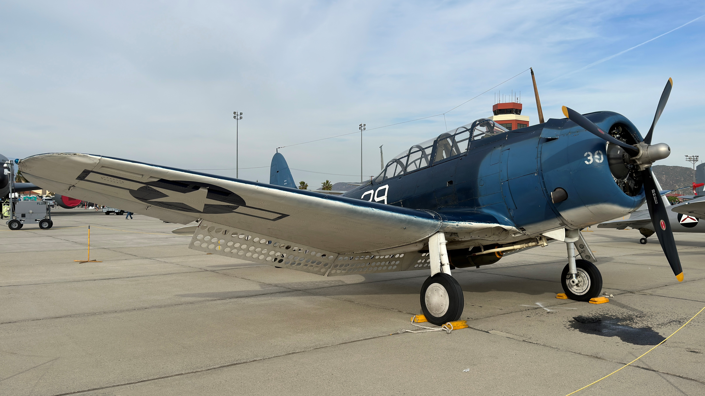
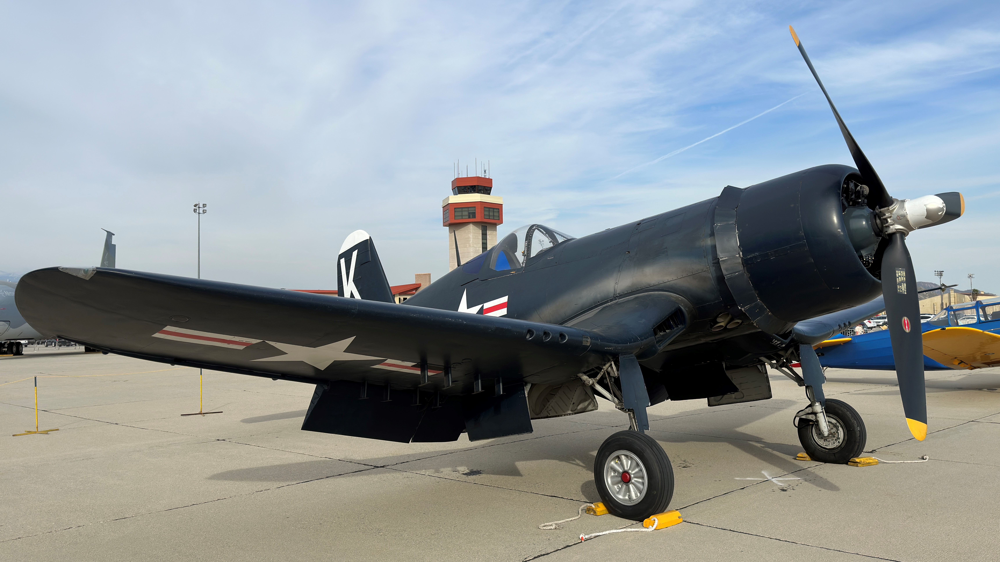
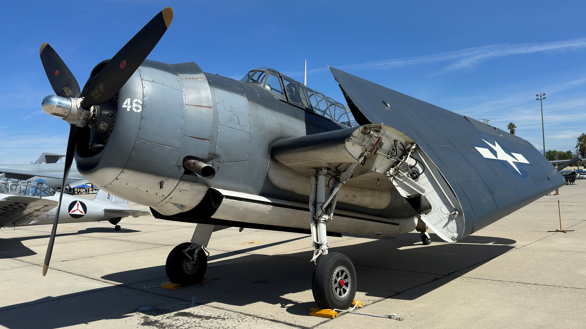
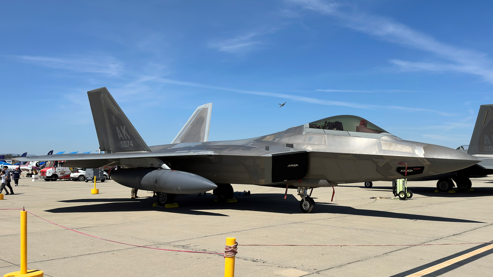
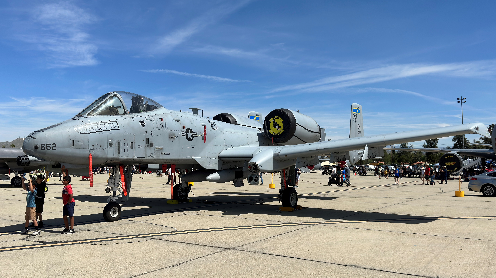
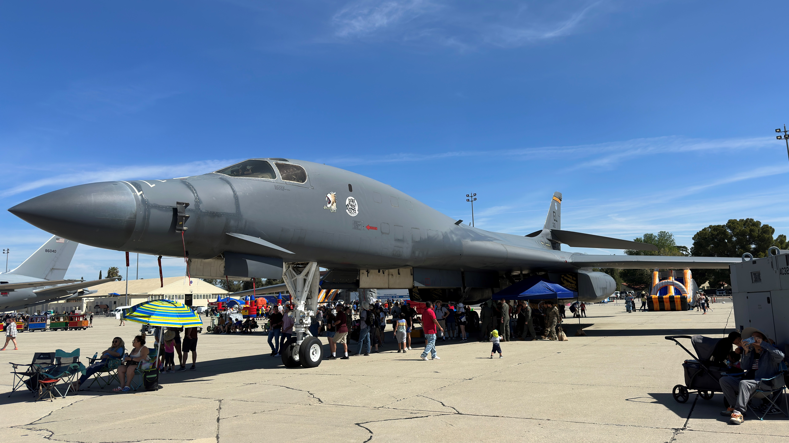

# 2023 Southern California Air Show Static Displays 

The 2023 Southern California Air Show took place at March Air Reserve Base in Riverside, California from April 22-23. I attended the first day of the show and found it to be a mixed bag. Despite arriving prior to the gates opening, we waited in stop-and-go traffic for over an hour due to the lack of enforcement. Most of the flight line was also obscured by premium seating, making it difficult to see aircraft at times. Despite these challenges, I still enjoyed the event due to the exceptional static displays.  

Below are fifteen aircraft which were present at March Air Reserve Base: 

## Boeing P-26 Peashooter

The world's only airworthy P-26, this 1930s vintage fighter is operated by the Planes of Fame Museum.

## Douglas SBD Dauntless

Another Planes of Fame aircraft, this Dauntless dive bomber is a combat veteran of the Pacific War.  

## Vought F4U Corsair

Like the Dauntless on display, this F4U Corsair also saw action in the Pacific and is flown by the Planes of Fame Museum. 

## Grumman TBF Avenger

The Avenger is a torpedo bomber which was used extensively in the Pacific and to a lesser extent in the Atlantic. This aircraft is operated by the Planes of Fame Museum but did not see combat.

## North American F-86 Sabre

The F-86 Sabre was the primary United States fighter during the Korean War. This aircraft is operated by the Planes of Fame Museum.

## Mikoyan Guverich MiG-15

Flown by Soviet, Chinese, and North Korean pilots during the Korean War, the MiG-15 was the main adversary of the F-86 Sabre. This aircraft is operated by the Planes of Fame Museum.

## Boeing KC-46 Pegasus

The KC-46 Pegasus is the newest aerial refueling aircraft in the USAF inventory. 

## Boeing B-52 Stratofortress

The B-52 Stratofortress has been in active service since the 1950s. This particular B-52 had flown in from Edwards AFB. 

## Lockheed Martin F-22 Raptor

Two Alaska-based F-22 Raptors were present at the airshow. 

## McDonnell Douglas F-15 Eagle

This F-15 from the CA ANG 144th Fighter Wing is painted in a commemorative paint scheme and has flown over 10,000 flight hours. 

## Lockheed Martin F-35 Lightning II

Many of the F-35s on static display belonged to newly-activated units from MCAS Miramar in San Diego. 

## Lockheed Martin F-16 Fighting Falcon

This F-16 from Luke AFB is painted in a heritage scheme to match those of a World War II P-47 Thunderbolt. 

## Fairchild Republic A-10 Thunderbolt II

This A-10 had flown in from Davis-Monthan AFB in Arizona. Another A-10 made a few passes around the flight line during the airshow.  

## Rockwell B-1B Lancer

The B-1B is the only Air Force bomber capable of supersonic flight. 86-0113 "Jagged Edge" is based at Ellsworth AFB in South Dakota. A second B-1B arrived during the middle of the airshow. 

## Boeing KC-135 Stratotanker

The KC-135 is the oldest yet most numerous aerial tanker in service. 