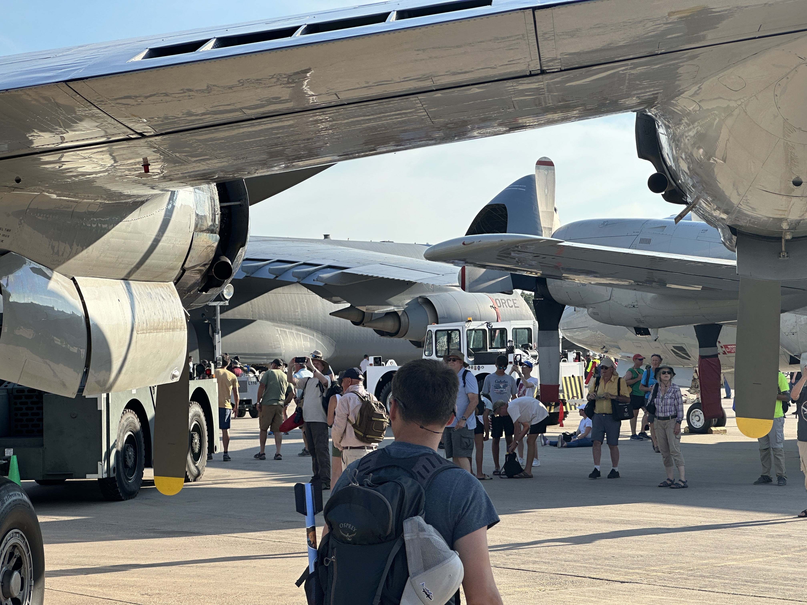
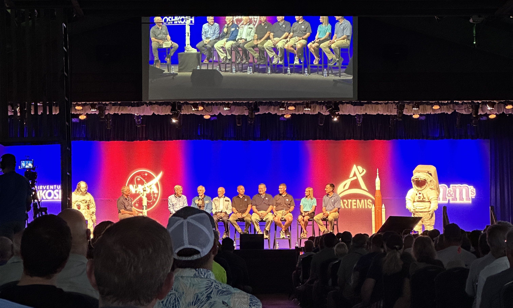
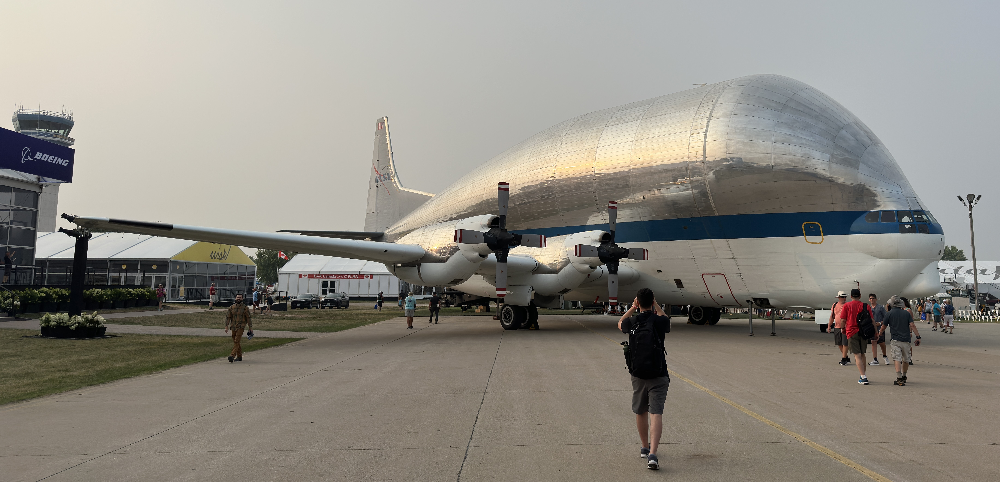
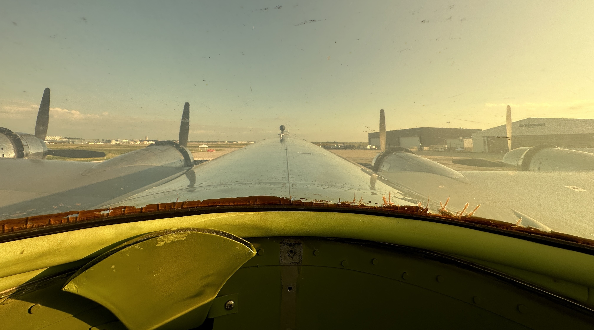

# 2023 EAA AirVenture Oshkosh

Every July, the Experimental Aircraft Association (EAA) hosts a weeklong celebration of all things aviation, with workshops, presentations, forums, and aerial displays scheduled from the break of dawn until late into the night. These festivities, collectively known as EAA AirVenture Oshkosh, take place at the EAA headquarters located at Wittman Regional Airport in Oshkosh, Wisconsin. This blog post breaks down my first time attending AirVenture in 2023 and some of the highlights of the “World’s Greatest Aviation Celebration”.

## Preparing for AirVenture

I began planning for AirVenture in January by booking my flight and arranging accommodations. AirVenture dates are announced years in advance and local hotels are usually reserved as soon as openings are available. I decided to stay at the student dormitories on the University of Wisconsin Oshkosh campus. The dormitory registrations typically open up in the preceding fall and by January, only rooms without air conditioning remain. Overall, I found the university housing to be sufficient for my needs and was able to manage without air conditioning, although a few nights were quite warm.

During the month leading up to AirVenture, I began piecing together my itinerary. There was a webinar in late June which presented the daily themes and major highlights of AirVenture, including notable display aircraft and tentative airshow schedules. The official EAA app also began to populate with forums, seminars, talks, and workshops. I was able to designate which events interested me and the app would output a mobile itinerary which I could save offline.

## Around the Grounds

I walked approximately 40 miles during AirVenture week, spending significant amounts of time at the following locations:

## Boeing Plaza

Located a third of a mile from the main entrance gate, Boeing Plaza features a rotating arrangement of showstopper aircraft, such as airliners and military assets. Some aircraft remain in Boeing Plaza for the entire week while others would be on display for a only day or two. Throughout the day, the ground crew constantly shuffles aircraft around, making space for departures and arrivals. The Boeing Plaza schedule is posted in advance and a large crowd would often congregate when aircraft arrive or depart. Attendees can purchase souvenirs from the Boeing store or the various military and warbird booths dotting the plaza. 

## Warbird Alley

A half-mile walk north from Boeing Plaza leads to Warbird Alley, home to vintage military trainers, transports, fighters, and bombers ranging from various periods of aviation history. There are tram tours available for attendees to comfortably view the rows and rows of warbirds lining the grass field. Additionally, guests can attend the Warbirds in Review program each morning and afternoon. Warbirds in Review provides a focused discussion on a specific subset of warbirds and the individuals who flew and maintained them. For example, the Tuesday afternoon session featured World War II triple ace Bud Anderson and the North American P-51 Mustang fighter. AirVenture is popular amongst warbirds enthusiasts because there is always a good chance to get a close look at some newly restored aircraft. In 2023, P-47D “Bonnie” and P-51C “Thunderbird” made their Oshkosh debuts and attracted considerable attention.

## Ultralight Runway

Three quarters of a mile south of Boeing Plaza is the Ultralight Runway. On nights without the an airshow, the Ultralight Runway hosts the Twilight Flight Fest. This event features a STOL completion, paramotor performances, parchuters, and RC aerobatics.

## Theater in the Woods

This partially-covered outdoor theater hosts evening programs with special invitees to discuss a variety of topics, such as NASA’s return to the moon and aerial cinematography. 

## EAA Museum / Pioneer Airport

The EAA Museum is actually located outside of the AirVenture grounds and can be accessed by foot or bus transportation. The museum collection includes numerous experimental and historic aircraft, some of which are stored at Pioneer Airport, located adjacent to the museum.

## The Daily Routine

After a quick morning breakfast at the University of Wisconsin Oshkosh Blackhawk Commons dining hall, I boarded the City of Oshkosh’s GO Transit bus to Wittman Regional Airport. GO Transit operates a special frequent service route during AirVenture, with convenient pick-up and drop-off locations. The security screening is quick and once inside, I would follow my itinerary for the day. I would typically return to Boeing Plaza near 2:00 PM to stake a spot for the four-hour afternoon airshow. There is no assigned seating, so any empty patch of grass for my folding chair is sufficient. Following the afternoon show, I find dinner before making my way to the various events taking place in the evening. I usually depart the grounds between 10:00 PM and 11:00 PM.

## AirVenture Highlights

There were plenty of interesting and unique aircraft on display at AirVenture. My personal favorites were the NASA Super Guppy and Boeing Dreamlifter. 

AirVenture is more than just an airshow, but the flying displays are a major draw. The daily airshow is four hours long and begins around 2:00 PM. There is a two-hour night airshow on Wednesdays and Saturdays, which starts at 8:00 PM. The night show concludes with a dramatic fireworks and pyrotechnics show. Featuring a variety of civilian aerobatics, warbird acts, and military demonstrations, each day presents a different list of performers.

I have always wanted to fly aboard a vintage aircraft and the variety of options during AirVenture were impressive. EAA’s Ford Trimotor, Bell 47, and B-25 were available for rides. Additionally, Commemorative Air Force Airbase Georgia offered rides on their P-51 Mustang, SBD Dauntless, LT-6 Mosquito, and T-35 Mentor. Lastly, B-17 “Sentimental Journey” and B-29 “Doc”. I ended up deciding to fly aboard the B-29 and selected the master gunner seat. This seat is located aft of the bomb bay and includes a 360 degree-view of the sky from the viewing dome. Passengers were picked up from Warbird Alley and whisked to Appleton, where Doc was based. The flight experience lasted about 45 minutes, 30 of which were airborne. The flight path crossed over AirVenture and provided a great opportunity to see the event from a different perspective. We were equipped with headsets, allowing us to hear the crew go through their checklists and communications with air traffic control.   

AirVenture also offers a glimpse into the future. Wisk Aero, based in California, brought their Wisk Cora autonomous aerial taxi to Oshkosh. In addition to being displayed on the event grounds, Wisk Cora also flew during one of the afternoon airshows. NASA hosted multiple forums and discussions on their ongoing research and development projects. One program, Quesst, aims to use the X-59 experimental aircraft to assess the viability of quiet supersonic flight. Quesst could potentially lead to the revivial of supersonic commercial air travel. 
 
 

