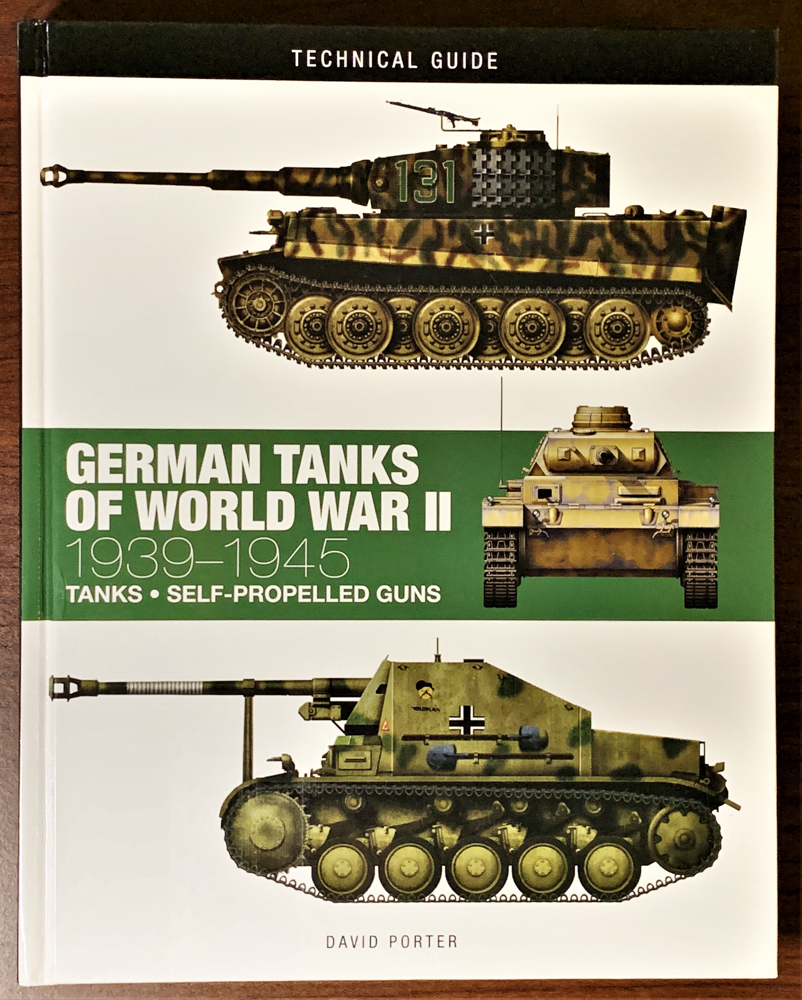
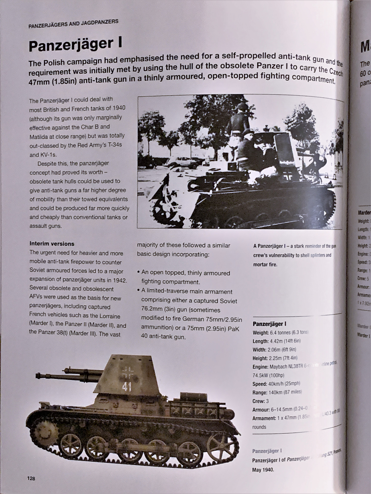

# *German Tanks of World War II: 1939-1945* 

One of several Technical Guides published by Amber Books, *German Tanks of World War II: 1939-1945* is 200-page overview of the myriad of armored vehicles fielded by the German army during the Second World War. The book covers armored cars, tanks, self-propelled artillery, tank destroyers, and specialized vehicles. Numerous prototype tanks, such as the VK30.02 and Maus, are mentioned and there is also a section dedicated to captured Allied and Soviet armor pressed into service. 

Each vehicle entry is accompanied with a description of its development, purpose, and usage. Several drawings or photographs are provided alongside a profile summarizing dimensions, performance, and armament. The author is diligent in providing enough information for the reader to distinguish between multiple variants of the same vehicle. 

*German Tanks of World War II: 1939-1945* is an excellent quick reference for armored vehicle enthusiasts and doesn't take up too much shelf space either.  