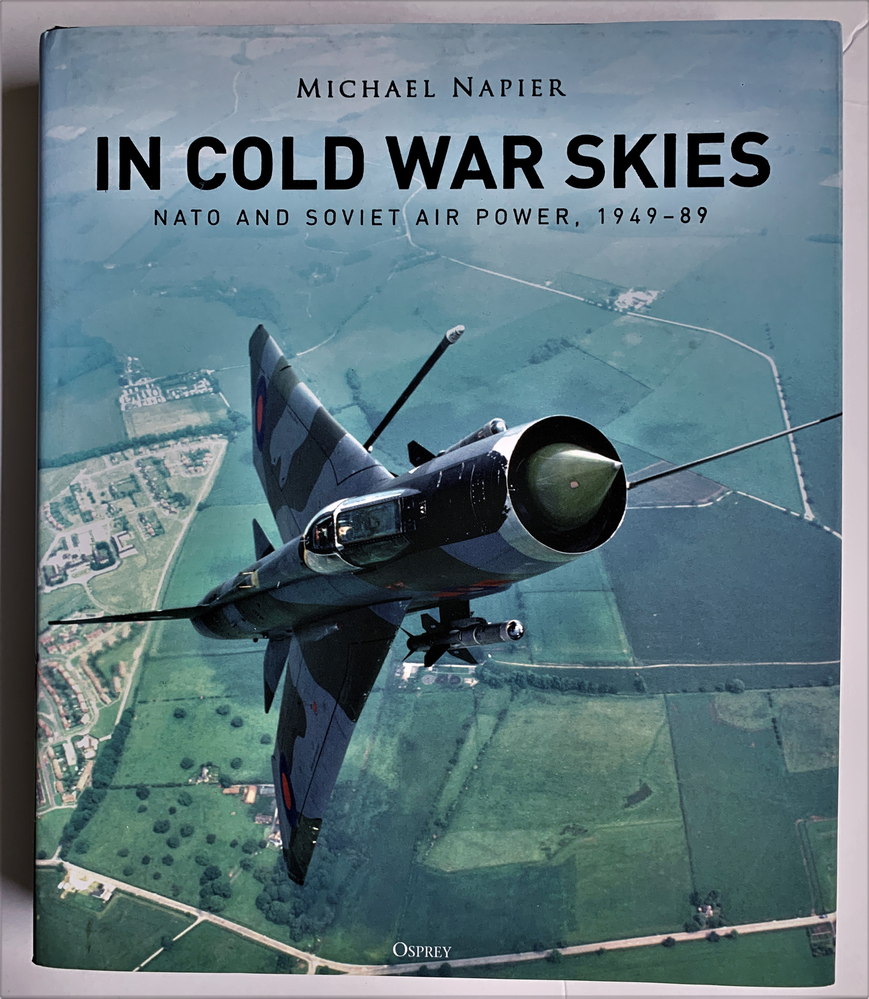
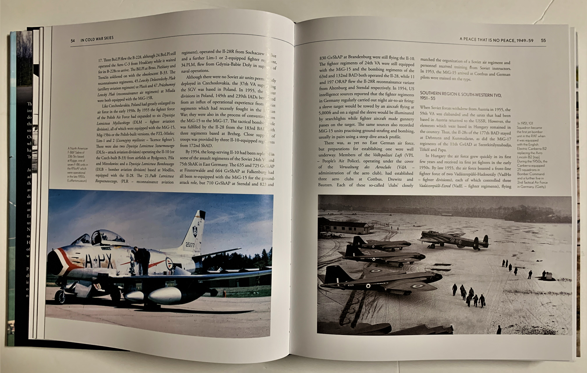
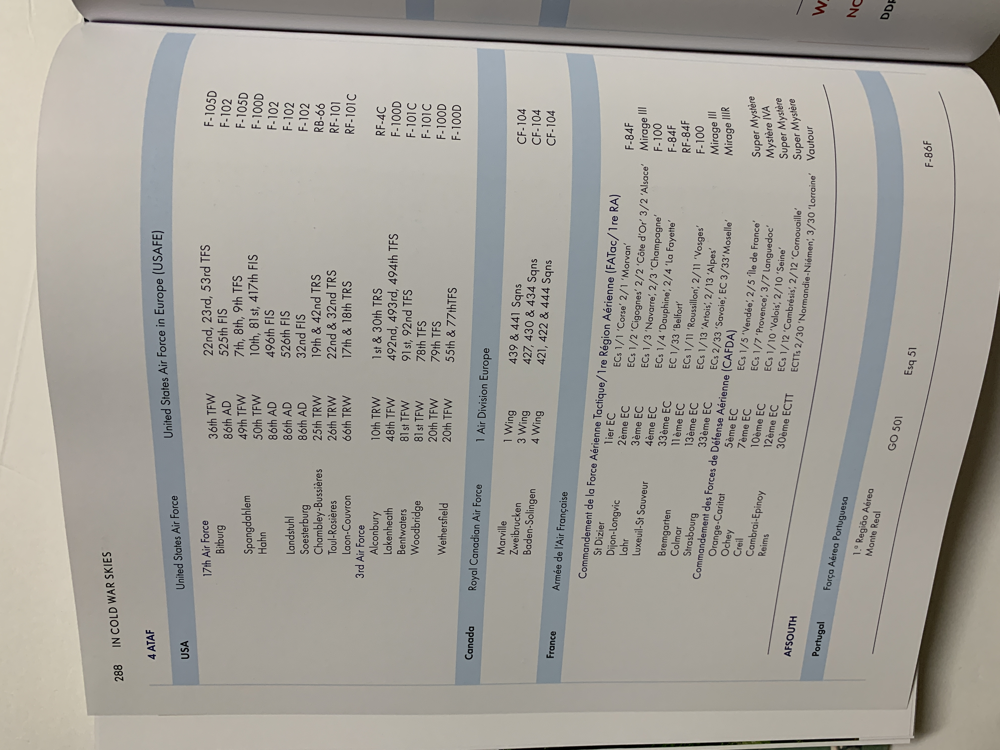

# *In Cold War Skies* 

For half a century, NATO and the Warsaw Pact engaged in an arms race for control of the skies, constantly fielding new technologies and weapons. As propellers gave way to jet engines, the proliferation of nuclear weapons led to both sides preparing themselves for conventional and nuclear war.   

A fairly sizable book, Michael Napier's *In Cold War Skies* chronicles how the NATO and Warsaw Pact air forces evolved throughout decades of heightened tension. With over 300 pages filled with images, narration, and anecdotes, the author goes into great detail about specific units, incidents, and tactics. Furthermore, these snippets tie together into a greater narrative about geopolitics and faction where NATO and the Warsaw Pact are analyzed not as individual entities but a conglomerate of allied nations. While the book exclusively focuses on the European theater, global events are brought in as necessary to demonstrate how the Cold War was truly a worldwide affair. 

The book shines in its thorough coverage of the Cold War. The constant reorganization and reequipment underwent by each air force is chronicled along with comparisons of various weapons systems. Several primary sources are brought in to offer an inside glimpse into missions, excerises, and general preparation for a conflict which never arrived. 

Structurally, *In Cold War Skies* is organized by decade and furthermore by region or nation. The final chapter of the book outlines the order of battle across the Cold War. Had war broken out, the author details the units and aircraft which would have flown into battle. 

*In Cold War Skies* strikes a solid balance between technology, politics, and tactics. By encompassing the major and minor participants of the Cold War, the author provides a comprehensive outlook of the strategic realities at various phases of the Cold War. 