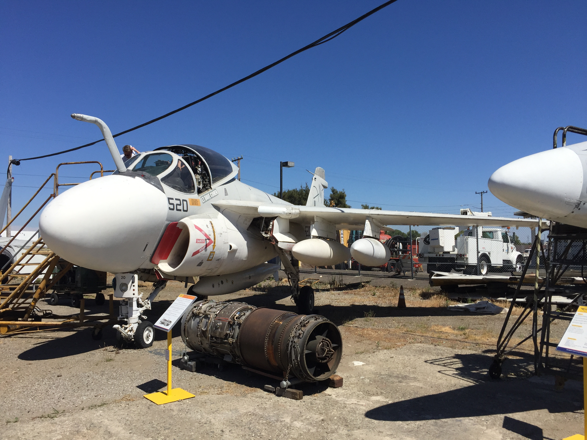
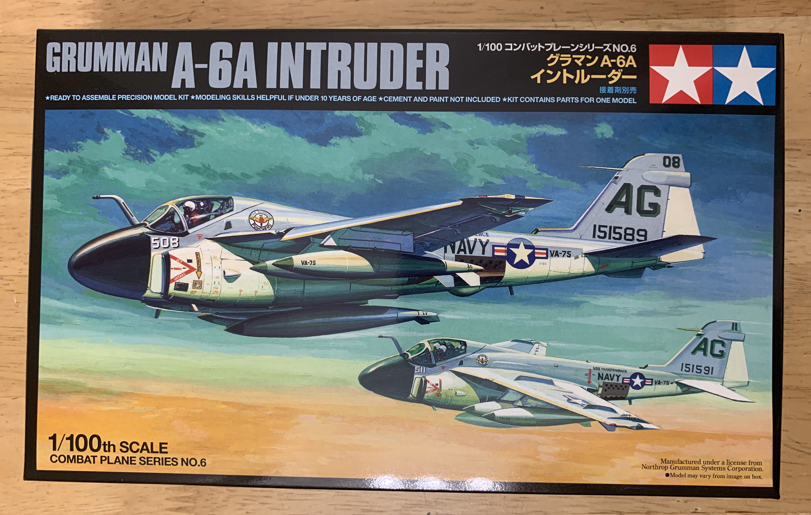
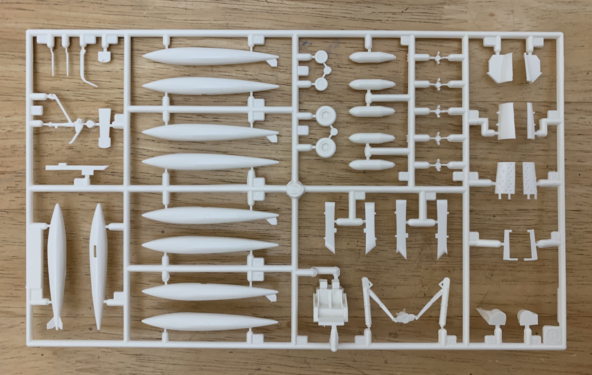
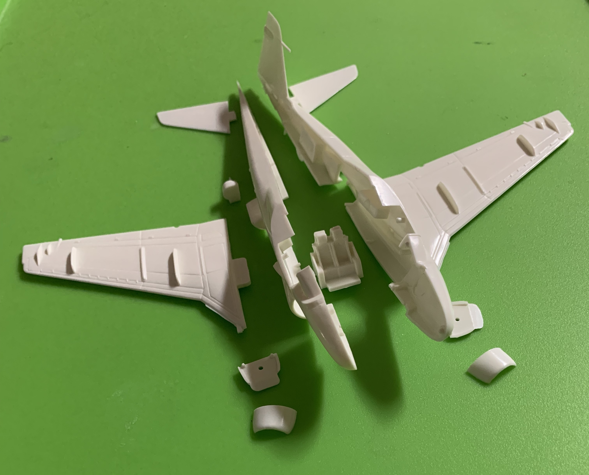
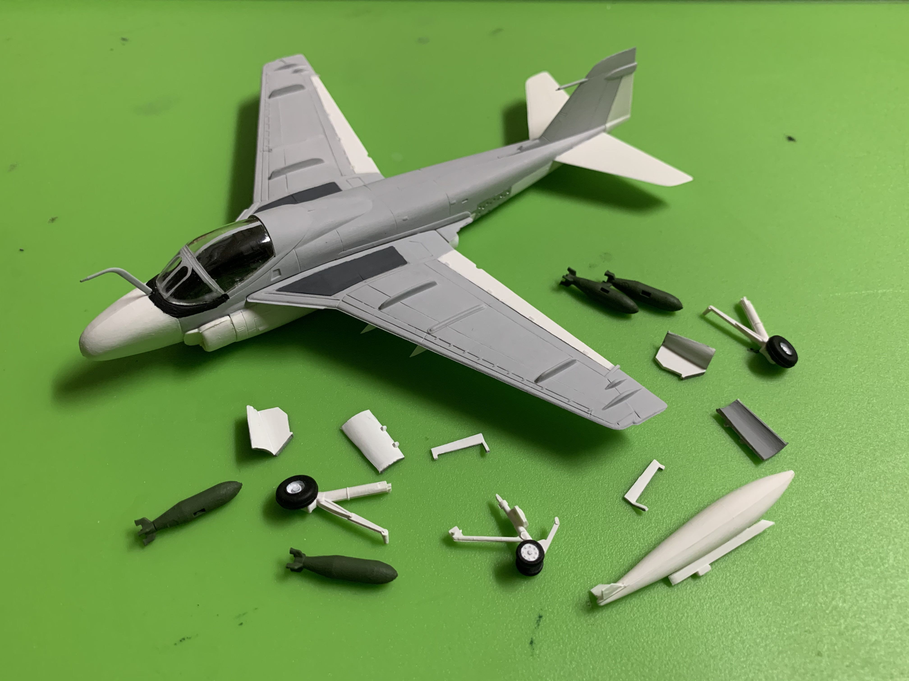
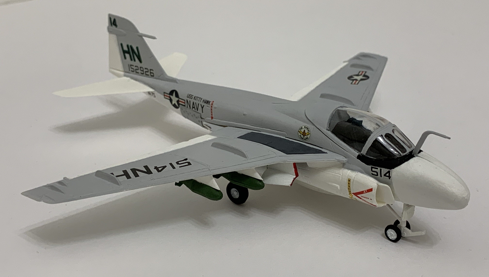

# Grumman A6A Intruder (built December 2019)

## The Plane

The successor to the venerable Douglas A-1 Skyraider, the Grumman A6 Intruder is an all-weather, carrier-borne attack aircraft. Its bulbous cockpit and tapered fuselage earned it the nickname "Flying Drumstick." The first Intruder squadrons became operational in the early 1960s and the aircraft made its combat debut in the skies over Vietnam. A6s also participated in the Gulf War and the NATO intervention in the Balkans. 

The Intruder was further developed into two variants, the KA-6D tanker and EA-6B Prowler electronic warfare aircraft.

## The Kit

One of Tamiya's 1/100 aircraft kits, this model is perfect for a quick weekend build.   

## The Build

