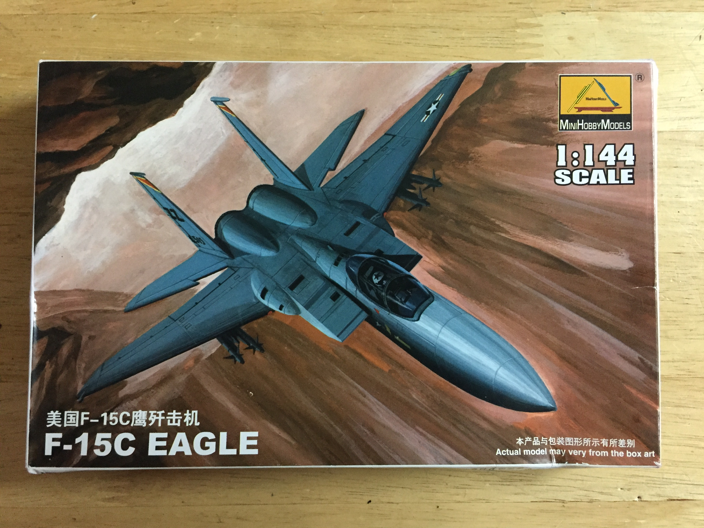
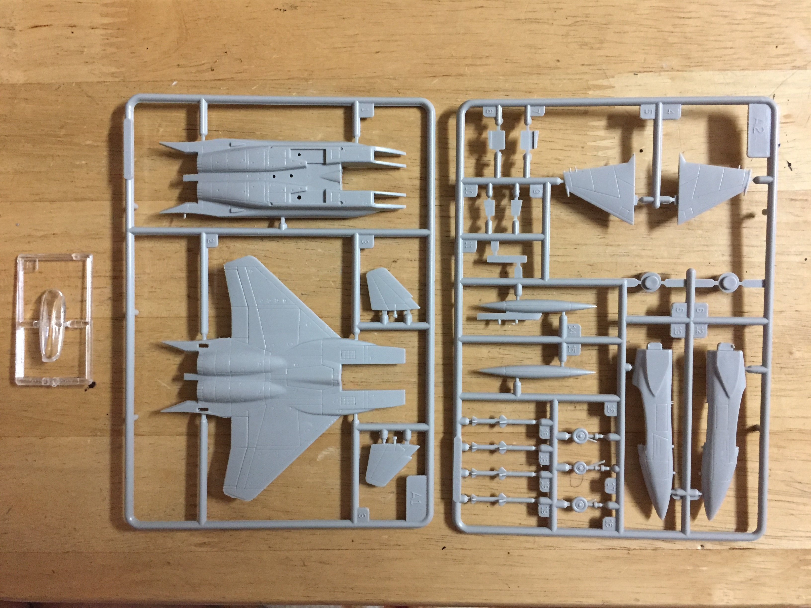

# McDonnell Douglas F-15A Eagle  (built July 2018)

## The Plane
The F-15 Eagle is a air superiority fighter capable of exceeding Mach 2.5. The F-15 entered service in 1976 and is expected to remain in the USAF inventory for several more decades. Foreign operators of the Eagle include Israel, Japan, and Saudi Arabia. F-15 pilots have scored over 100 kills against zero losses.

## The Kit

I purchased this kit at a Taiwan hobby shop for $3 USD. The manufacturer of this kit is Mini Hobby Models but the mold was created by Crown in 1975. The kit does not include an interior. 

## The Build

The instructions were printed on the back of the box. The provided paint scheme was too difficult to interpret but I was able to use the decals to find images of the correct aircraft. 

## The Result
