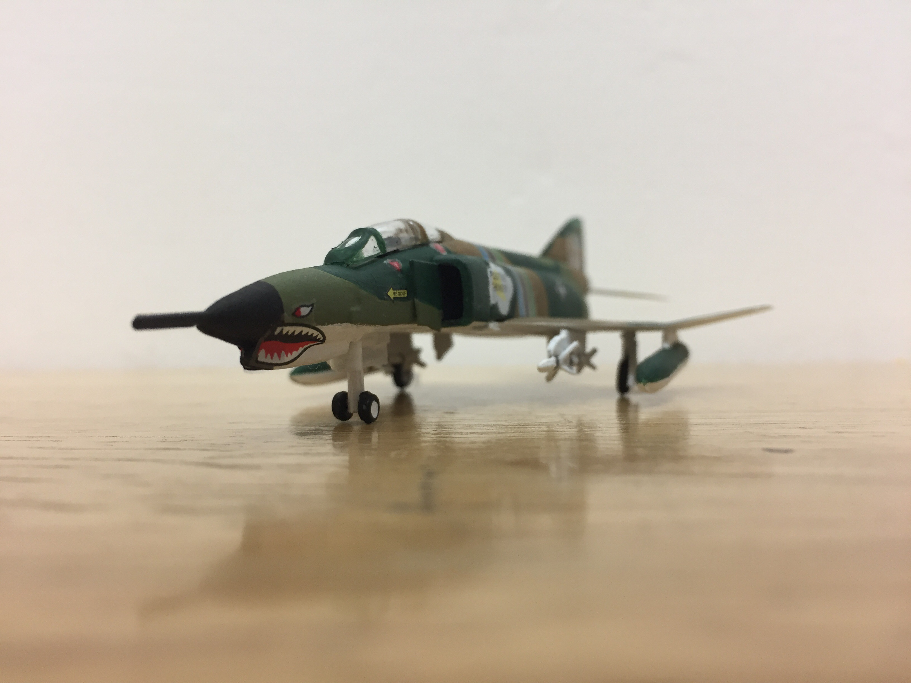
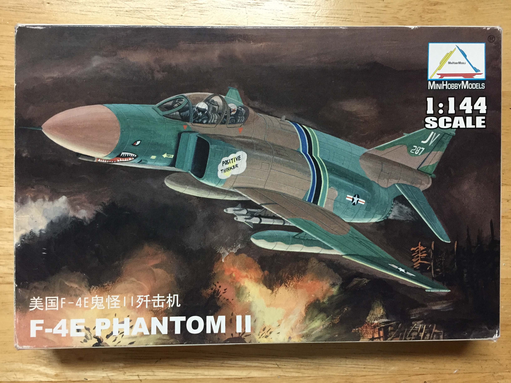
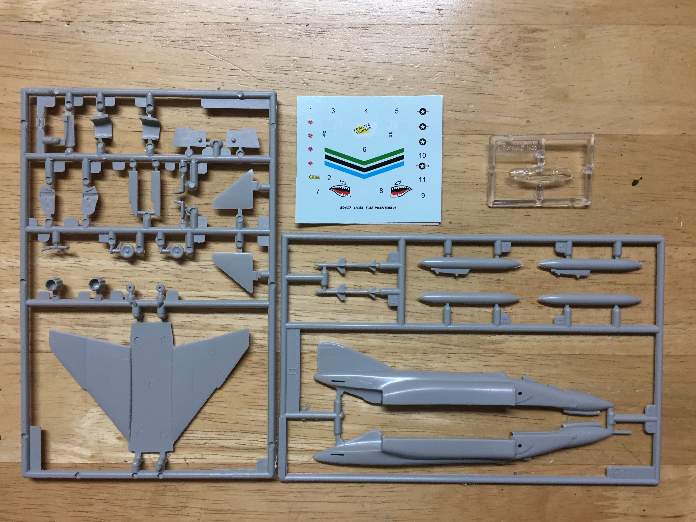
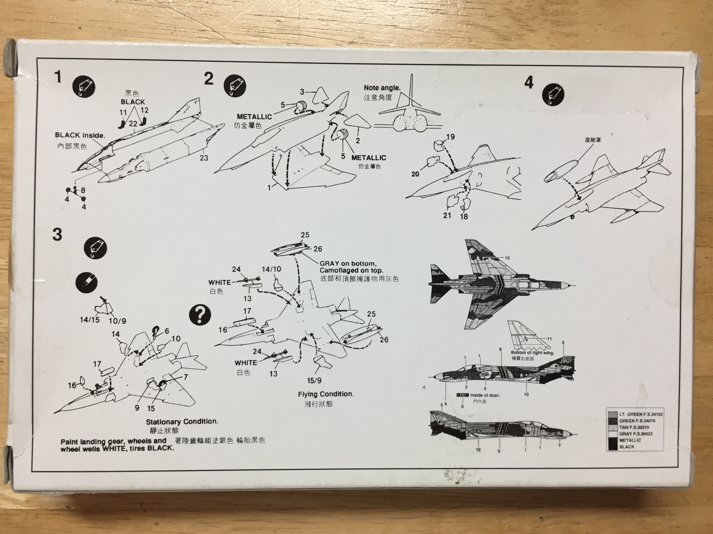
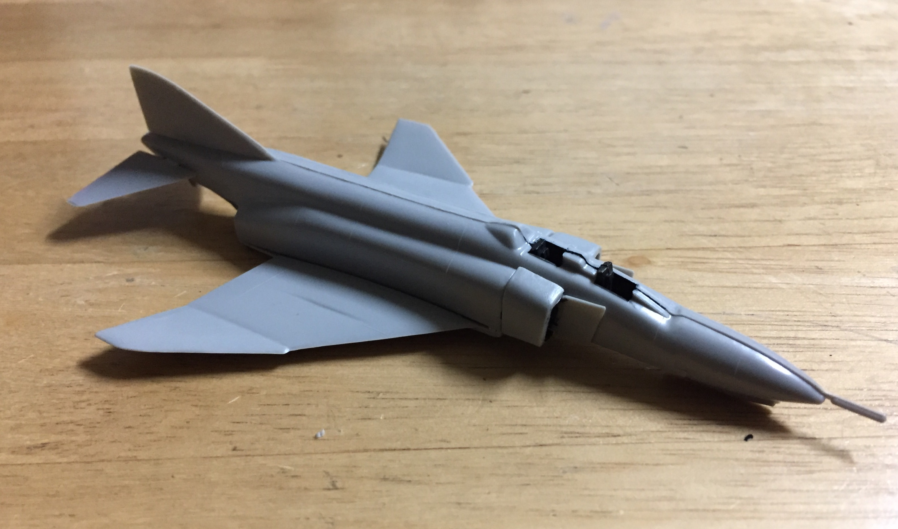
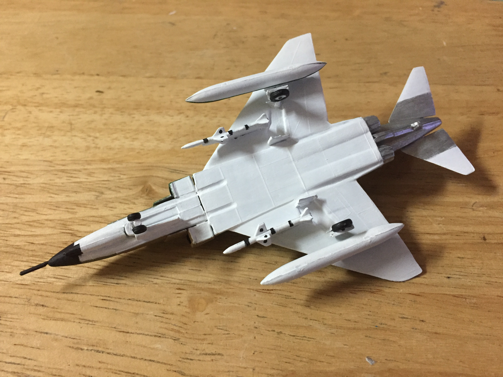
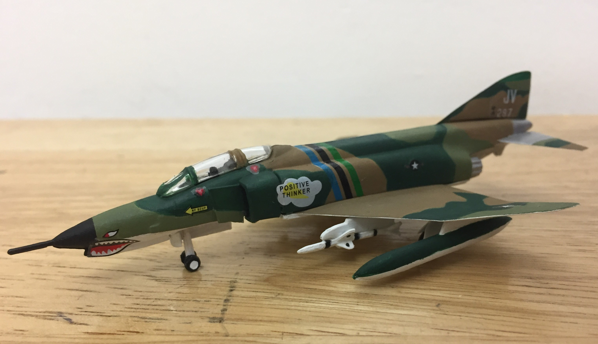
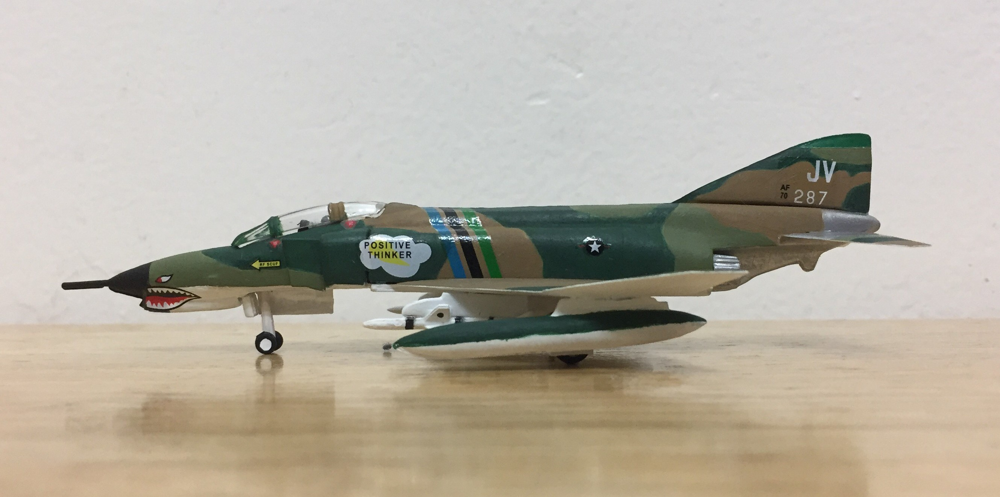

# McDonnell Douglas F-4E Phantom II (built January 2019)

## The Plane
A symbol of Western airpower during the Cold War, the McDonnell Douglas F-4 Phantom II was widely exported and participated in numerous regional conflicts in Southeast Asia and the Middle East. 

A heavy two-seat, twin-engine interceptor, the Phantom was capable of Mach 2 flight and set several speed records. 

The F-4 was the primary fighter aircraft deployed by the United States in the Vietnam War. Designed to shoot down lumbering bombers, the Phantom instead battled lighter, more agile MiG-17s and MiG-21s of the Vietnamese People's Air Force. Initially armed with only air-to-air missiles which tended to misfire, later variants of the F-4 were equipped with the M61 Vulcan cannon. 

The F-4E was the most numerous variant of the Phantom and the first to carry internal armament. 

Although the United States retired the F-4 in the late 1990s, they remain in service today with several nations. 

## The Kit

Although it came in a MiniHobbyModels box, the kit made its debut in 1984 as part of Academy's Warplanes of the World line. 

There are 31 parts distributed across three sprues. Decals are included for Positive Thinker, a Phantom stationed in Thailand during the Vietnam War. 

The back of the box shows the assembly instructions and proper paint scheme. 

## The Build

Began by putting together the cockpit. There's no detail at all. 

Assembled the fuselage. 

Painted the aircraft. During the Vietnam War, aircraft operating from land bases adopted a tricolor scheme incorporating two shades of green and one shade of brown. 

Attached landing gear, fuel tanks, air-to-air missiles. 

## The Result

