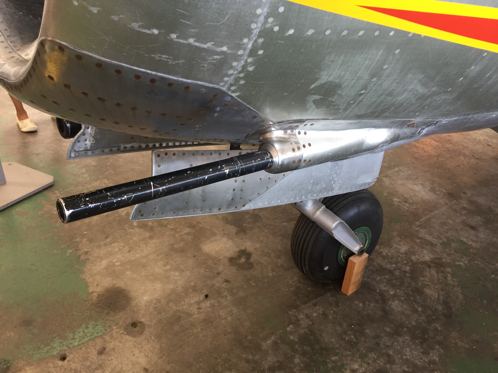
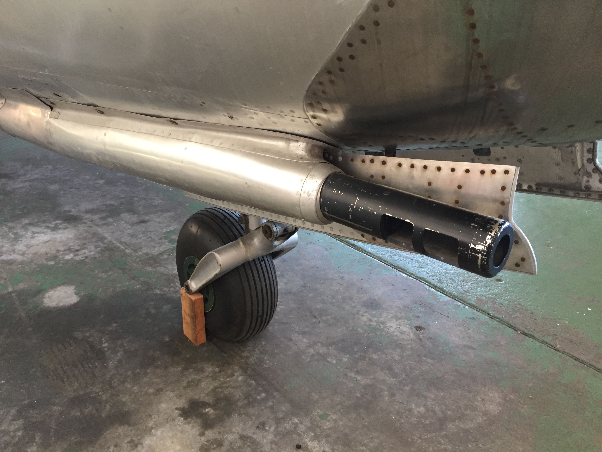

# Mikoyan-Gurevich MiG-15bis  (built August 2018)

## The Plane

Combining captured German technology and the British Nene turbojet, the MiG-15 was the Soviet Union's first operational swept-wing fighter. It entered service in 1949 and was codenamed "Fagot" by NATO intelligence. 

A year later the MiG-15 was further refined into the MiG-15bis. The major modification was the installation of the more powerful Klimov VK-1 engine.   

The MiG-15 was designed to intercept and destroy bombers. To accomplish this task, the MiG-15 was armed with two 23mm and one 37mm cannon. 

 

left: 23mm Nudelman-Rikhter NR-23 cannon

right: 37mm Nudelman N-37 cannon

The MiG-15 participated in a variety of conflicts, most notably the Korean War. 

By the winter of 1950, UN aircraft controlled the skies over Korea and freely attacked opposing ground forces. The introduction of the MiG-15 to Korea changed the balance of airpower. The swept-wing MiG-15 proved superior to the UN inventory of propeller and straight-wing jets. The only aircraft that could challenge the new threat, the F-86 Sabre, was quickly sent to the Korean theater. MiG-15s and F-86s dueled over a stretch of airspace near the Chinese-North Korean border known as "MiG Alley."

## The Kit

I purchased this kit at a Taiwan hobby shop for $3 USD. The manufacturer of this kit is Mini Hobby Models but the mold was created by Crown in 1975. The kit includes neither an interior nor wing hardpoints. 

## The Build

Assembly was simple and all pieces fit together snugly. The aircraft's markings indicated it belonged the 18th Wing of the USAF, stationed in Okinawa.

## The Result

