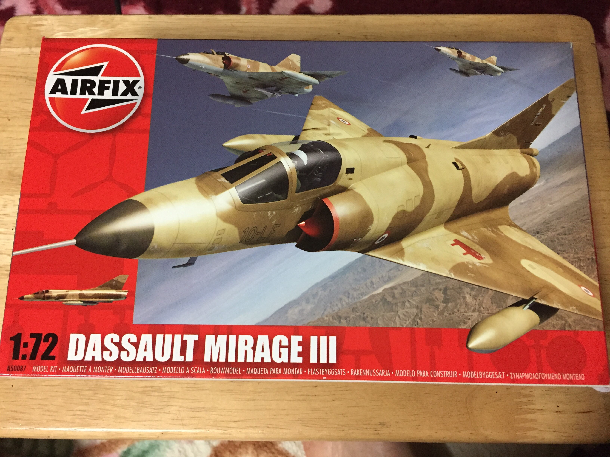
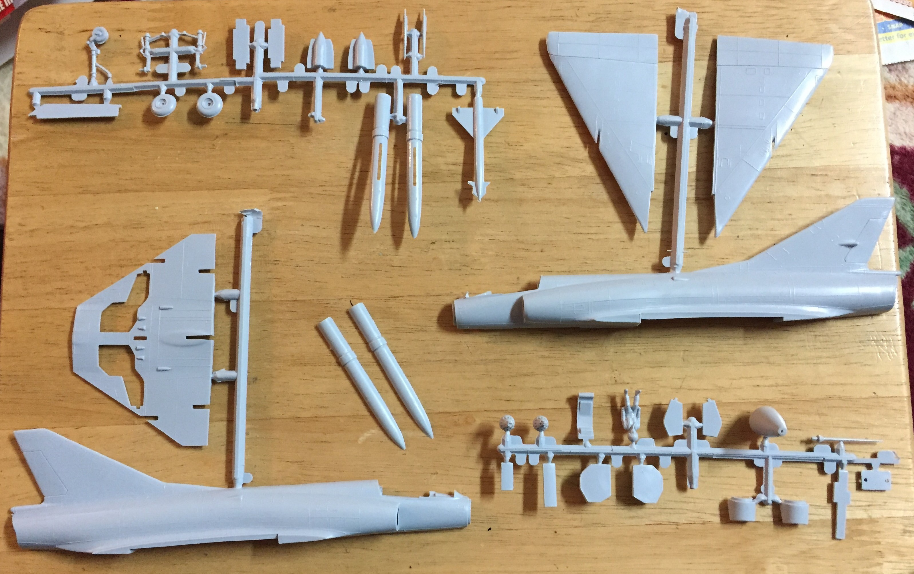
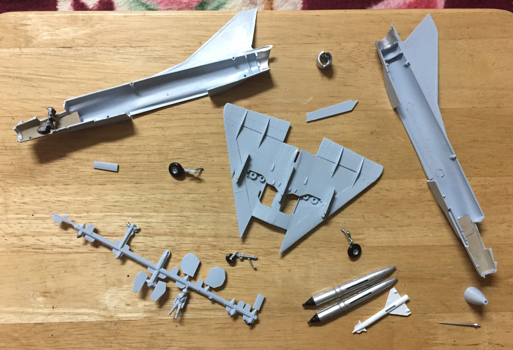
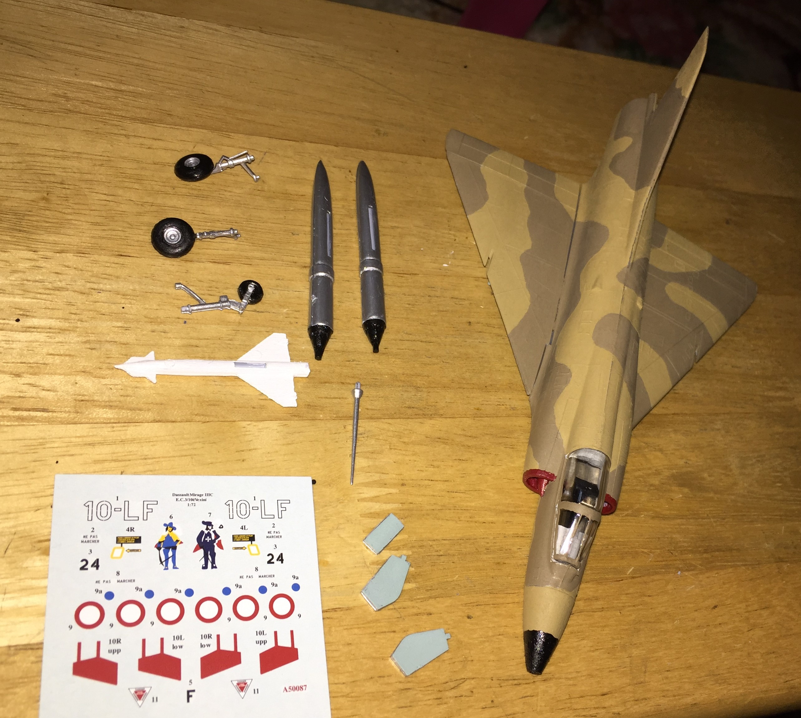
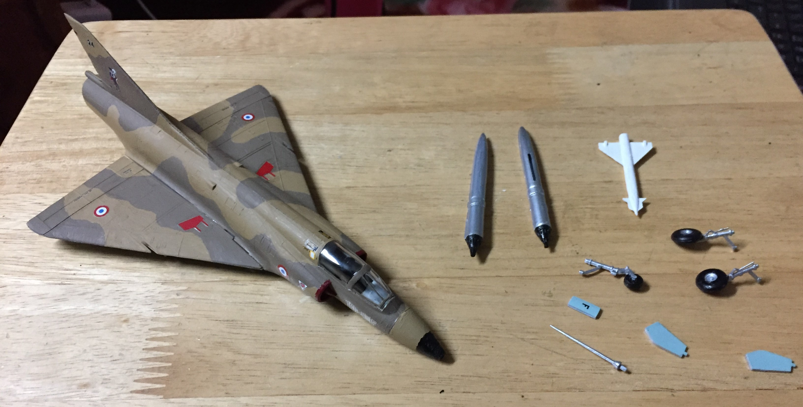

# Dassault Mirage III (built January 2017)

## The Plane
A single-engine interceptor capable of Mach 2 flight, the Mirage III entered service in 1961 and saw combat in the Middle East, Africa, and South America. Designed by the French firm Dassault Aviation, the aircraft featured a delta wing configuration and lacked horizontal stabilizers. 

## The Kit
 

I bought this kit online in 2016 during Airfix's Black Friday sale. Being a relatively old Airfix kit, there were fewer parts and thicker sprues. 

## The Build
 

 

 

 

Being an old Airfix kit, the build was very simple and straightforward. The model has the markings of a French Air Force Mirage III stationed in East Africa during the early 1980s. 

## The Result
 

