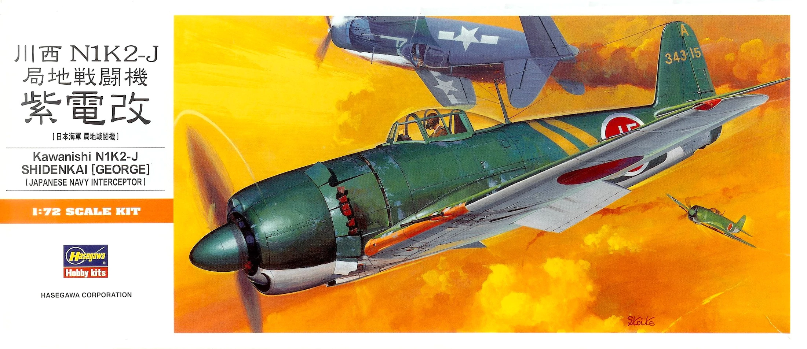
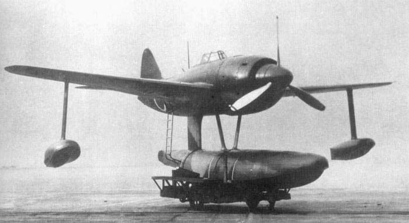
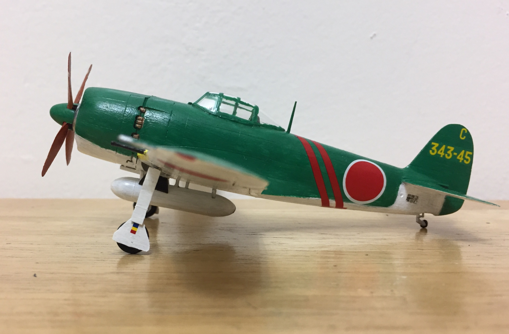
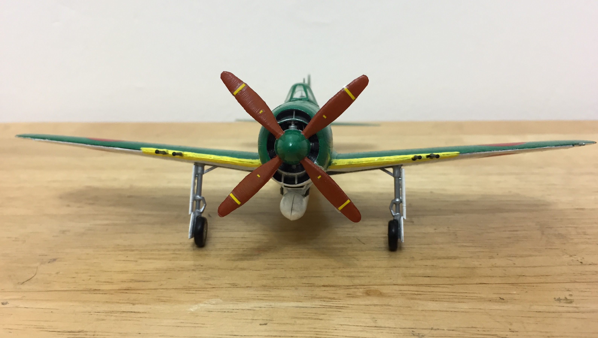
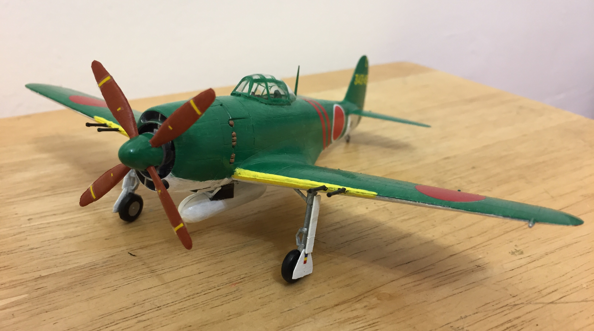

# Kawanishi N1K2-J Shiden-Kai  (built July 2017)

## The Plane

The story of the N1K2-J began with the N1K1 Kyofu. The N1K1 was similar in speed and maneuverability to the Zero, impressive for a floatplane fighter.  

A land-based variant of the N1K1, the N1K1-J Shiden, took flight in late 1942. It was a promising design but had complications with its engine and landing gear.   

The N1K1-J Shiden was further refined to the N1K2-J Shiden-Kai. A notable difference was that the wing was mounted lower on the N1K2-J, allowing for shorter landing gear. The Shiden-Kai was an excellent fighter capable of taking on the latest Allied types. However, it lacked the high-altitude performance to intercept B-29s. The Allied codename for this aircraft was "George."

## The Kit
It's a 1/72 Hasegawa kit. I don't have any images of the sprues but they can be found on https://www.super-hobby.com/products/N1K2-J-George-Shidenkai.html. 

## The Build
Overall it was an enjoyable build. The parts fit together nicely. Assembly was straightforward. 

## The Result

