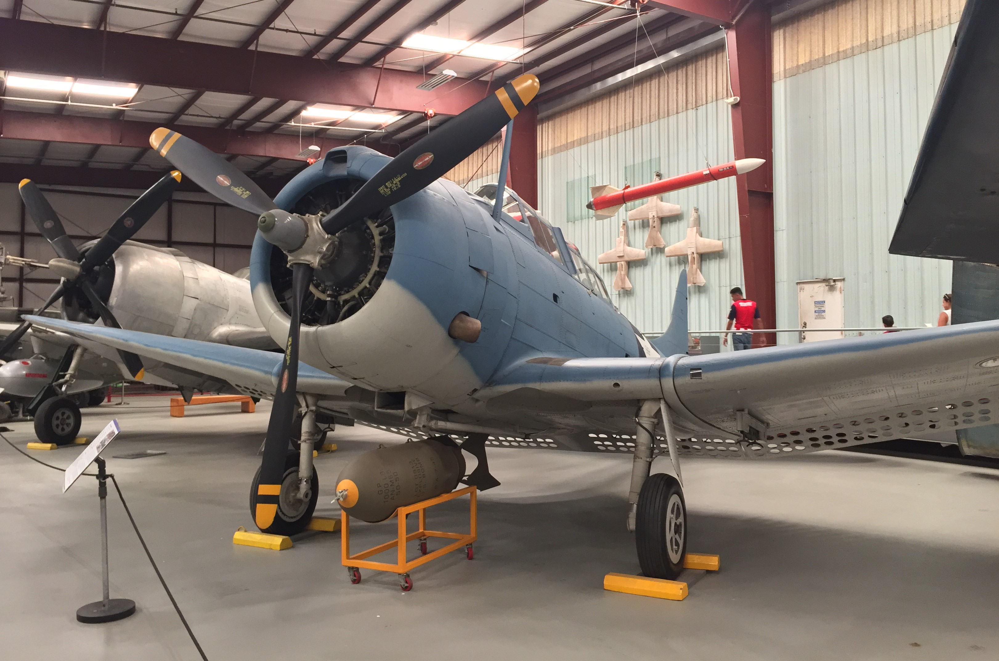

# Douglas SBD Dauntless  (built June 2017)

## The Plane

Developed from the Northrop BT, the Douglas SBD Dauntless became the U.S. Navy's primary carrier-based dive bomber throughout most of World War II. Nicknamed "Slow But Deadly," the Dauntless played a key role in the Pacific Theater and participated in all major carrier battles. Its claim to fame took place during the Battle of Midway when SBDs sank four Japanese aircaft carriers. Beginning in 1944, the SBD Dauntless became superseded by the Curtiss SB2C Helldiver.  

## The Kit
The 1/48 scale model kit is manufactured by Revell. Its low part count and simple assembly makes it an ideal kit for beginners.  

## The Build

