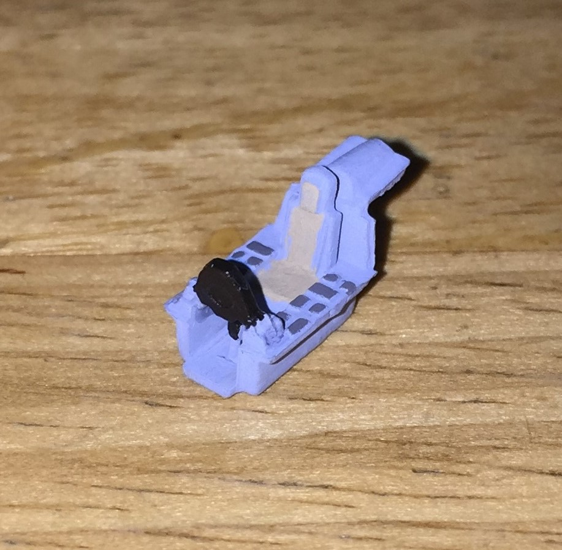
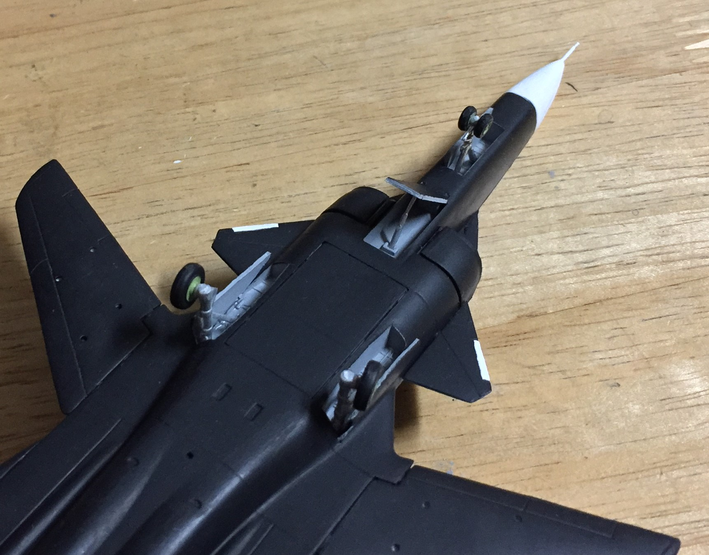

# Sukhoi Su-47 Berkut (built August 2018)

## The Plane
Developed by Sukhoi and never intended for mass production, the agile Su-47 Berkut first flew in 1997 as a technology demonstrator. While its unique forward-swept wings might suggest the Berkut is an entirely new design, in reality the aircraft shared several components with the already-existing Su-27 Flanker. The Berkut contributed to the advancement of subsequent aircraft, such as the latest Flanker variants and the soon-to-be-operational Su-57 stealth fighter.

## The Kit

This 1/144 Trumpeter Su-47 kit consists of 57 parts on four sprues.

## The Build
The instructions were printed on a single side of paper and were broken down into six steps. However, there was no guidance for painting interior surfaces, such as the cockpit and wheel wells. Unlike most of the models I've built, this kit did not contain cockpit decals. 

I began by assembling the tiny cockpit. Unable to find an image of a Su-47 cockpit, I decided to follow the precedent for Sukhoi fighters and painted the interior a light blue-gray.

 

  
I then glued together the wings and tails.
  

I decided not to include externally mounted armament because the Su-47 has never been photographed with visible weaponry. However, the aircraft does have an internal weapons bay.

## The Result

The Su-47 is a one-of-a-kind (literally) aircraft and will fit nicely with the other modern jets I've built. 
