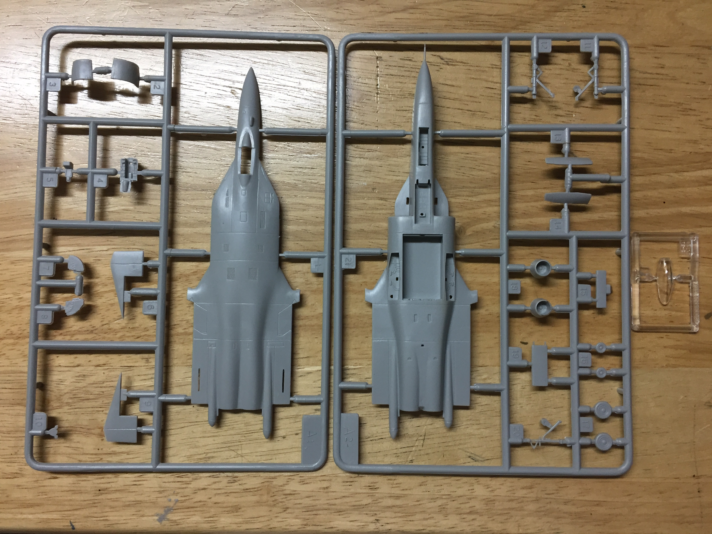
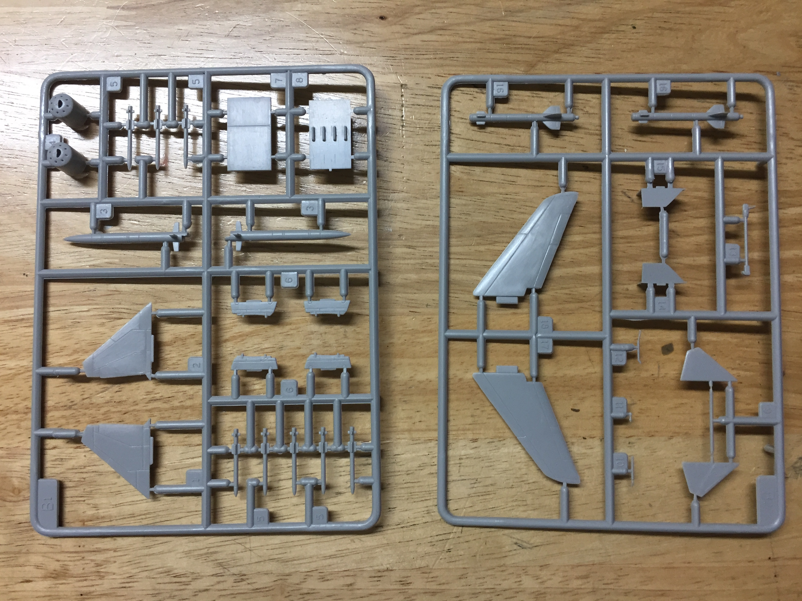
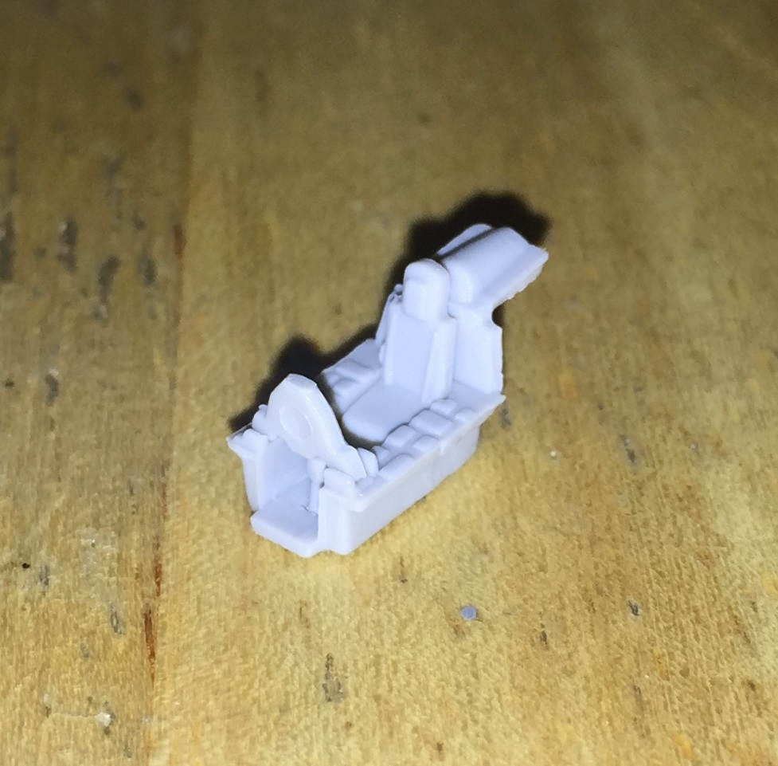

# Sukhoi Su-47 Berkut (built August 2018)

## The Plane
The Sukhoi Su-47 Berkut first flew in 1997 as a technology demonstrator. It featured forward-swept wings which provided excellent maneuverability. Only one aircraft was produced. 

## The Kit
 

The kit is 1/144 Trumpeter. It consists of 57 parts on four sprues. The parts contain minimal flash.

## The Build
The instructions were printed on a single side of paper and consisted of six steps. However, there was no guidance for painting interior surfaces, such as the cockpit and wheel wells. There were also no cockpit decals. 

I began by assembling the tiny cockpit. Unable to find an image of a Su-47 cockpit, I decided to follow the standard for Sukhoi fighters and painted the interior a light blue-gray.

## The Result

