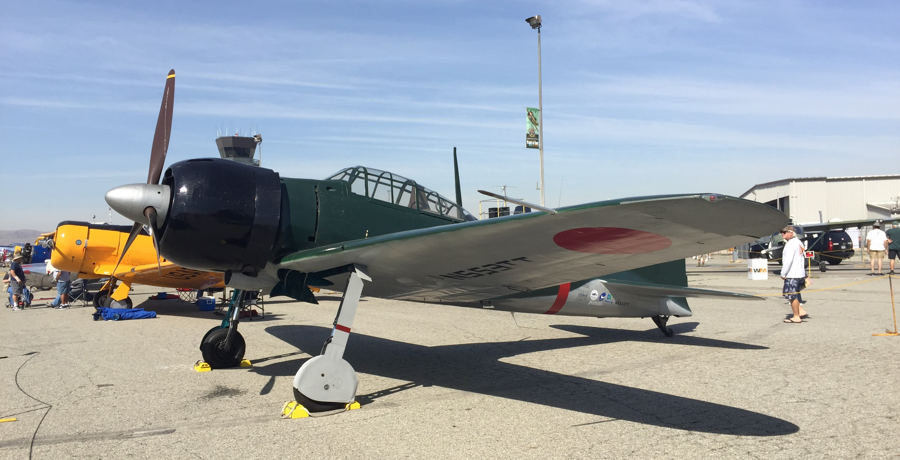
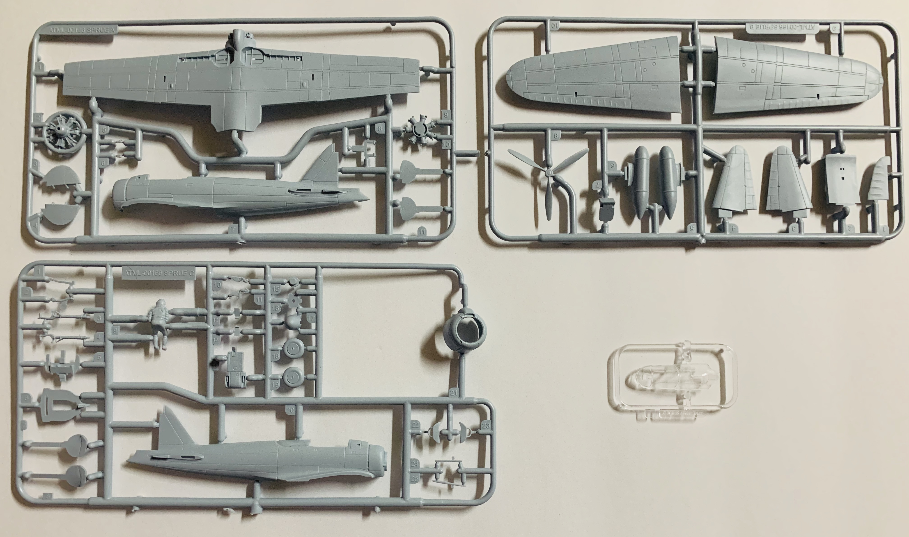
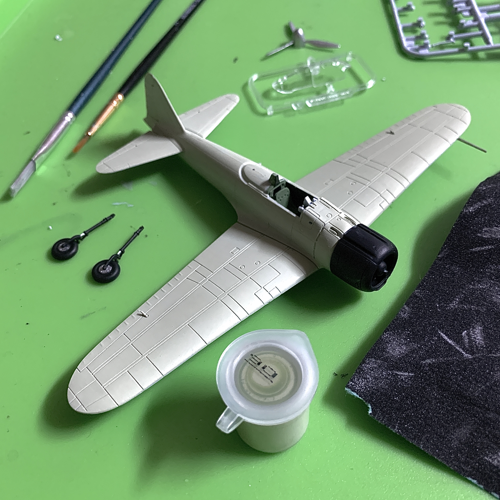
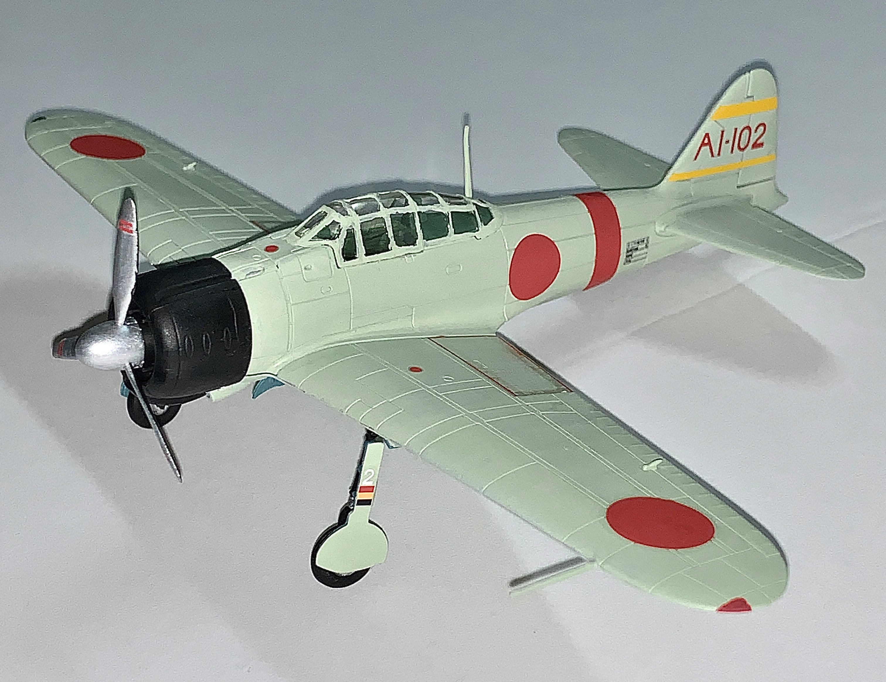

# Mitsubishi A6M2 Zero (completed February 2020)

## The Plane

The Zero was the Imperial Japanese Navy's frontline fighter during World War II. The Zero could operate off aircraft carriers and proved to be a dangerous threat to Allied pilots. Its lightweight construction allowed it to outrange, outclimb, and outturn its early war opponents. This came at a cost as the Zero was lacking in armor protection and would catch fire easily if hit. Later advancements in technology and training negated much of the Zero's advantages. 

## The Kit

This A6M is one of Airfix's 1/72 aircraft kits and its tooling dates back to 2011. It was packaged along with a P-40B Warhawk in a Dogfight Doubles set. The Zero also came with several paint pots. It's a fairly straightforward kit.

## The Build

I had a slight issue with getting one of the landing gears to fit tightly but otherwise everything was fine.

## The Result

