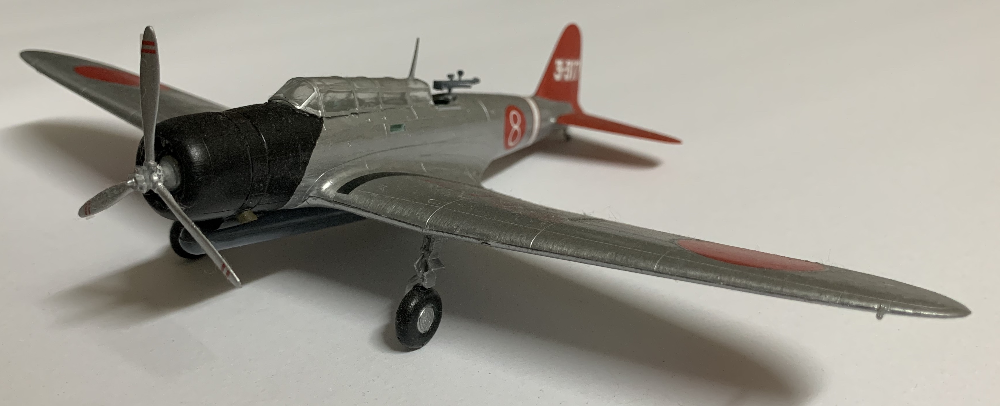
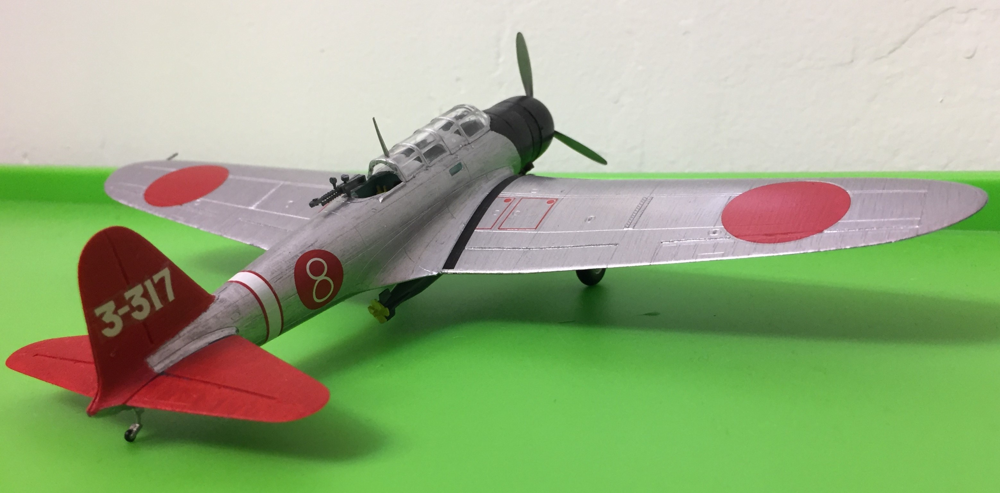

# Nakajima B5N2 (completed January 2017)

## The Plane

The Nakajima B5N served as the Imperial Japanese Navy's primary carrier-based torpedo bomber for much of World War II. Codenamed "Kate" by Allied intelligence, the B5N took part in the Pacific Theater's major carrier battles.  

## The Kit

This B5N is in 1/72 scale and was distributed by Hasegawa. However, Mania originally produced this kit back in 1976 and despite its age, I had no trouble assembling this model.