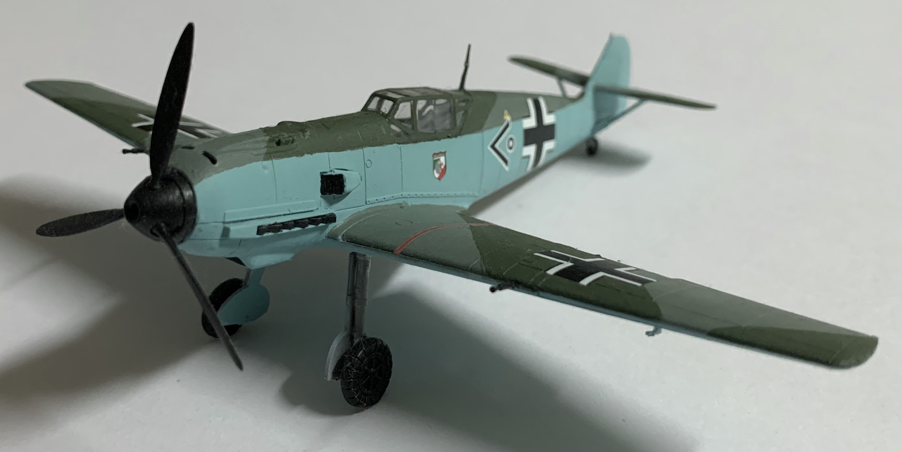
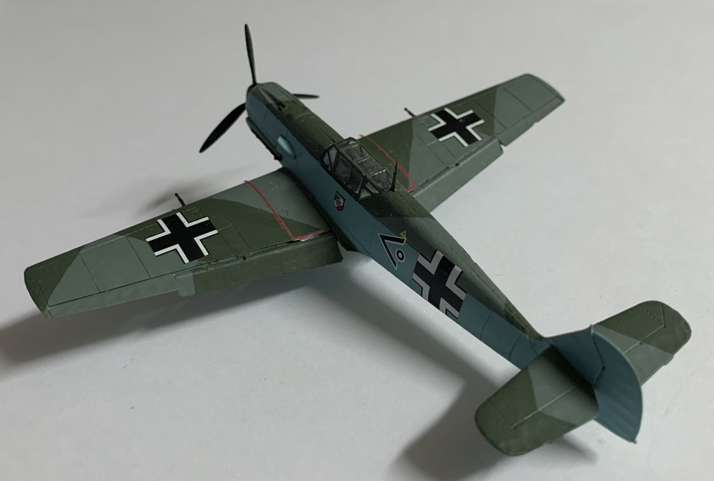
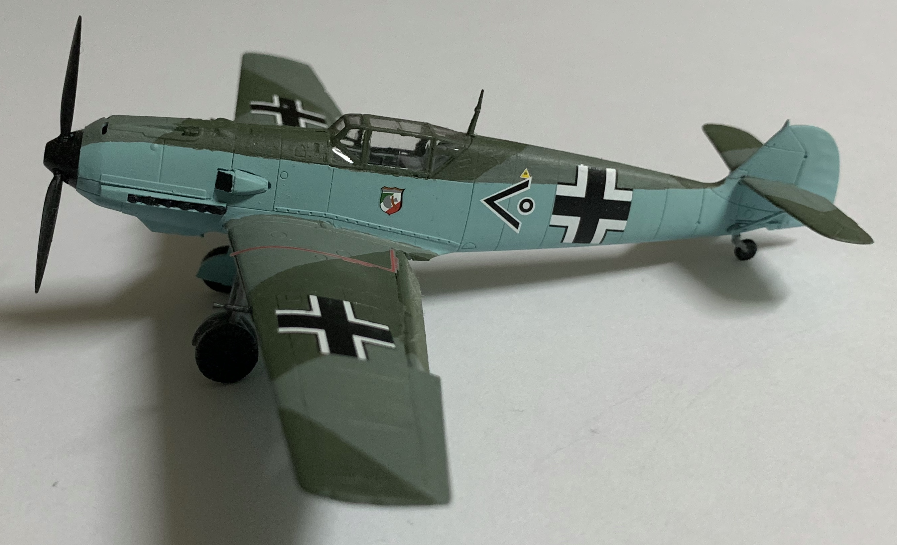

# Messerchmitt Bf 109 E-3 (completed January 2018)

## The Plane

The Messerchmitt Bf 109 entered service in 1937 and was the Luftwaffe's primary fighter during the beginning of World War II. The Bf 109 E series clashed with the Royal Air Force over the skies of Great Britain during the summer of 1940. The 109's ability to escort long range bombers and loiter over targets was hindered by its limited range.

## The Kit

This 1/72 kit was tooled by Airfix in 2012. I purchased the starter set kit, which contained paints, glue, and a brush. This model is great for anyone looking to enter the hobby or for more experienced modelmakers seeking a cheap and quick build. 

