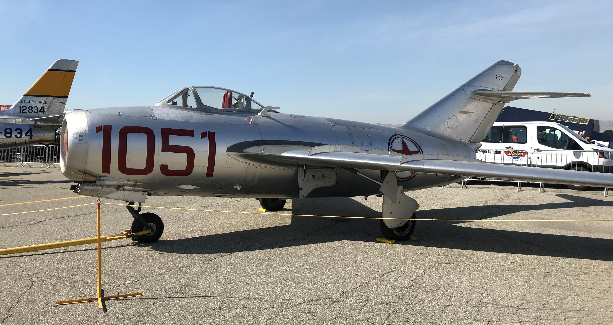
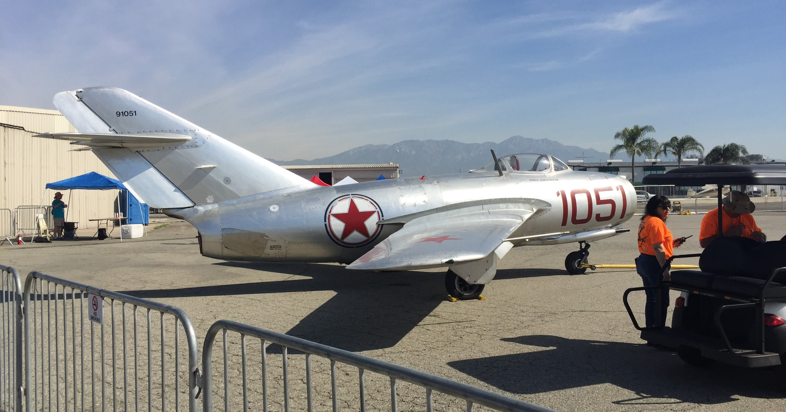
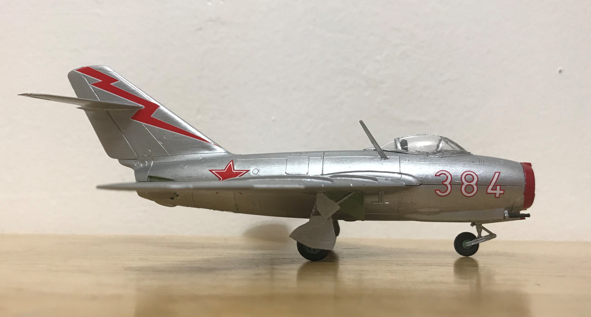

# Mikoyan-Gurevich MiG-15bis  (built August 2018)

## The Plane

Combining captured German technology and the British Nene turbojet, the MiG-15 was the Soviet Union's first operational swept-wing fighter. It entered service in 1949 and was codenamed "Fagot" by NATO intelligence. 

A year later the MiG-15 was further refined into the MiG-15bis. A major modification was the installation of the more powerful Klimov VK-1 engine.   

The MiG-15 was designed to intercept and destroy bombers. To accomplish this task, the MiG-15 was armed with two 23mm and one 37mm cannon. 

 

left: 23mm Nudelman-Rikhter NR-23 cannon

right: 37mm Nudelman N-37 cannon

The MiG-15 participated in a variety of conflicts, most notably the Korean War. 

By the winter of 1950, UN aircraft controlled the skies over Korea and freely attacked opposing ground forces. The introduction of the MiG-15 to Korea changed the balance of airpower. The swept-wing MiG-15 proved superior to the UN inventory of propeller and straight-wing jets. The only aircraft that could challenge the new threat, the F-86 Sabre, was quickly sent to the Korean theater. MiG-15s and F-86s dueled over a stretch of airspace near the Chinese-North Korean border known as "MiG Alley."

## The Kit
This model is one of HobbyBoss's 1/72 Easy Assembly kits. My F-86 Sabre was also built from an Easy Assembly kit.

## The Build

The instructions do not mention this model being tail-heavy (the images on the side of the box clear show a tilted model.) I remedied this issue by placing weights and putty around the cockput. Otherwise, the rest of the build was smooth and easy. 

## The Result

