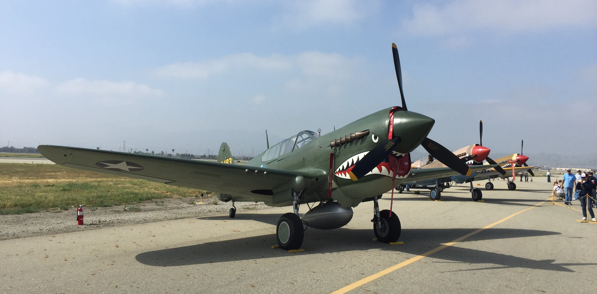
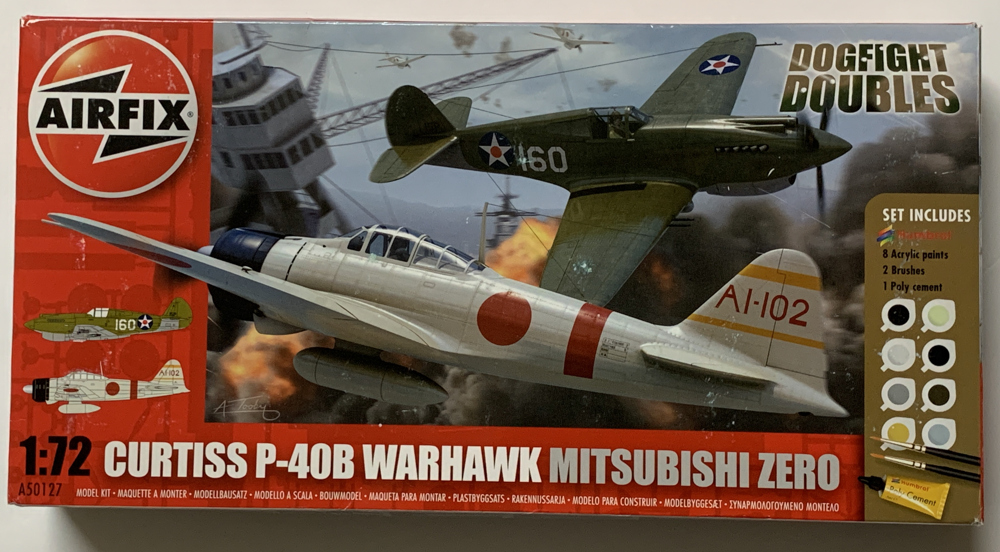
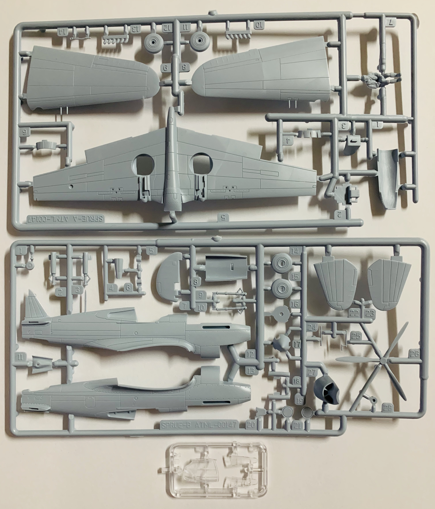
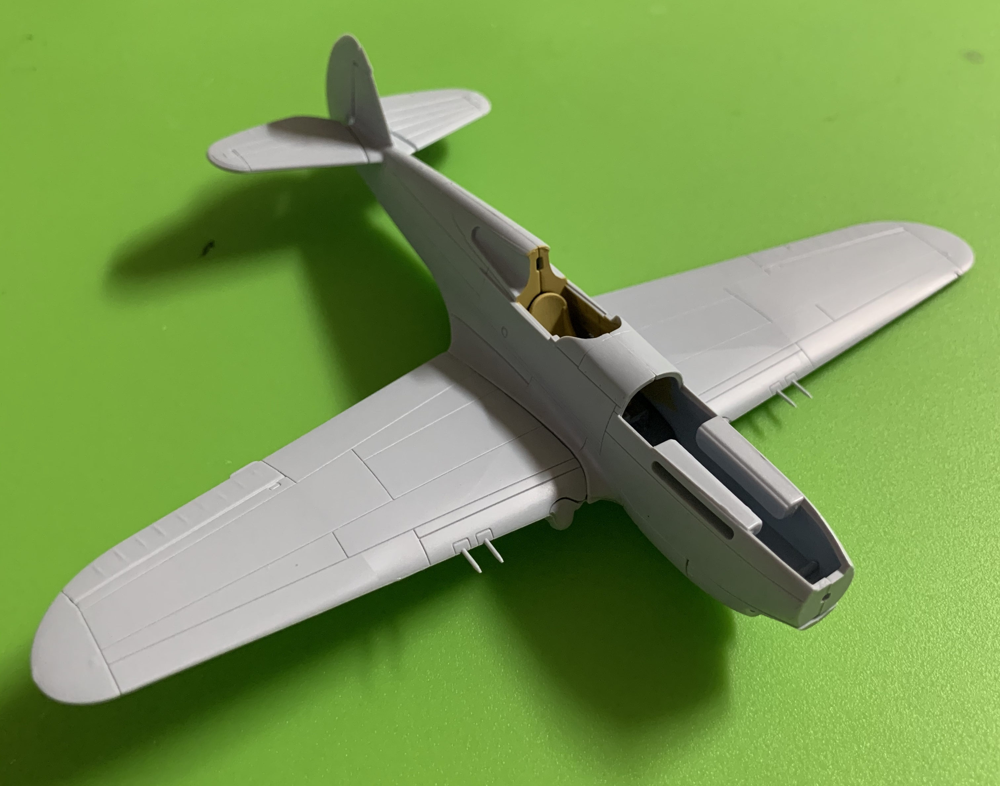
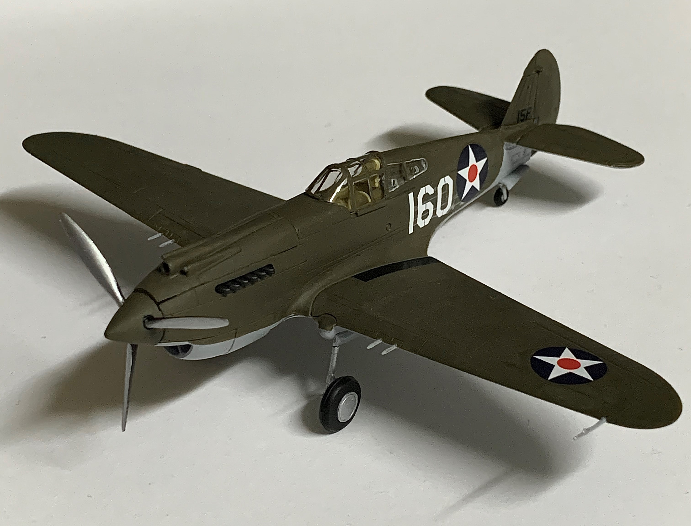

# Curtiss P-40B Warhawk (completed February 2020)

## The Plane

The United States, Great Britain, and the Soviet Union all operated the P-40 Warhawk during World War II. It was durable and could be flown across a wide variety of environments. The Warhawk was able to outdive most of its opponents but lacked high-altitude performance. The P-40 was continuously upgraded until production ceased in 1944.

## The Kit

This P-40 is one of Airfix's 1/72 aircraft kits and its tooling dates back to 2011. It was packaged along with an A6M2 Zero in a Dogfight Doubles set. 

## The Build

As with most of the recent Airfix toolings, this kit was a breeze to put together. 

## The Result

