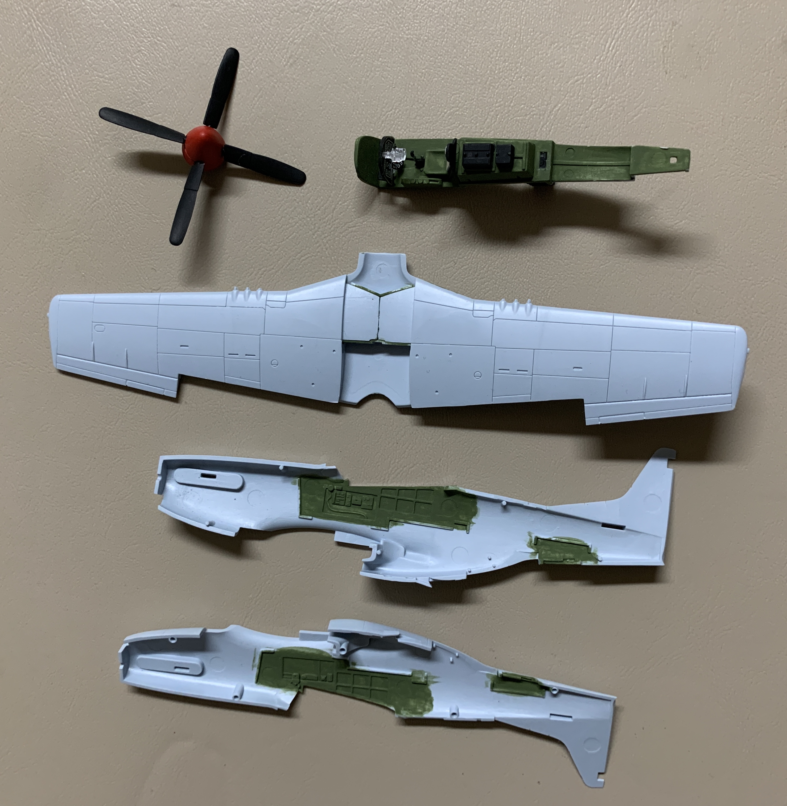
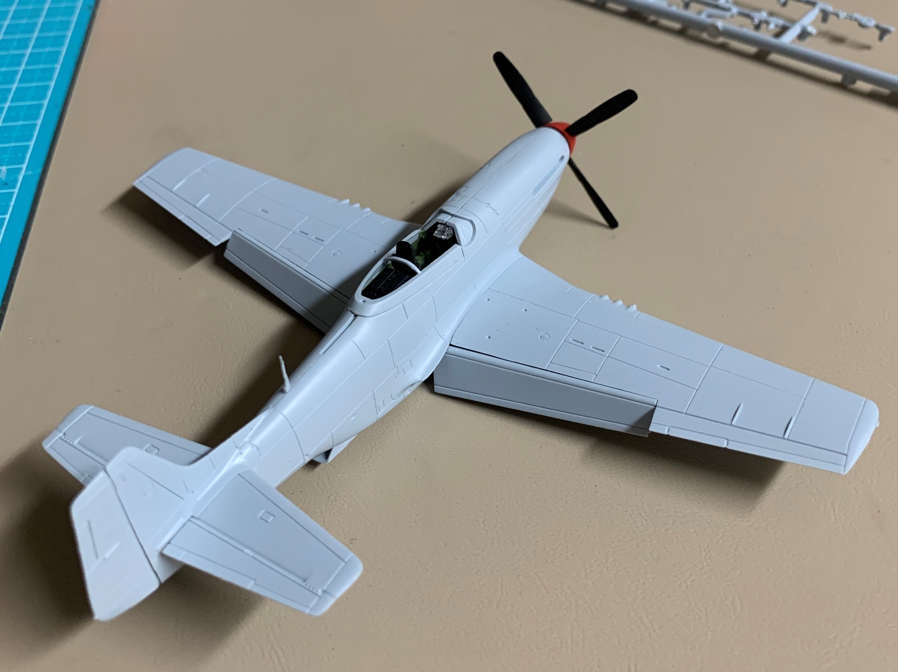
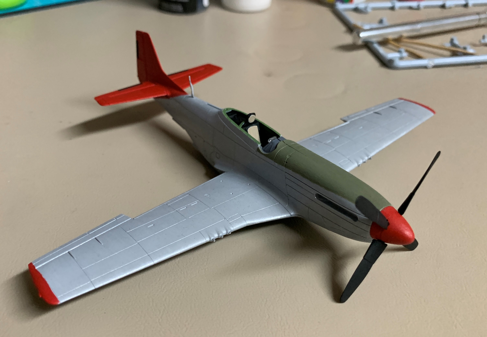
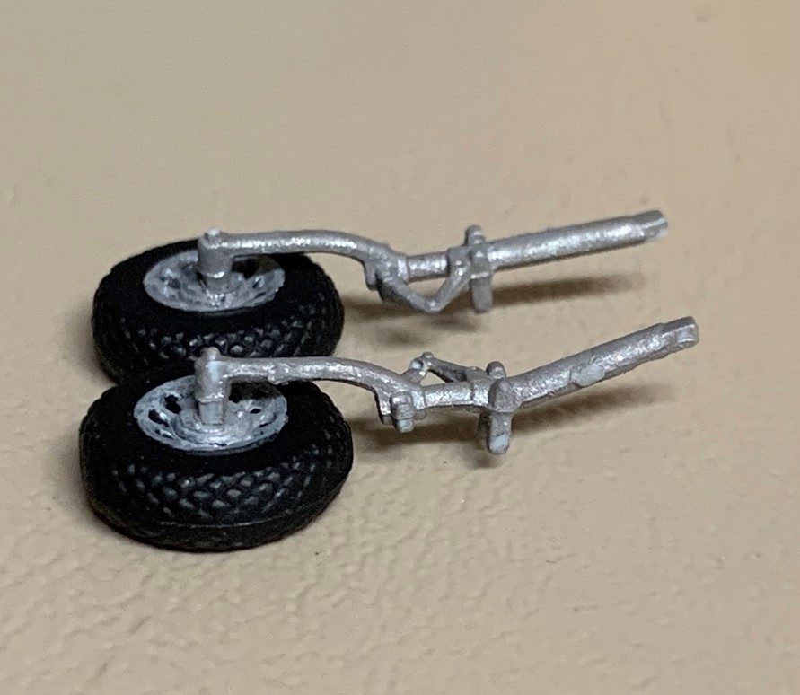
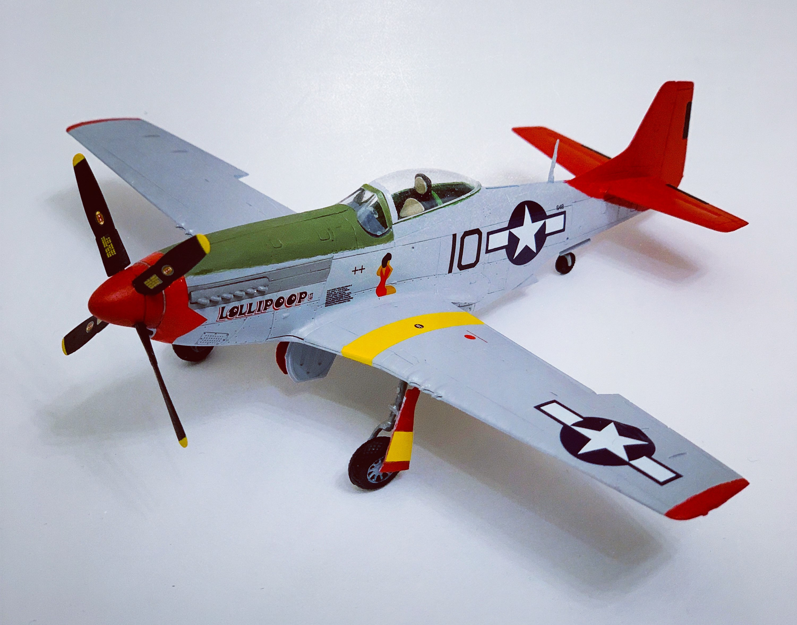

# North American P-51D Mustang (built April 2020)

## The Plane

The P-51D Mustang played a key role in winning the air war over Europe. It provided the Allies with an escort which could defend bombers all the way to Berlin and back. It excelled as a fighter, neutralizng the Luftwaffe in the months leading to D-Day. Postwar, several P-51s were converted to civilian racers and many still grace the skies today. 

## The Kit

One of the more recent Airfix 1/72 toolings, this P-51D is perfect for a quick build. Its low part count and ease of fit makes this kit perfect for the casual modeler. 

## The Build

  

The landing gear was substantially warped but a minute in warm water allowed me to straighten it. 

## The Result

The aircraft bears the markings of 'Lolipoop,' a P-51D piloted by the famed Tuskegee Airmen.