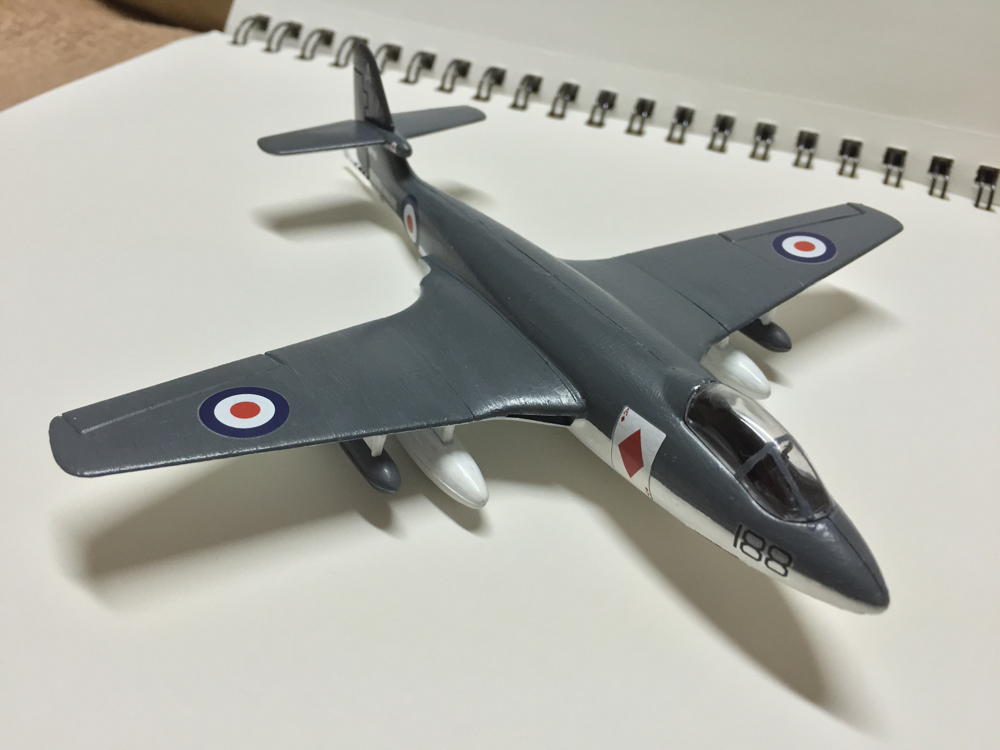

# Hawker Sea Hawk  (built January 2016)

The Hawker Sea Hawk was a British naval jet fighter which was introduced in early 1950s. Towards the end of its fairly short career with the Royal Navy, the Sea Hawk flew combat missions during the 1956 Suez Crisis. The aircraft continued to operate with other nations throughout the Cold War, retiring just shy of its conclusion. 

This Sea Hawk is a 1/72 vintage tooling by Airfix, dating back to the late 1950s. I snagged the starter set during a Black Friday sale, which came with a brush and acrylic paints. It was a simple, minimal-effort kit and I was able to complete it within a day. 

