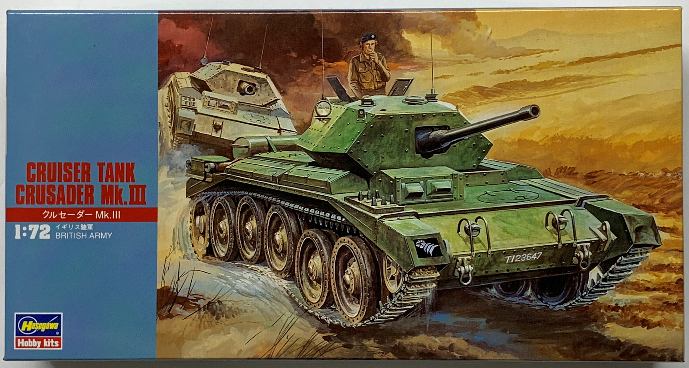
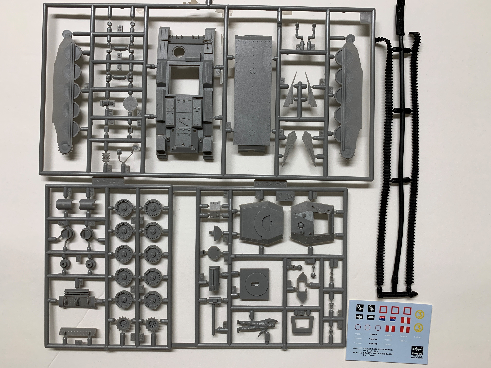
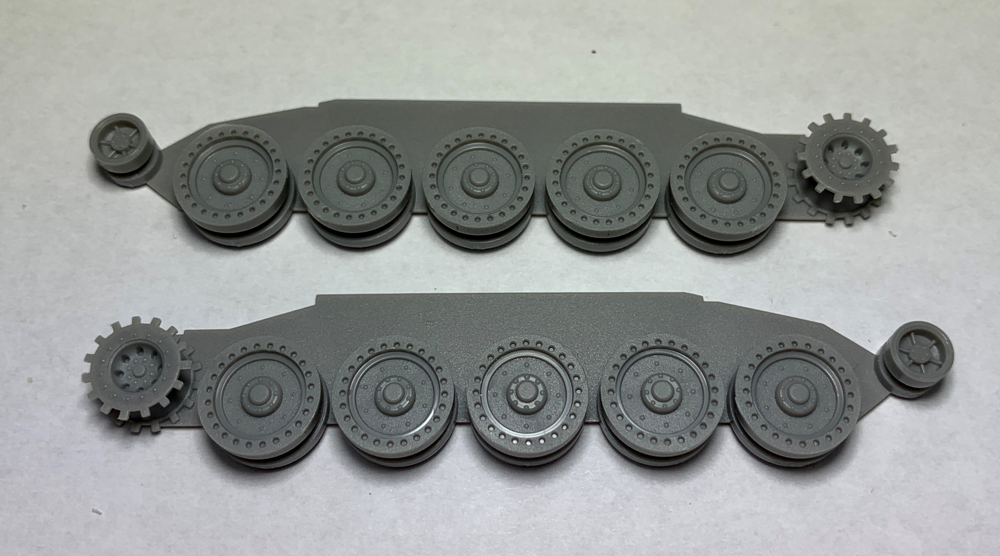
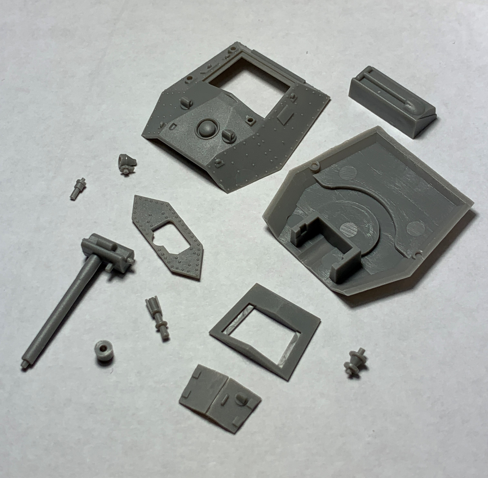
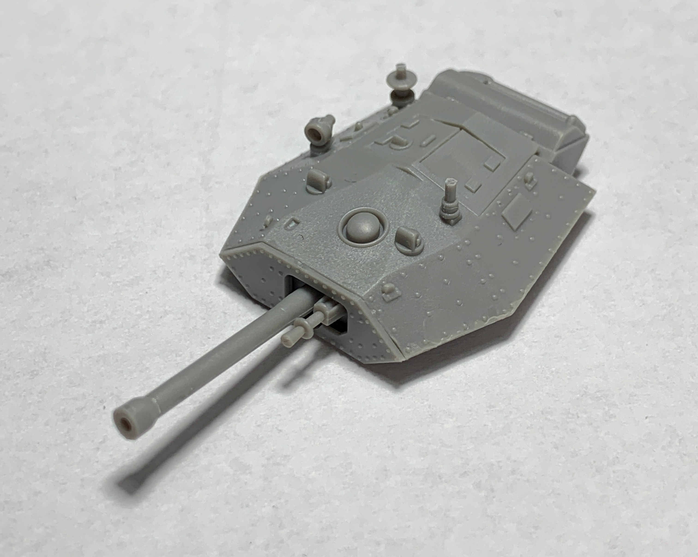
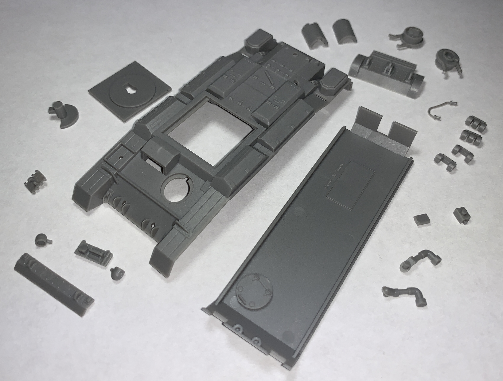
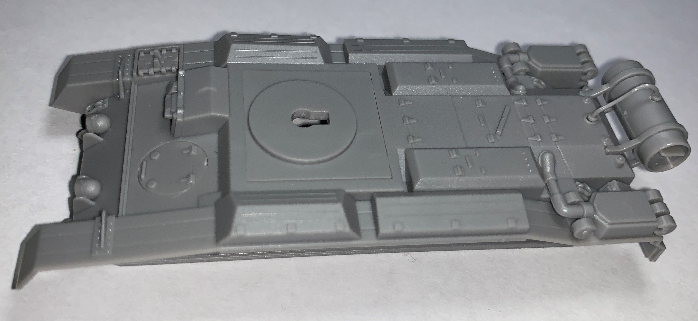
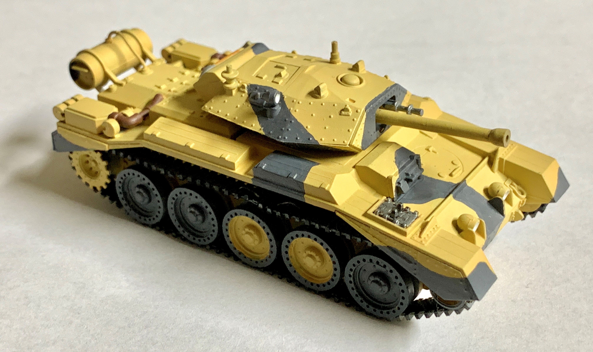
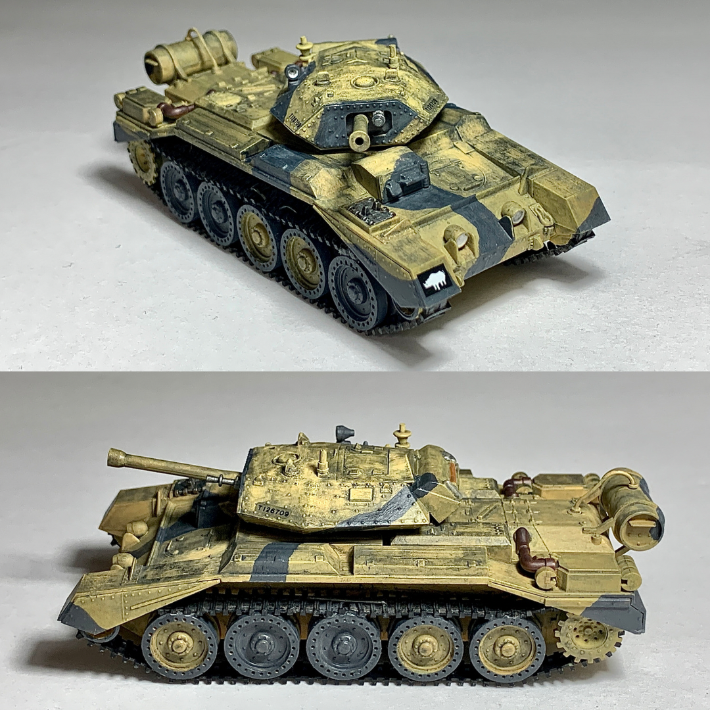

# Crusader Mk III (completed August 2021)

## The Tank

Fast but lacking in armor and armament, the Crusader mainly saw combat in North Africa against Italian and German forces. While the Crusaders outclassed their Italian opposition, they were at a disadvantage compared to the Germans. 

By the time the Mk III with its upgraded QF 6-pounder gun arrived, the Crusader series was already rendered obselete by the American M3 Grant and M4 Sherman medium tanks.

## The Kit

Hasegawa initially released this 1/72 scale kit in 1975. 

## The Build

Putting together the Christie suspension was a simple task. The turret assembly was likewise straightforward and allowed for the builder to traverse and elevate the 6-pounder armament.

Earlier Crusaders featured a secondary frontal machine gun turret, which were removed in the Mk III. 

I applied a two-tone camouflage and later weathered it with thinned gray paint and subtle smudging using diluted rubbing alcohol.

## The Result

I enjoyed making this model and found it very suitable for modelers of all skill levels. 