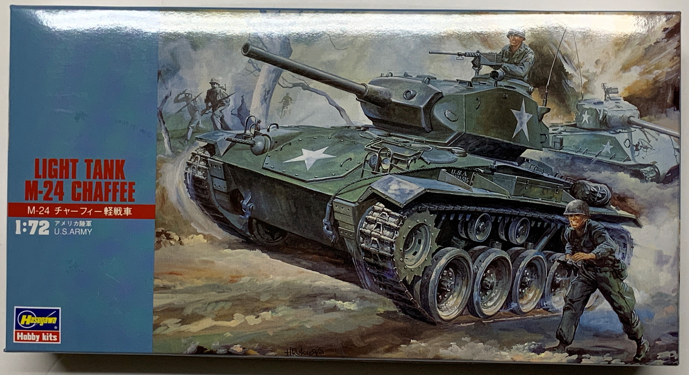
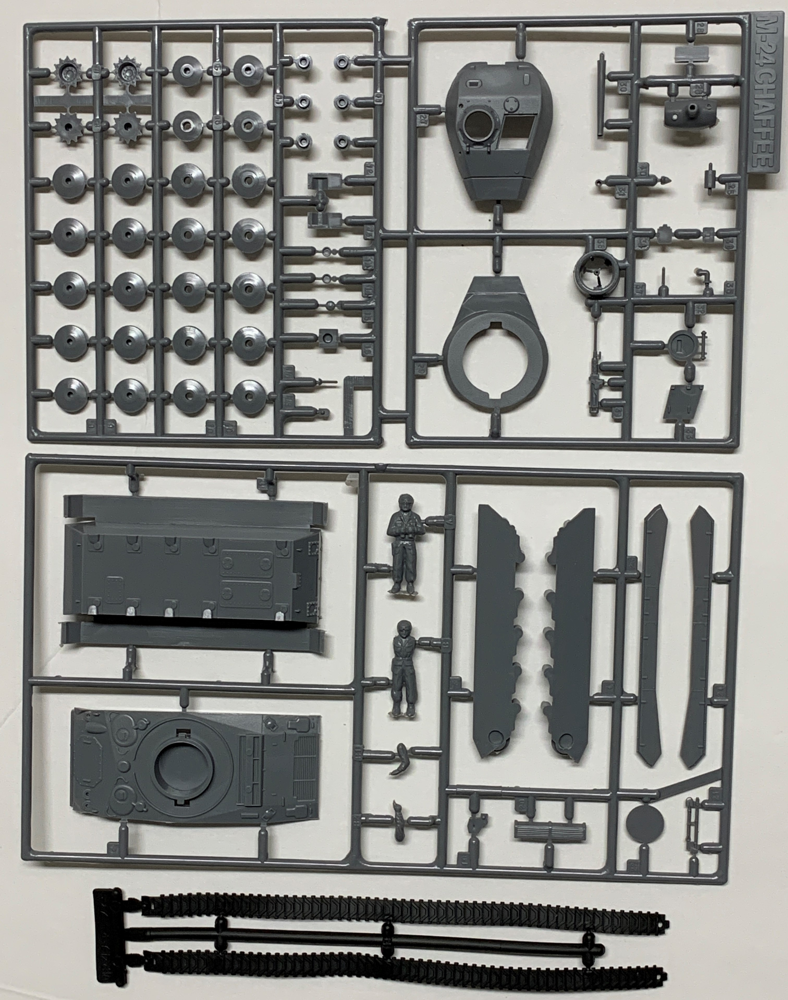
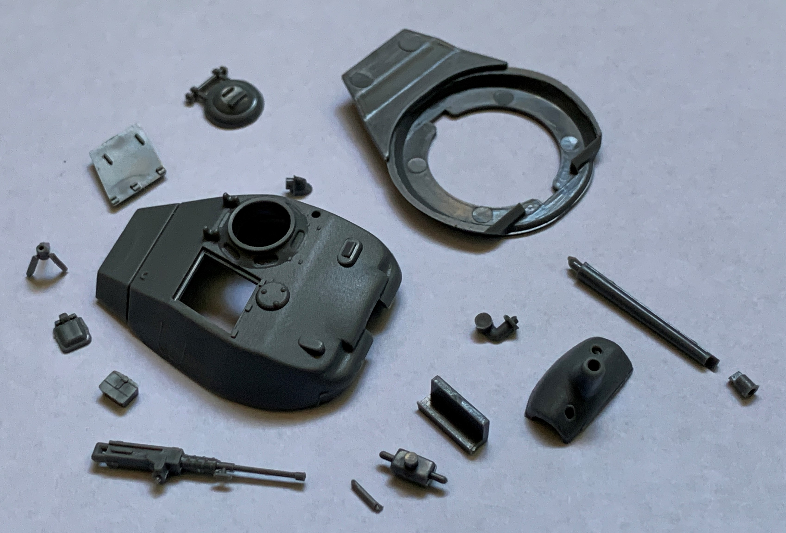
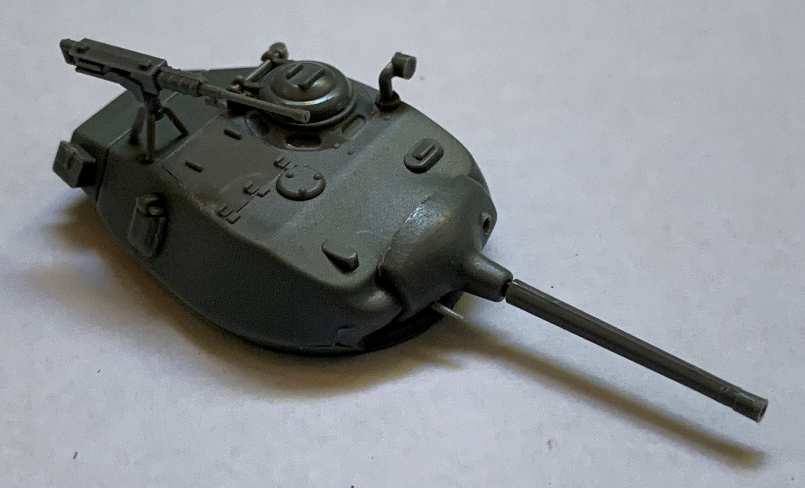
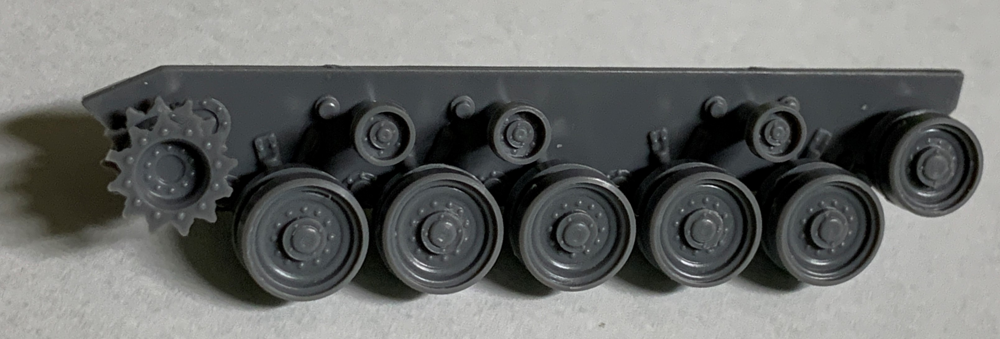
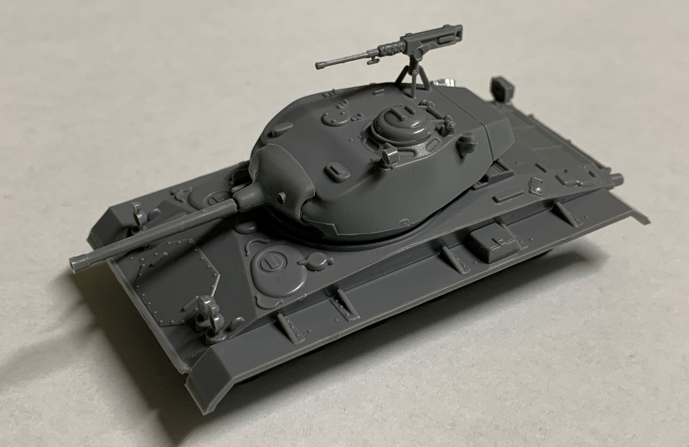
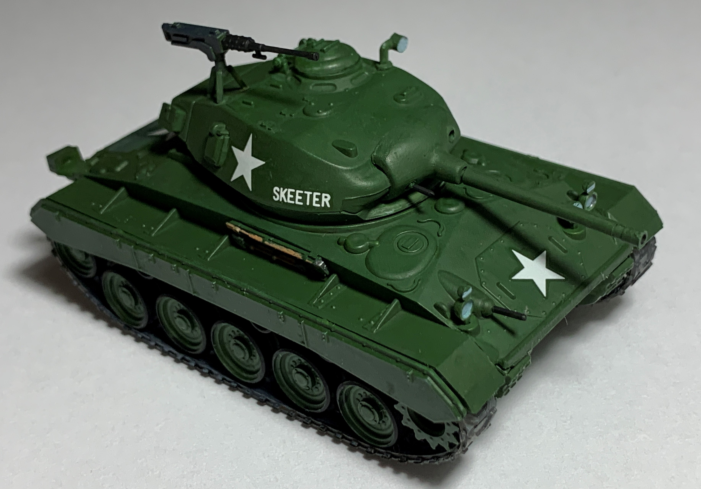

# M24 Chaffee (completed April 2021)

## The Tank

The M24 Chaffee replaced the M5 Stuart in the light tank role. It was speedy, maneuverable, and armed with the same 75mm gun as the M4 Sherman. It entered service in the final years of World War II and saw postwar in Korea and Vietnam. 

## The Kit

This 1/72 scale kit was released by Hasegawa in 1974. 

## The Build

A few of the turret accessories had to be eyeballed. 

The main gun does not offer much in terms of elevation. 

The road wheels were a tight fit but aligned with the tracks well. 

I completed the rest of the build with no difficulties.

## The Result

This vintage M24 kit still holds strong against the test of time.  