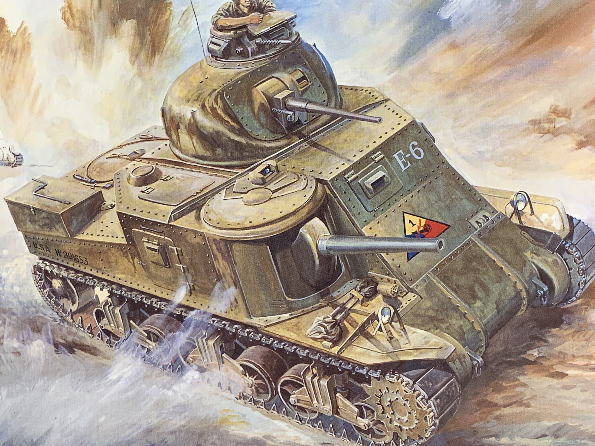
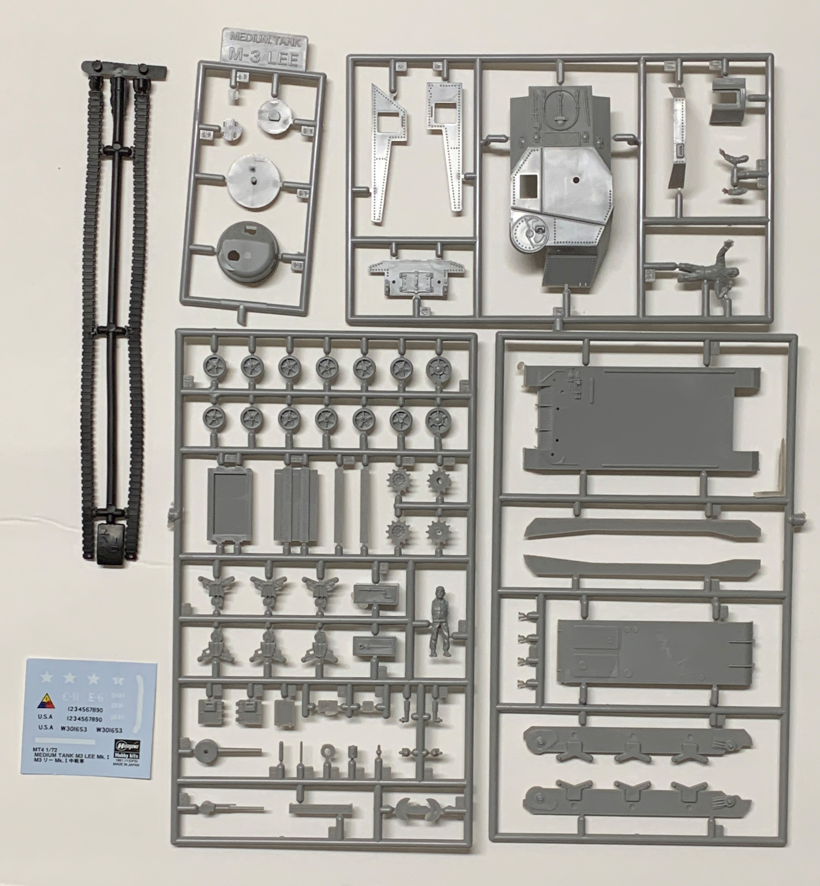
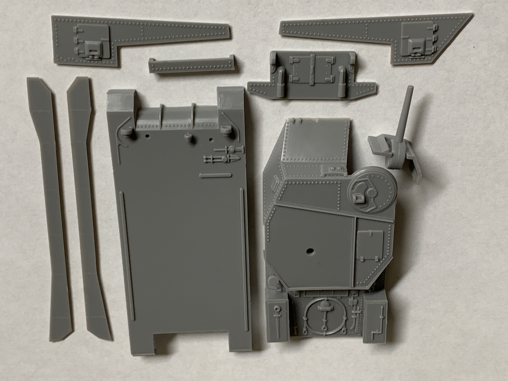
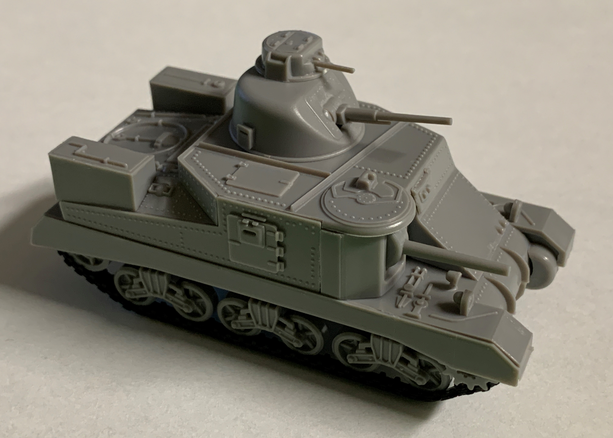

# M3 Lee (completed October 2021)

## The Tank

By the summer of 1940, it became clear that the United States did not have a medium tank comparable to the German Panzer III or IV. The M3 Lee was designed to meet a request for a medium tank armed with a 75mm gun, which had to be mounted in the hull since a compatible turret was still being designed.

The M3 Lee saw combat from North Africa to the Pacific. Its armament was sufficient to defeat Axis tanks although its tall profile made the vehicle an easy target. It was soon replaced by the M4 Sherman. 

## The Kit

This 1/72 scale kit was released by Hasegawa in 1973. 

## The Build

Like most of Hasegawa's 1/72 armor kits from the 1970s, I was able to assemble the tank relatively quickly. 

The roof machine gun was the only minor annoyance since there were not any guide holes to ensure proper alignment.  

I stapled the tracks together and hid the staples underneath the side skirts.

The base coat was too bright for my liking so I toned it down with thinned coats of yellow, orange, and red. 

## The Result

This kit has certainly aged well into the 2020s. I am looking forward to completing the rest of my Hasegawa kits. 