# Churchill Mk VII (completed April 2021)

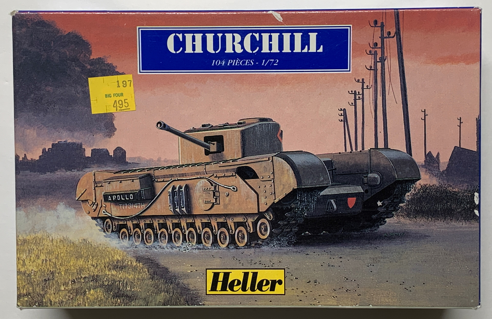

## The Tank

Slow and well-protected, the Churchill tank was designed to fight in a trench warfare environment similar to World War I. During World War II, the Churchill served as an effective infantry support tank and could cross difficult terrain such as the mountains of North Africa and Italy. Its chassis was versatile and spawned a variety of special variants, most notably the Crocodile flamethrower tank.

The 1944 Mk VII model of the Churchill featured frontal armor which exceeded that of the Tiger I heavy tank. It was also the first Churchill to be armed with the QF 75mm tank gun. 

## The Kit

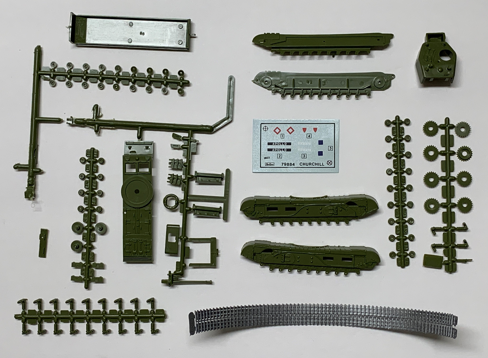

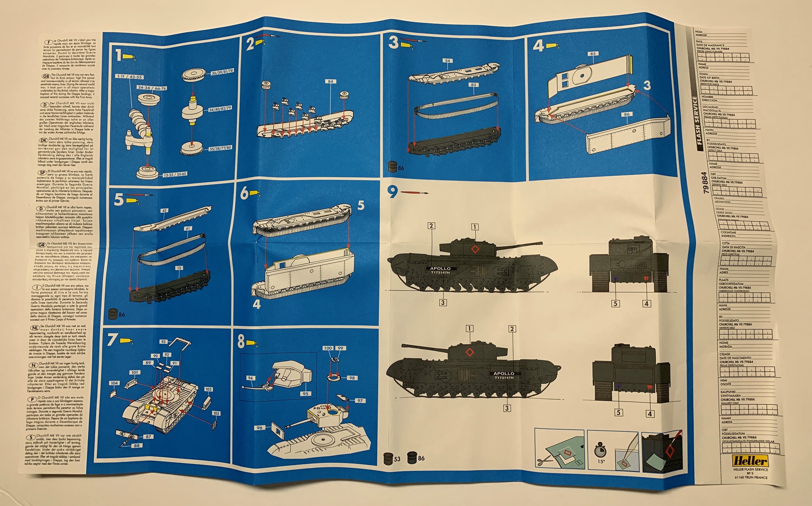

This 1/76 scale kit was first released in 1961 by Airfix. While Airfix continues to sell the kit today, a few were also distributed in the late 1990s by Heller. 

## The Build

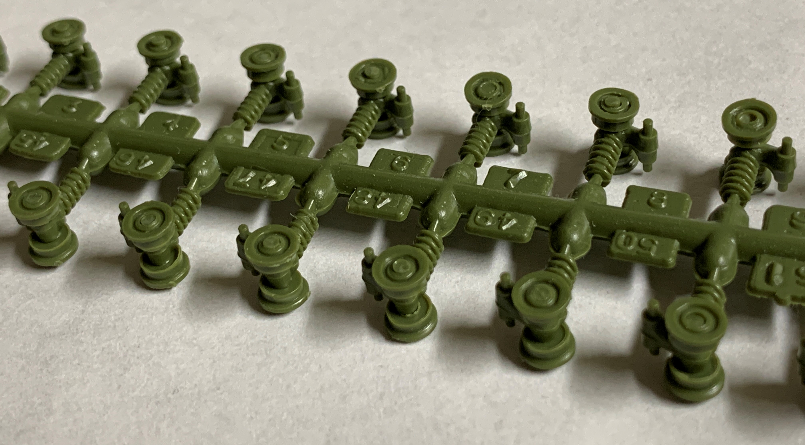

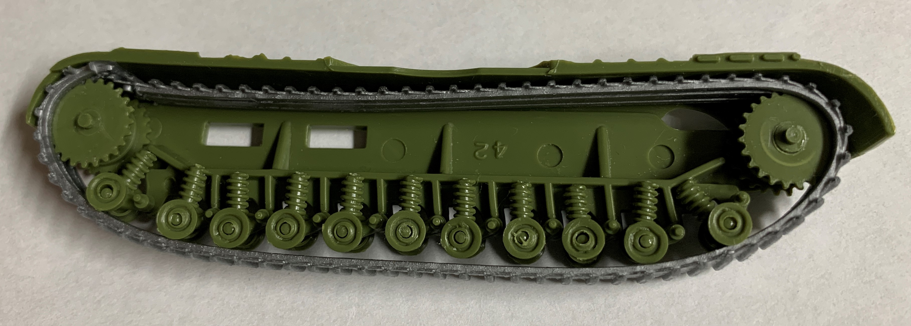

I first assembled the suspension, which consisted of gluing road wheels onto the brackets. I found it helpful to not remove the brackets from the sprue until after the road wheels have been attached. The road wheels did not quite align with the tracks. 

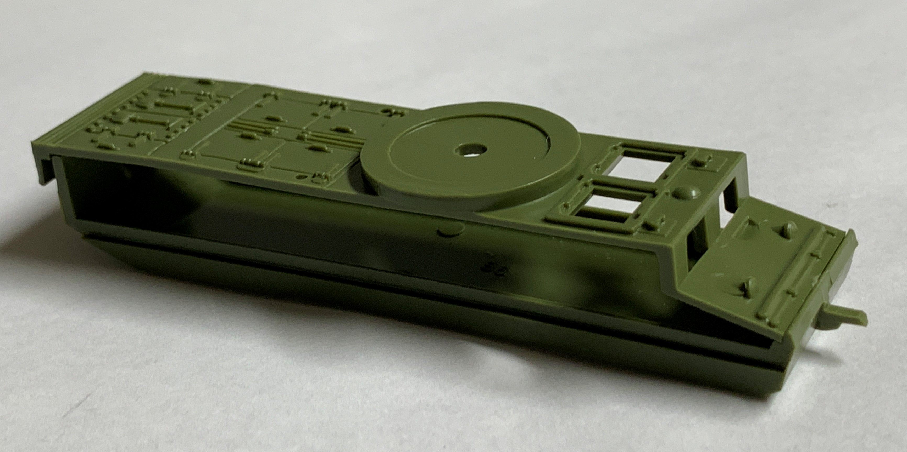

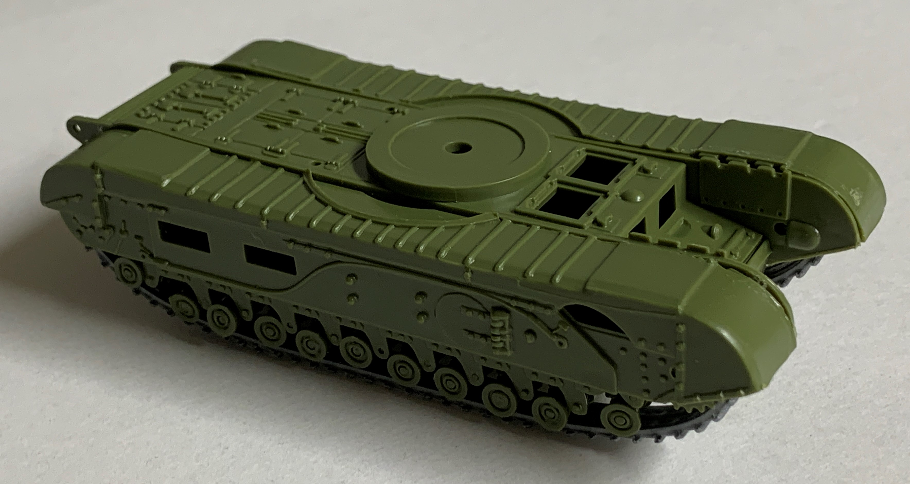

Joining the two track assemblies with the center hull assembly requires a bit of patience and careful handling. Even then, the fit wasn't perfect. 

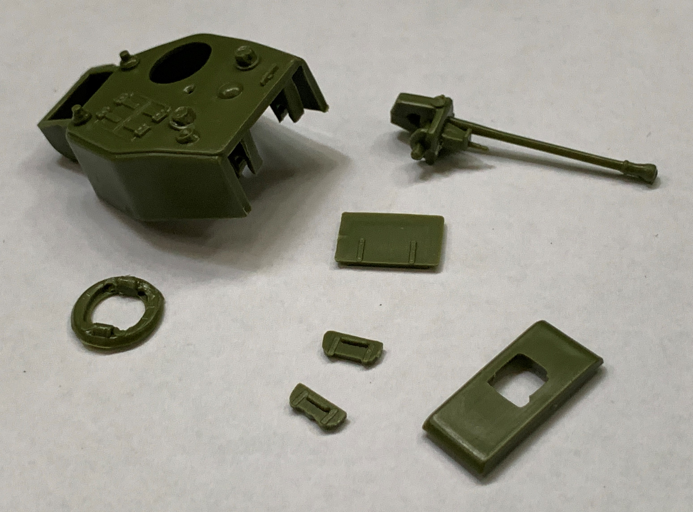

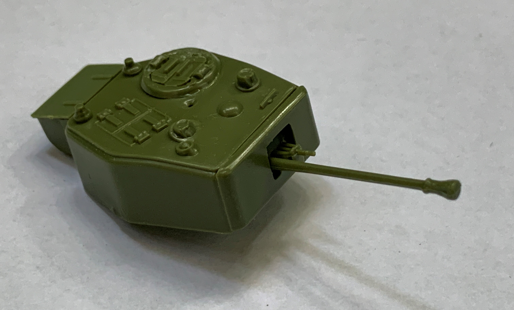

I had no issues putting together the turret but I found the plastic to be too flexible to easily elevate the main gun. 

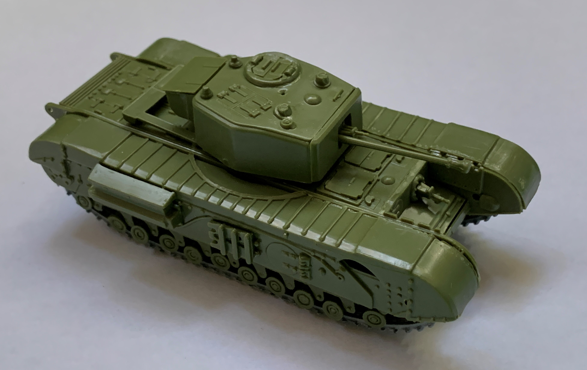

Despite the kit's age, it offers a decent representation of a Churchill tank. 

## The Result

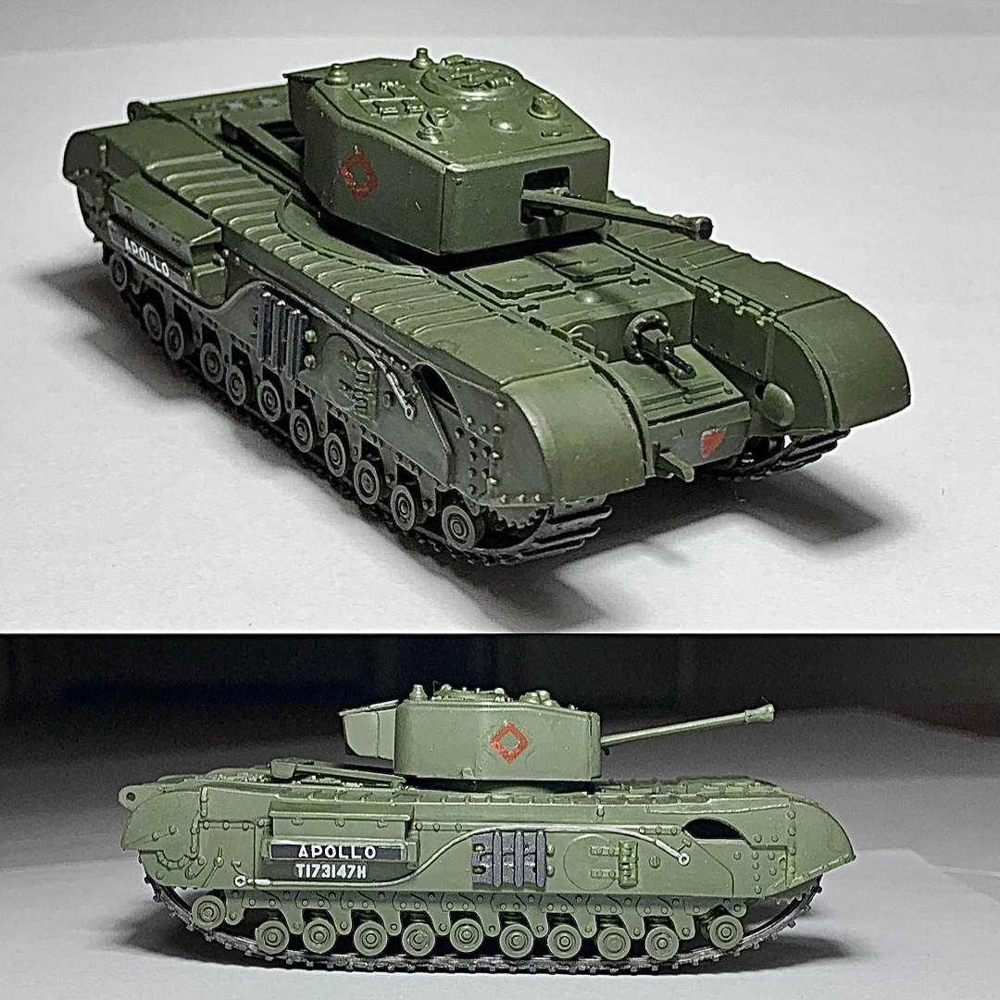

Overall, this is a basic and quick build for anyone looking to add a Churchill to their model tank collection. 