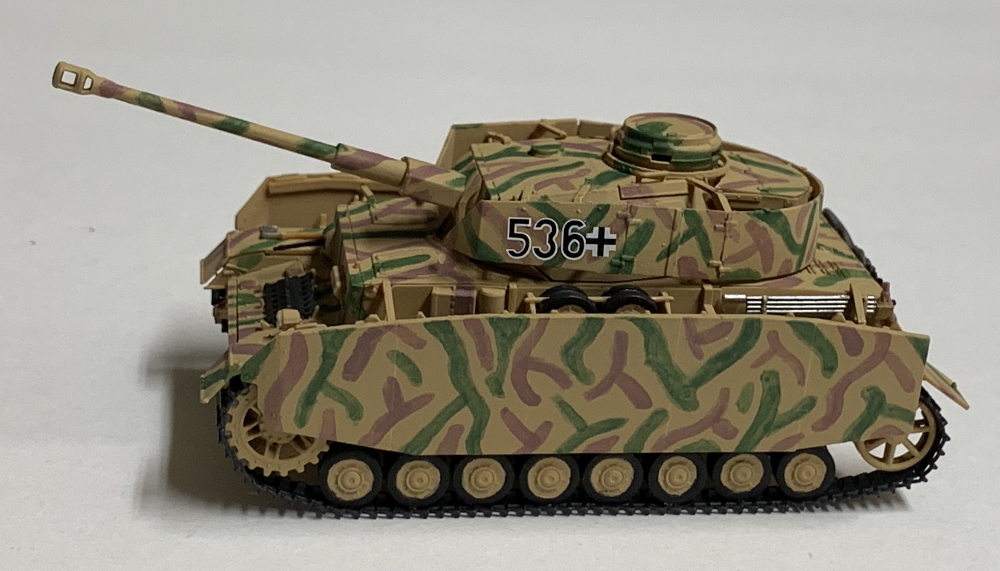
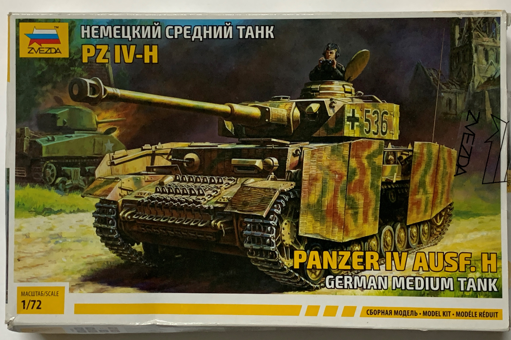
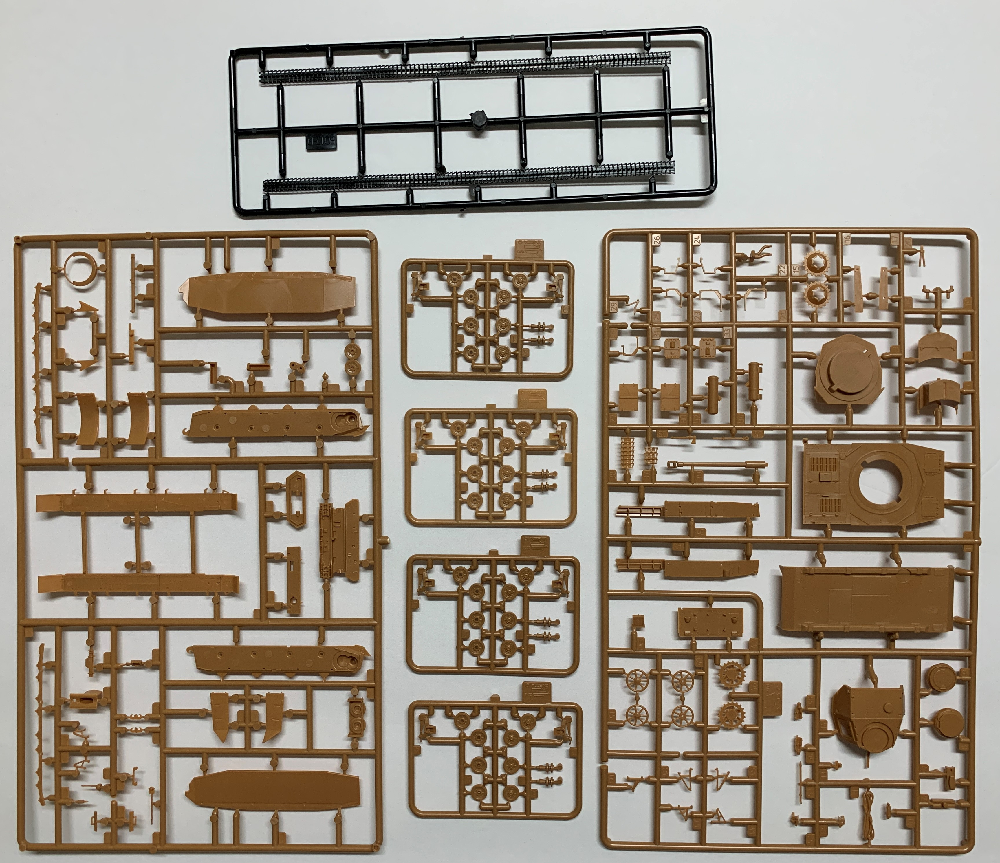
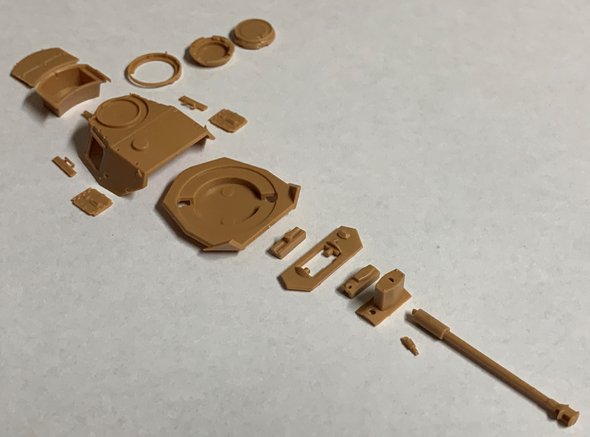
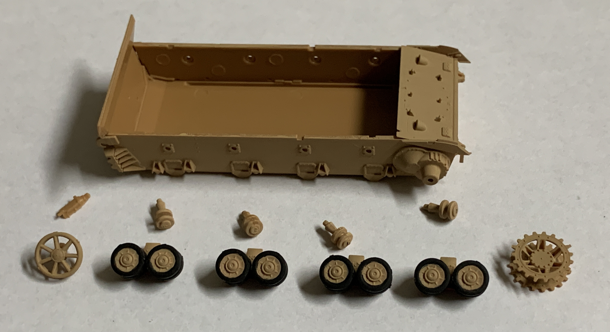
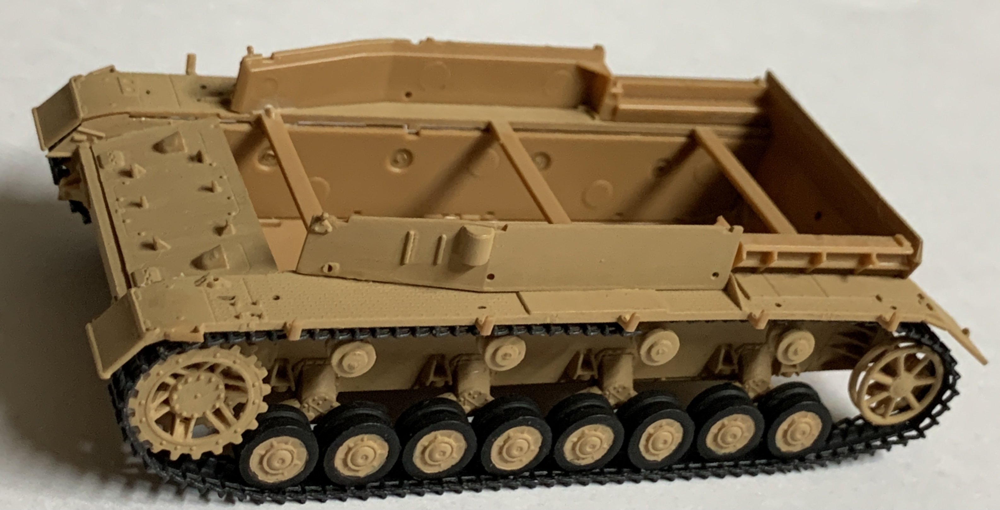
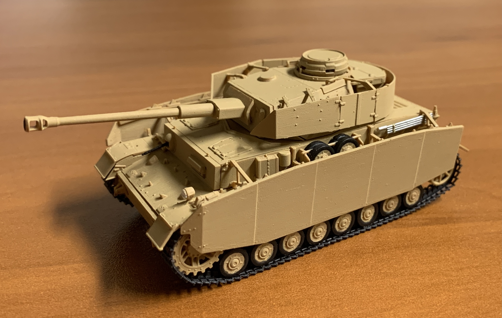
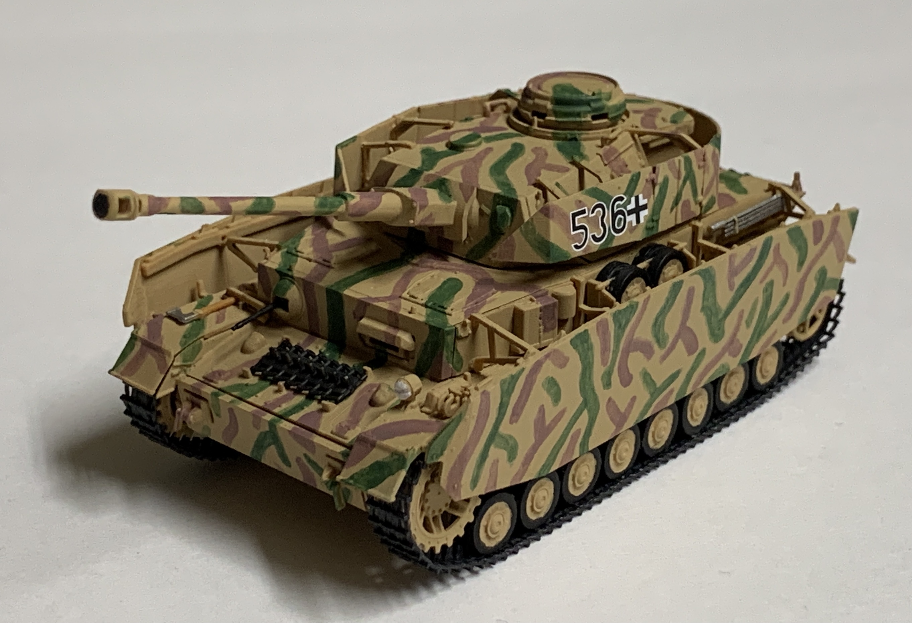

# Panzerkampfwagen IV Ausf. H (completed January 2021)

## The Tank

The Panzer IV was the mainstay of the German armored forces during World War II. A prewar design, the tank remained in production through the entire war and saw service across all fronts. While orignally intended to serve the infantry support role, the Panzer IV was more feasible to upgrade and proved its worth at engaging enemy armor. Its chassis was also verstatile enough that many German self-propelled guns were developed from the Panzer IV. 

The Ausf. H variant was introduced in 1943 and featured a 75mm KwK 40 L/48 along with spaced armor to protect against anti-tank rifles. 

## The Kit

The kit is in 1/72 scale and manufactured by Zvezda. My second Zvezda kit, this seemed less complex than their IS-2 I completed earlier.

## The Build

Turret assembly was easy to follow. Getting the spaced armor plates to align proved to be a bit of a challenge but with patience, everything worked out. 

Attaching the suspension was painless but a few of the brackets popped off when fitting the tracks. 

Putting together the hull - the parts fit together nicely. 

The tank before applying the ambush camouflage. The side skirts held up really well once the glue has dried.

## The Result

